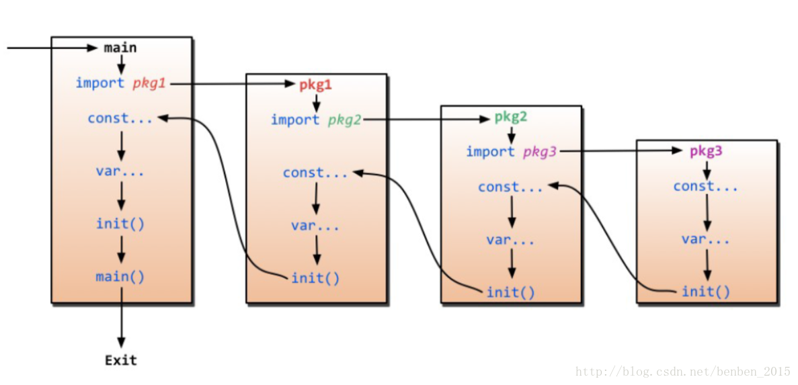

```java
@author FuMing
@data 2020.03.10
```

# Go 包的初始化及init()函数

[TOC]


### 包的初始化

为了使用导入的包，首先必须将其初始化。初始化总是以单线程执行，并且按照包的依赖关系顺序执行。这通过Golang的运行时系统控制，如下图所示：

1. 初始化导入的包（递归导入）

2. 对包块中声明的变量进行计算和分配初始值

3. 执行包中的init函数

   

### Go init函数详解

init()函数会在每个包完成初始化后自动执行，并且执行优先级比main函数高。init 函数通常被用来：

- 对变量进行初始化
- 检查/修复程序的状态
- 注册
- 运行一次计算

#### initial.go

```go
package main

import "fmt"

var _ int64=s()

func init(){
    fmt.Println("init function --->")
}

func s() int64{
    fmt.Println("function s() --->")
    return 1
}

func main(){
    fmt.Println("main --->")
}
```

#### 执行结果

```
function s() --->
init function --->
main --->
```

**即使包被导入多次，初始化只需要一次。**

### 特性

init函数不需要传入参数，也不会返回任何值。与main相比而言，init没有被声明，因此也不能被引用。

```go
package main

import "fmt"

func init(){
    fmt.Println("init")
}

func main(){
    init()
}
```

在编译上面的函数时，会出错“undefined：init”。

每个源文件中可以包含多个init函数。

```go
package main

import "fmt"

func init(){
    fmt.Println("init 1")
}

func init(){
    fmt.Println("init2")
}

func main(){
    fmt.Println("main")
}

/*执行结果：
init1
init2
main */
```

从上面的例子中，可以看出每个源文件可以包含多个init函数。 
init函数常用的一个例子就是用来设置初始表达式的值。

```go
var precomputed=[20]float64{}

func init(){
    var current float64=1
    precomputed[0]=current
    for i:=1;i<len(precomputed);i++{
        precomputed[i]=precomputed[i-1]*1.2
    }
}
```

因为上面代码中不可能用for循环来作为precomputed的值（这是一句声明），因此可以用init函数来解决这个问题。

Go包导入规则的副作用

Go要求非常严格，不允许引用不使用的包。但是有时你引用包只是为了调用init函数去做一些初始化工作。此时空标识符（也就是下划线）的作用就是为了解决这个问题。

```
import _ "image/png"
```

[阅读原文](https://blog.csdn.net/benben_2015/article/details/79486077)

