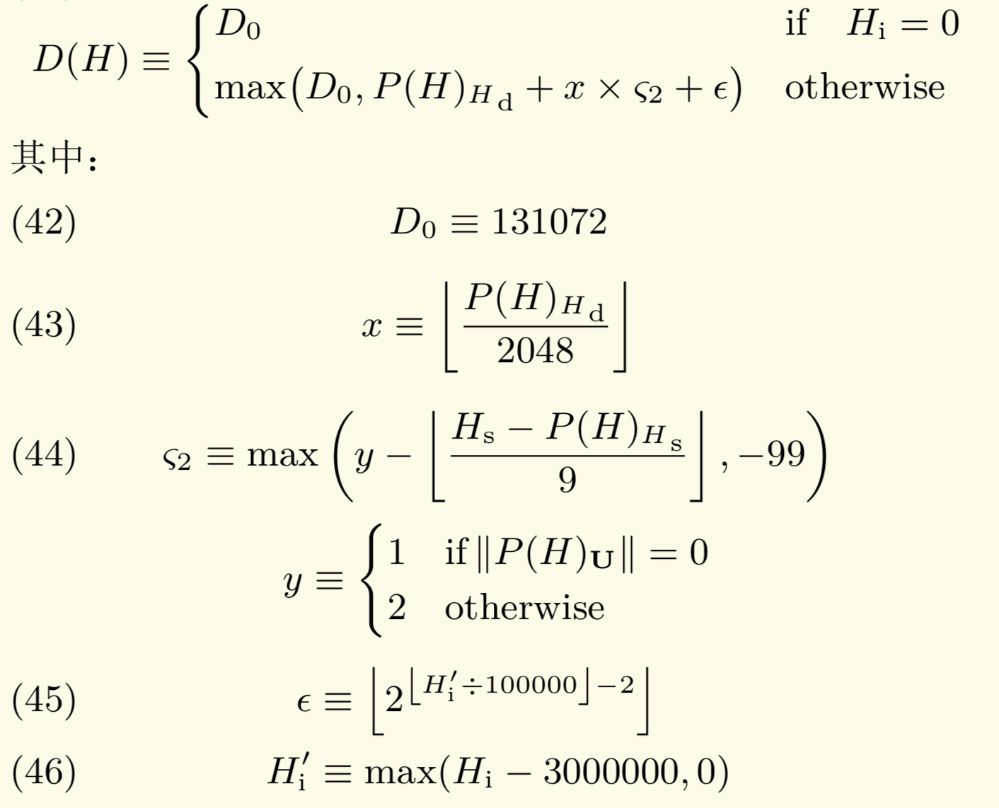
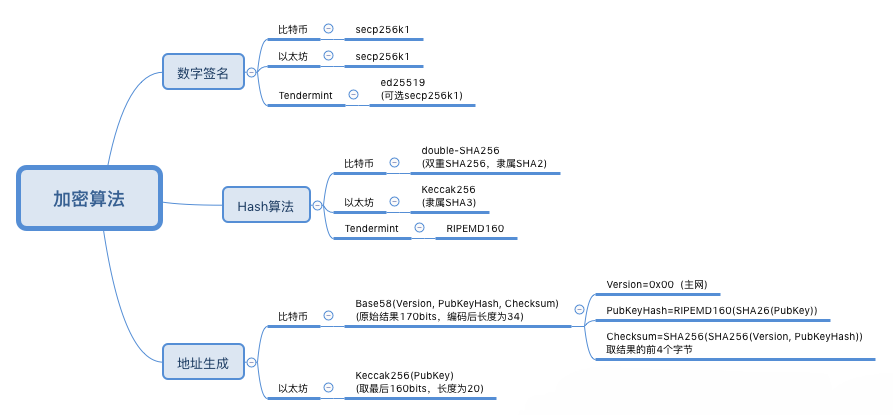

```java
@author FuMing
@data 2020.02.29
```

# 以太坊技术点部分总结

+ [TOC]

## 以太坊中的两种账户（外部账户和合约账户）

+ 外部账户

由密钥控制，有账户余额，不与代码关联，能触发交易（即转账、部署或调用智能合约）。

+ 合约账户

不受密钥控制，无账户余额，与代码关联，只受合约账户所关联的代码的控制，不能主动发起交易，只能通过被调用的方式执行其中的代码，并且可以继续调用其他合约账户。

外部账户和合约账户都拥有以下4个字段，也被称为账户状态

|    字段     |                           外部账户                           |                           合约账户                           |
| :---------: | :----------------------------------------------------------: | :----------------------------------------------------------: |
|    nonce    | 从此账户地址发送的交易序号，每发送一笔交易nonce加一，可以防止双花攻击。 | 此账户创建的合约序号，每创建一个合约nonce加一。但是合约调用其他合约属于内部调用，nonce值不变。 |
|   balance   |            此账户地址拥有Wei的数量，即账户余额。             | 此账户地址拥有Wei的数量，即账户余额。指定了可以接收以太币的智能合约也可以像自然人一样，持有以太币。 |
| storageRoot |                  外部账户storageRoot为空。                   | 保存了账户的存储内容（智能合约在运行中产生的数据，可读写）的 Merkle Pa- tricia 树的根节点的 256 位哈希值。合约账户storageRoot不为空。 |
|  codeHash   |                    外部账户codeHash为空。                    | 这个账户的 EVM 代码（EVM 代码只读）哈希值。合约账户codeHash不为空。 |

空账户判断：一个账户的storageRoot为空且nonce为0且balance为0，说明这是一个空账户。


## 以太坊中的重要数据结构（交易树，收据树，状态树）

+ 交易树

每一个区块中都存在一个交易树，每一个区块头中都存储本区块的交易树根hash，交易树也是一棵Merkle Tree，树根节点存储每一笔交易，树的组织则按照排列顺序进行串联哈希，最终层层哈希得出世界状态。交易树可以提供Merkel Proof功能，向轻节点证明某个交易是打包在区块中的。

+ 收据树

每一个区块中都存在一个收据树，每一个区块头中都存储本区块的收据树根hash，收据树也是一棵Merkle Tree，树根节点存储每一笔交易执行结果，树的组织则按照排列顺序进行串联哈希，最终层层哈希得出世界状态。收据树可以向轻节点证明某个交易的执行结果。

+ 状态树

每一个区块中都存在一个状态树，每一个区块头中都存储本区块的状态树根hash，状态树也是一棵Merkle Tree，树根节点存储每个账户的状态，树的组织则按照排列顺序进行串联哈希，最终层层哈希得出世界状态。世界状态随着区块链的前进而不断变化，状态树的值也不断变更。状态树可以向轻节点证明某个交易的执行结果。

## 以太坊中的GHOST共识协议 Greedy Heaviest Observed Subtree

GHOST协议是以包含子树数目最多为基本原则。


在比特币协议中，最长的链被认为是绝对的正确。如果一个块不是最长链的一部分，那么它被称为是“孤块”。根据GHOST协议，不认为孤块没有价值，而是会给与发现孤块的矿工以回报。孤块被称为“叔块”(uncle block)，它们可以为主链的安全作出贡献，也同样能获得奖励，这激励了矿工在新发现的块中去引用叔块，减少了孤块的产生。

孤块奖励问题：

- 主链节点获得base reward；
- 一个节点最多引用两个叔块；
- 叔块必须是区块的前2层~前7层的祖先的直接子块；
- 被引用过的叔块不能重复引用；
- 引用叔块的区块，可以获得挖矿报酬的$\frac{1}{32}$，也就是5$\times\frac{51}{32}=0.15625$ Ether，最多获得2$\times$0.15625=0.3125 Ether；
- 主链节点的兄弟（非主链节点）获得 ((叔块高度+8-当前块的高度)/8 )*base reward。
- 交易费用(transaction fee)不会分配给叔块

## 以太坊中的挖矿算法和挖矿难度调整机制

### 以太坊中的挖矿算法

以太坊在挖矿过程中设计了两个数据结构，分别为Cache和dataset。其中Cache是16M大小，而dataset是1G大小，对于矿工来说，每次选取一个nonce之后的挖矿操作，都要从dataset中读取数据。具体的挖矿过程如下：

1.根据当前区块信息生成一个Seed种子。
2.根据Seed种子生成16M大小的Cache,Cache是一个List结构，其数据前后相关。
3.根据Cache来生成1G大小的Dataset（又称为Dag）。
4.矿机每次选取一个Nonce之后，从Dataset中读取两个数进行挖矿测试，直到找到合适的Nonce。

区块链中每30000个区块的时候，Cache和Dataset的大小都会增加$\frac{1}{128}$,也就是说Cache会增加128K，Dataset会增加8M。

### 挖矿难度调整机制



+ D(H)是本区块的难度，创始块的难度被设置为D<sub>0</sub>=131072，此后每个区块的难度都与其父区块难度P(H)<sub>H<sub>d</sub></sub>有关。
+ $x$ $\times$ ζ<sub>2</sub>用于自适应调节出块难度，维持稳定的出块速度。
+ ϵ 表示难度炸弹。
+ 难度有最低下限，不能低于D<sub>0</sub>=131072。
+ $x$是父区块难度的12048的取整，是调整的单位。
+ ζ<sub>2</sub>是调整系数，其小只能是-99。
+ $y$的取值依赖于父区块是否包含叔父区块，如果包含，则$y$=2，否则$y$=1。
+ ϵ是2的指数函数，每十万个块扩大一倍，后期增长非常快，这就是难度“炸弹”的由来。
+ H<sup>′</sup><sub>i</sub>称为fake block number，由真正的block number Hi减少三百万得到。之所以减少三百万，是因为目前proof of stake的工作量证明方式还存在一些问题，pos协议涉及不够完善，但是难度炸弹已经导致挖矿时间变成了30秒左右，为了减小难度，就会减去三百万。

## 以太坊中的分叉（硬分叉和软分叉）和the  DAO

同时产生2个新区块的状况叫做分叉。

产生分叉时通过GHOST共识协议区分出主链和叔块的过程称为软分叉。

产生分叉时对形成的两条链都进行承认，产生的链不消失，此过程称为硬分叉。

## 以太坊中的p2p网络


## 以太坊中智能合约的创建，调用和执行


## 以太坊中的POW，POS算法

比特币的共识机制是PoW，以太坊为了弥补比特币的不足，提出了新的共识机制，名叫PoS。PoS只是以太坊发布之初的一个计划或者说目标，目前以太坊采用的共识机制也是PoW，就是比特币那个PoW。在以太坊最初的设定中，以太坊希望能够通过阶段性的升级，在前期依旧采用PoW来构建一个相对稳定的系统，之后逐渐采用PoW+PoS，最后完全过渡到PoS。

#### PoW

以太坊采用的PoW就是比特币那个PoW，但是并不是一模一样的，是有差别的；以太坊最初的设定中，希望通过阶段性升级来最终实现由PoW向PoS过渡的。以太坊采用的Pow的过程，即为不断调整Nonce值，对区块头做双重SHA256哈希运算，使得结果满足给定数量前导0的哈希值的过程。其中前导0的个数，取决于挖矿难度，前导0的个数越多，挖矿难度越大。

PoW流程如下：

1.生成交易，并与其它所有准备打包进区块的交易组成交易列表，生成Merkle根哈希值。

2.将Merkle根哈希值，与区块头其它字段组成区块头，80字节长度的区块头作为Pow算法的输入。

3.不断变更区块头中的随机数Nonce，对变更后的区块头做双重SHA256哈希运算，与当前难度的目标值做比对，如果小于目标难度，即Pow完成。

Nonce目标值应符合下式：

​																						$nonce\leq\frac{2^{256}}{H_{d}}$

其中$H_{d}$是当前区块难度，$H_{d}$越大，寻找符合条件的nonce值越困难，挖矿难度越高。

PoW完成的区块向全网广播，其他节点将验证其是否符合规则，如果验证有效，其他节点将接收此区块，并附加在已有区块链之后。之后将进入下一轮挖矿。

#### PoS


## 以太坊中常见的几种哈希算法

### Keccak256哈希算法

SHA3采用Keccak算法，在很多场合下Keccak和SHA3是同义词，但在2015年8月SHA3最终完成标准化时，NIST调整了填充算法，标准的SHA3和原先的Keccak算法就有所区别了。在早期的Ethereum相关代码中，普遍使用SHA3代指Keccak256，为了避免和NIST标准的SHA3混淆，现在的代码直接使用Keccak256作为函数名。



## [以太坊中的数据存储方式](https://blog.csdn.net/zxkr777/article/details/82146064)


## 以太坊中的EVM虚拟机


## 以太坊中gas的相关算法

Gas是由两个部分组成：Gas Limit和Gas Price

- Gas Limit 是用户愿意为执行某个操作或确认交易支付的最大Gas量（最少21,000）。
- Gas Price 是 Gwei 的数量，用户愿意花费于每个 Gas 单位的价钱。

当进行每笔交易时，发送人设定Gas Limit和Gas Price，将 Gas Limit$\times$Gas Price ，就得到了ETH交易佣金的成本。

发送者支付的Gas Price越高，则其交易的优先级越重要，因为矿工的报酬会更高。

交易完成后，所有未使用的Gas都会退到发送者账户。 但是，如果用户设置的限制值太低，那么他的交易被认为是无效的，并且会因为“Gas不足”错误而被取消，并且用于计算的Gas不会退到账户。也就是说，无论交易是否通过，发送者总是向矿工支付计算费用。

gas和Ether是以太坊中两种不同的计量单位，把它分开的目的是为了避免以太币的价格波动进而影响gas价格的变化。

