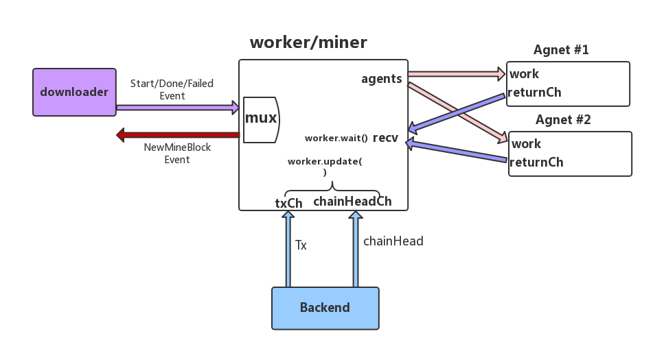
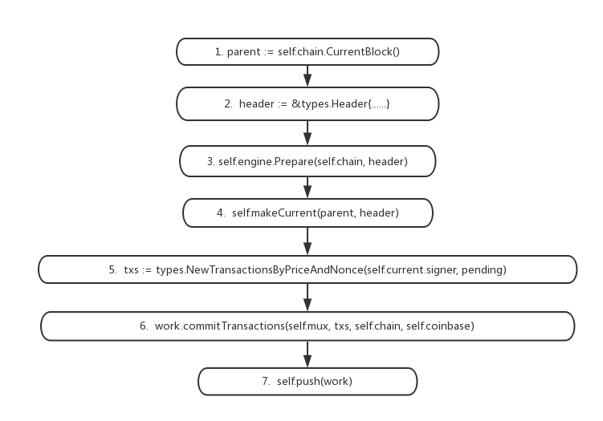

# 挖矿与共识

+ 在源码目录中，consensus提供了以太坊的一些共识算法，miner提供以太坊的区块创建和挖矿。

+ **挖矿(mine)**是指矿工节点互相竞争生成新区块以写入整个区块链获得奖励的过程。**共识(consensus)**是指区块链各个节点对下一个区块的内容形成一致的过程。在以太坊中, `miner`包向外提供挖矿功能，`consensus`包对外提供共识引擎接口。

### 挖矿

`miner`包主要由`miner.go` `worker.go` `agent.go` 三个文件组成。

- `Miner` 负责与外部交互和高层次的挖矿控制。
- `worker` 负责低层次的挖矿控制 管理下属所有Agent。
- `Agent` 负责实际的挖矿计算工作。

三者之间的顶层联系如下图所示



#### 下面先从这几个数据结构的定义和创建函数来了解下它们之间的联系

#### Miner

Miner的定义如下

```go
type Miner struct{
    mux *event.TypeMux 
    worker *worker
    coinbase common.Address
    eth  Backend
    engine consensus.Engine
    .... 
}
```

各字段作用如下, 其中标有<sup>外</sup>的字段表示与Miner包外部有联系

- `mux` <sup>外</sup> 接收来自**downloader**模块的*StartEvent* *DoneEvent* *FailedEvent*事件通知。在网络中，不可能只有一个矿工节点,当**downloader**开始从其他节点同步Block时，我们就没有必要再继续挖矿了.
- `eth` <sup>外</sup> 通过该接口可查询后台`TxPool` `BlockChain` `ethdb`的数据.举例来说，作为矿工，我们在生成一个新的Block时需要从`TxPool`中取出`pending Tx`(待打包成块的交易),然后将它们中的一部分作为新的Block中的Transaction
- `engine` <sup>外</sup> 采用的共识引擎,目前以太坊公网采用的是`ethash`,测试网络采用`clique`.
- `worker` 对应的worker,从这里看出Miner和worker是一一对应的
- `coinbase` 本矿工的账户地址,挖矿所得的收入将计入该账户
- `mining` 标识是否正在挖矿

`miner.New()`创建一个Miner,它主要完成Miner字段的初始化和以下功能

- 使用**miner.newWorker()**创建一个worker
- 使用**miner.newCpuAgent()**创建Agent 并用`Register`方法注册给`worker`
- 启动**miner.update()** 线程.该线程等待mux上的来自 **downloader**模块的事件通知用来控制挖矿开始或停止

#### worker

worker成员比较多,其中部分成员的意义如下

- `mux` `engine` `eth` `coinbase` 这几项都来自与`miner`, 其中`mux`相对于Miner里的稍微有点不同, Miner里的`mux`是用来接收**downloader**的事件，而worker里用`mux`来向外部**发布**已经挖到新Block
- `txCh` <sup>外</sup> 从后台`eth`接收新的Tx的Channel
- `chainHeadCh` <sup>外</sup> 从后台`eth`接收新的Block的Channel
- `recv` 从agents接收挖矿结果的Channel，注意，每个管理的`agent`都可能将挖出的Block发到该Channel,也就是说,这个收方向Channel是一对多的
- `agents` 管理的所有`Agent`组成的集合

`miner.newWorker()` 创建一个worker,它除了完成各个成员字段的初始化,还做了以下工作

- 向后台`eth`注册`txCh` `chainHeadCh` `chainSideCh`通道用来接收对应数据
- 启动**worker.update()** 线程.该线程等待上面几个外部Channel 并作出相应处理
- 启动**worker.wait()**线程.该线程等待Agent挖出的新Block
- 调用**worker.commitNewWork()** 尝试启动新的挖掘工作

#### Agent

`Agent`(定义在worker.go)是一个抽象interface ,只要实现了其以下接口就可以充当`worker`的下属agent

```go
type Agent interface {
    Work()   chan <-*Work
    SetReturnCh (chan<-*Result)
    Stop()
    Start()
    GetHashRate() int64
}
```

在agent.go中定义了`CpuAgent`作为一种Agent的实现,其主要成员定义如下

```go
type CpuAgent struct {
      workCh      chan *Work
      stop        chan struct{}
      returnCh    chan<-*Result
      chain     consensus.ChainReader
      engine   consensus.Engine
}
```

- `workCh` 接收来自`worker`下发的工作任务`Work`
- `returnCh` 向`worker`反馈工作任务的完成情况,实际上就是挖出的新Block
- `stop` 使该`CpuAgent`停止工作的信号
- `chain` 用于访问本地节点BlockChain数据的接口
- `engine` 计算所采用的共识引擎
  `CpuAgent`的创建函数中并没有启动新的线程, `Agent`的工作线程是由**Agent.Start()**接口启动的
  在`CpuAgent`实现中,启动了**CpuAgent.update()**线程来监听`workCh`和`stop`信道

```go
func (self *CpuAgent) Start(){
      if !atomic.CompareAndSwapInt32(&self.isMining, 0, 1){
            return 
      }
      go self.update()
}
```

而Agent真正的挖矿工作是在收到工作任务'Work'后调用**CpuAgent.mine()**完成的

以上就是`Miner` `worker` `Agent`三者之间的联系,将它们画成一张图如下:

总结以下就是

- `Miner`监听后台的数据
- 需要挖矿时,`worker`发送给各个`Agent`工作任务`Work`, `Agent`挖出后反馈给`worker`

让我们顺着一次实际的挖掘工作看看一个Block是如何被挖掘出来的以及挖掘出之后的过程
从`worker.commitNewWork()`开始



1.**parent Block**是权威链上最新的Block
2.将标识矿工账户的**Coinbase**填入Header，这里生成的`Header`只是个半成品
3.对于`ehtash`来说,这里计算Block的**Difficulty**
4.工作任务`Work` 准确地说标识一次挖掘工作的上下文Context,在创建时,它包含了当前最新的各个账户信息`state`和2中生成的**Header**,在这个上下中可以通过调用**work.commitTransactions()**执行这些交易,这就是俗称的`打包`过程
5.矿工总是选择Price高的交易优先执行,因为这能使其获得更高的收益率,所以对于交易的发起者来说,如果期望自己的交易能尽快被所有人承认,他可以设置更高`gasPrice`以吸引矿工优先打包这笔交易
6.运行`EVM`执行这些交易
7.调用共识引擎的**Finalize()**接口
8.如此,一个Block的大部分原料都已经准备好了,下一步就是发送给Agent来将这个Block挖掘出来

当`Cpuagent`收到`Work`后,调用**mine()**方法

```go
func (self *CpuAgent) mine(work *Work, stop<-chan struct{}) {
        result, _  = self.engine.Seal(self.chain, work.Block, stop) 
        self.returnCh <- &Result{work,result}
}
```

可以看到实际上是调用的共识接口的`Engine.Seal`接口，挖掘的细节在后面共识部分详述,这里先略过这部分且不考虑挖矿被Stop的情景，Block被挖掘出来之后将通过`CpuAgent.returnCh`反馈给`worker`，`worker`在`wait`线程收到接口后将结果写入数据库，通过worker.mux向外发布**NewMinedBlockEvent**事件，这样以太坊的其他在该`mux`上订阅了该事件组件就可以收到这个事件

# 共识

共识部分包含由`consensus`对外提供共识引擎的接口定义，当前以太坊有两个实现，分别是公网使用的基于POW的`ethash`包和测试网络使用的基于POA的`clique`

根据前文的分析，在挖矿过程中主要涉及**Prepare()** **Finalize()** **Seal()** 接口，三者的职责分别为
**Prepare()** 初始化新Block的Header
**Finalize()** 在执行完交易后，对Block进行修改(比如向矿工发放挖矿所得)
**Seal()** 实际的挖矿工作

### ethash

`ethash`是基于POW(Proof-of-Work)，即工作量证明，矿工消耗算力来求得一个`nonce`，使其满足难度要求`HASH(Header) <= C / Diff`,注意,这里的`HASH`是一个很复杂的函数，而`nonce`是Header的一个成员字段,一旦改变`nonce`，左边的结果将发生很大的变化。 `C`是一个非常大的常数，`Diff`是Block的难度,可由此可知,`Diff`越大，右式越小，要想找到满足不等式的`nonce`就越发的困难，而矿工正是消耗自己的算力去不断尝试`nonce`，如果找到就意味着他**挖出**这个区块。
本文不打算详述具体的`HASH`函数,感兴趣的读者可以参考官方文档https://github.com/ethereum/wiki/blob/master/Dagger-Hashimoto.md

##### Prepare()

`ethash`的Prepare()计算新Block需要达到的难度(Diffculty)，这部分理论可见https://www.jianshu.com/p/9e56faac2437

##### Finalize()

`ethash`的Finalize()向矿工节点发放奖励，再**Byzantium**时期之前的区块，挖出的区块奖励是**5 ETH**
，之后的奖励**3 ETH**，这部分理论比较复杂，准备以后专门写一篇文章。

##### Seal()

下面来看看ethash具体是怎么实现Seal接口的

```go
core/ethash/sealer.go
func (ethash *Ethash) Seal(chain consensus.ChainReader, block *types.Block, stop<-chan struct{})(*types.Block, error){
   ......
   abort := make(chan struct{})
   found:= make(chan *types.Blocks)
   threads:= runtime.NumCPU()
   for i := 0; i < threads; i++ {
        go func(id int, nonce uint64){
             ethash.mine(block,id,nonce,abort,found)
        }(i, uint64(ethash.rand.Int63()))
   }
   var result *type.Block
   select{
       case <- stop:
       ....
       case result<-found:
       close(abort)
    }
    return result, nil
}
```

可以看到，ethash启动了多个线程调用**mine()**函数，当有线程挖到Block时，会通过传入的`found`通道传出结果。

```go
core/ethash/sealer.go
func (ethash *Ethash) mine(block *types.Block, id int, 
seed uint64, abort chan struct{}, found chan *types.Block) {
.....
search:
    for {
        select {
            case <-abort:   
            ......
            default:
            digest, result := hashimotoFull(dataset.dataset, hash, nonce)
            if new(big.Int).SetBytes(result).Cmp(target) <= 0 {
                // Correct nonce found, create a new header with it
                header = types.CopyHeader(header)
                header.Nonce = types.EncodeNonce(nonce)
                // Seal and return a block (if still needed)
                select {
                    case found <- block.WithSeal(header):
                    ......
                    case <-abort:
                }
                break search
            }
            nonce++
         }
    }
......
```

可以看到,在主要for循环中，不断递增`nonce`的值，调用**hashimotoFull()**函数计算上面公式中的左边，而`target`则是公式的右边。当找到一个`nonce`使得**左式<=右式**时,挖矿结束，`nonce`填到`header.Nonce`

### clique

以太网社区为开发者提供了基于POA(proof on Authortiy)的`clique`共识算法。与基于POS的ethash不同的是，clique挖矿不消耗矿工的算力。在`clique`中,节点分为两类:

- 经过`认证`(Authorized)的节点，在源码里称为`signer`，具有生成(签发)新区块的能力，对应网络里的矿工
- 未经过认证的节点，对应网络里的普通节点
  在`ethash`中，矿工的账户地址存放在Header的`Coinbase`字段，但在clique中，这个字段另有他用。那么如何知道一个Block的挖掘者呢？答案是，矿工用自己的私钥对Block进行`签名`(Signature)，存放在Header的`Extra`字段，其他节点收到后，可以从这个字段提取出数字签名以及签发者(signer)的公钥，使用这个公钥可以计算出矿工(即signer)的账户地址。
  一个节点a的认证状态可以互相转换，每个`signer`在签发Block时，可以附带一个提议(purposal)，提议另一个本地记录为非认证的节点b转变为认证节点，或者相反。网络中的其他节点c收到这个提议后，将其转化为一张选票(Vote)，如果支持节点的选票超过了节点c本地记录的`signer`数量的一半，那么节点c就承认节点b是signer

```
clique`包由`api.go` `clique.go` `snapshot.go`三个文件组成
其中`api.go`中是一些提供给用户的命令行操作，比如用户可以输入以下命令表示他支持b成为`signer
```

```bash
clique.propose("账户b的地址", true)
```

`clique.go`和`snapshot.go`中分别定义两个重要的数据结构`Clique`和`Snapshot`
`Clique`数据结构的主要成员定义如下

```go
type  Clique struct {
    config *params.CliqueConfig
    recents      *lru.ARCCache
    signatures   *lrn.ARCCache
    proposals   map[common.Address]bool
    signer common.Address
    signFn  SignerFn
    ......
}
```

- `config` 包含两个配置参数，其中`Period`设置模拟产生新Block的时间间隔，而`Epoch`表示每隔一定数量的Block就要把当前的投票结果清空并存入数据库，这么做是为了防止节点积压过多的投票信息，类似于单机游戏中的存档
- `recents` 缓存最近访问过的`Snapshot`，查询的key为Block的Hash值，详见之后的`Snapshot`
- `signatures` 缓存最近访问过的Block的`signer`，查询的key为Block的Hash值
- `proposals` 本节点待附带的提议池，用户通过propose()命名提交的提议会存放在这里，当本节点作为矿工对一个Block进行签名时，会随机选择池中的一个提议附带出去
- `signer` 矿工节点的账户地址，意义上与`ethash`中的`Coinbase`类似
- `signFn` 数字签名函数，它和signer都由`Clique.Authorize()`进行设置，后者在eth/backend.go中的**StartMining()**中被调用

`Snapshot`翻译过来是**快照**，它记录了区块链在特定的时刻(即特定的区块高度)本地记录的认证地址列表，举个栗子，Block#18731的Snapshot记录了网络中存在3个signer分别为a\b\c，且a已经支持另一个节点d成为signer(a投了d一张支持票)，当Block#18732的挖掘者b也支持d时，Block#18732记录的`signer`就会增加`d`的地址

```go
type Snapshot struct{
    sigcache  *lru.ARCCache
    Number    uint64
    Hash    Common.Hash
    Signers map[Common.Address] struct{}
    Recents  map[uint64]common.Address
    Votes    []*Vote
    Tally    map[common.Address]Tally
}
```

- `sigcache` 缓存最近访问过的`signer`，key为Block的Hash值
- `Number` 本Snapshot对应的Block的高度，在创建时确定
- `Hash` 本Snapshot对应的Block的Hash，在创建时确定
- `Signers` 本Snapshot对应时刻网络中**认证过**的节点地址(矿工)，在创建时确定
- `Recents` 最近若干个Block的`signer`的集合，即挖出区块的矿工
- `Votes` 由收到的**有效**`proposal`计入的选票集合，每张选票记录了**投票人**/**被投票人**/**投票意见**这里的有效有两层意思
  - 投票人是有效的的，首先他是signer(在`Snapshot.Signers`中)，并且他不能频繁投票(不在 `Snapshot.Recents`中)
  - 被投票人是有效的，被投票人的当前认证状态与选票中携带的意见不同
- `Tally` 投票结果map，key为被投票人地址，value为投票计数

##### **Prepare()**

**Prepare()**的实现分为两部分

```go
func (c *Clique) Prepare(chain consensus.ChainReader, header *types.Header){
    header.Coinbase = common.Address{}
    header.Nonce = types.BlockNonce{}
    number := header.Number.Uint64()

    snap, err := c.snapshot(chain, num-1, header.ParentHash, nil)
    if number % c.config.Epoch {
        addresses := make ([]common.Address)
        for address, authorize := range c.proposals{
            addresses = append(addresses, address)
        }
        header.Coinbase = addresses[rand.Intn(len(addresses))]
        if c.proposals[header.Coinbase] {
            copy(header.Nonce[:], nonceAuthVote)
        }  else {
            copy(header.Nonce[:], nonceDropVote)
        }
    }
    ......
```

首先获取上一个Block的`Snapshot`，它有以下几个获取途径

- `Clique`的缓存
- 如果Block的高度恰好是在`checkpoint` 就可从数据库中读取
- 由一个之前已有的`Snapshot`经过这之间的所有Header推算出来

接下来随机地将本地`proposal`池中的一个目标节点地址放到**Coinbase** (注意在`ethash`中,这个字段填写的是矿工地址) 由于`Clique`不需要消耗算力，也就不需要计算nonce，因此在`Clique`中，Header的**Nonce**的字段被用来表示对目标节点投票的意见

```go
func (c *Clique) Prepare(chain consensus.ChainReader, header *types.Header){
   ......
   header.Difficulty = CalcDifficulty(snap, c.signer)
   header.Extra  = append(header.Extra, make([]byte, extraSeal))
   ......
```

接下来填充Header中的**Difficulty**字段，在`Clique`中这个字段只有 **1** 和 **2** 两个取值，取决与本节点是否`inturn`,这完全是测试网络为了减少Block区块生成冲突的一个技巧，因为测试网络不存在真正的计算，那么如何确定下一个Block由谁确定呢?既然都一样，那就轮流坐庄，inturn的意思就是**自己的回合**,我们知道，区块链在生成中很容易出现短暂的分叉(**fork**)，其中难度最大的链为权威(**canonocal**)链，因此如果一个节点**inturn**，它就把难度设置为 **2**，否则设置为 **1**

前面提到过在`Clique`中，矿工的地址不是存放在**Coinbase**，而是将自己对区块的数字签名存放在Header的**Extra**字段，可以看到在**Prepare()**接口中为数字签名预留了**Extra**的后 **65** bytes

##### **Finalize()**

`clique`的**Finalize()**操作比较简单，就是计算了一下Header的Root Hash值

##### **Seal()**

**Seal()**接口相对`ethash`的实现来说比较简单 (省略了一些检查)

```golang
func (c *Clique) Seal (chain consensus.ChainReader, block *type.Block, stop <-chan struct{})  (*types.Block, error) {
    header := block.Header()
    signer, signFn := c.signer, c.signFn
    snap, err := c.snapshot(chain, number-1, header.ParentHash, nil)
    delay := time.Unix(header.Time.Int64(), 0).Sub(time.Now())
    ......
    select {
    case <- stop:
        return nil, nil
    case <-time.After(delay):
    }
    
    sighash, err := signFn(accounts.Account{Address:signer}, sigHash(header).Bytes())
    copy(header.Extra[len(header.Extra) - extraSeal:], sighash)
    return block.WithSeal(header), nil
}
```

总的来说就是延迟了一定时间后对Block进行签名，然后将自己的签名存入header的**Extra**字段的后 **65** bytes，为了减少冲突，对于不是inturn的节点还会多延时一会儿，上面的代码我省略了这部分

# 总结

1. 挖矿的框架由`miner`包提供，期间使用了`consensus`包完成新的Block中一些字段的填充，总的来说挖矿分为**打包交易**和**挖掘**两个阶段
2. 以太坊目前实现了`ethash`和`clique`两套共识接口实现，分别用于公网环境和测试网络环境，前者消耗算力，后者不消耗。并且，他们对于Header中的字段的一些意义也不尽相同。