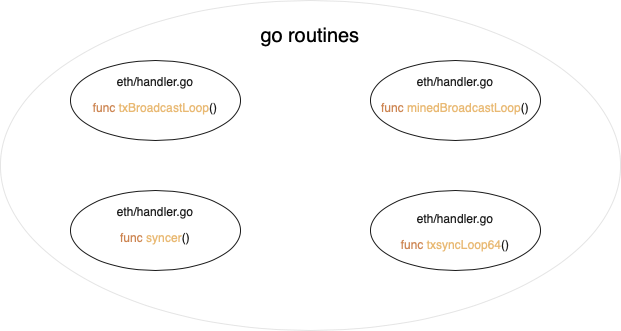

# 以太坊源码分析-P2P本地接收

> P2P上层由Protocols管理，中间层由handler管理，基础层（节点及广播）由node和peer管理。

本文主要讲区块与交易是如何从远端节点同步到本地节点的。



从这四个协程开始挖掘。

`txBroadcastLoop()`和`minedBroadcastLoop()`的作用上次已经分析过，主要是让我们本地自己的节点认为已经知道了本地节点新产生的交易和区块，并不需要广播。而真正的在网络层进行数据传输同步的能力需要`syncer()`和`txsyncLoop64()`提供。

### syncer()

先看此函数工作流程图

.png)

```go
// syncer is responsible for periodically synchronising with the network, both
// downloading hashes and blocks as well as handling the announcement handler.
func (pm *ProtocolManager) syncer() {
	// Start and ensure cleanup of sync mechanisms
	pm.blockFetcher.Start()
	pm.txFetcher.Start()
	defer pm.blockFetcher.Stop()
	defer pm.txFetcher.Stop()
	defer pm.downloader.Terminate()

	// Wait for different events to fire synchronisation operations
	forceSync := time.NewTicker(forceSyncCycle)
	defer forceSync.Stop()

	for {
		select {
		case <-pm.newPeerCh:
			// Make sure we have peers to select from, then sync
			if pm.peers.Len() < minDesiredPeerCount {
				break
			}
			go pm.synchronise(pm.peers.BestPeer())

		case <-forceSync.C:
			// Force a sync even if not enough peers are present
			go pm.synchronise(pm.peers.BestPeer())

		case <-pm.noMorePeers:
			return
		}
	}
}
```

上述函数主要有最开始的两个协程和for中的一个函数`synchronise()`，下面逐一分析。

最开始的两个协程loop的代码有五六百行，就不在这里放了，直接说一下到底做了什么工作。

#### BlockFetcher loop

Fetcher和Downloader是两个很重要且较为庞大的成员需要单独拎出来分析。

当你接收到其他节点广播过来的部分信息（如区块的哈希或交易的哈希），Fetcher会主动去请求与其相关完整的信息。

Downloader是你需要主动去和网络同步，以太坊认为这是一个比较大的数据传输量，用了download这个词，估计也和全同步和快速同步有关系，后面会对Fetcher和Downloader进行单独分析。