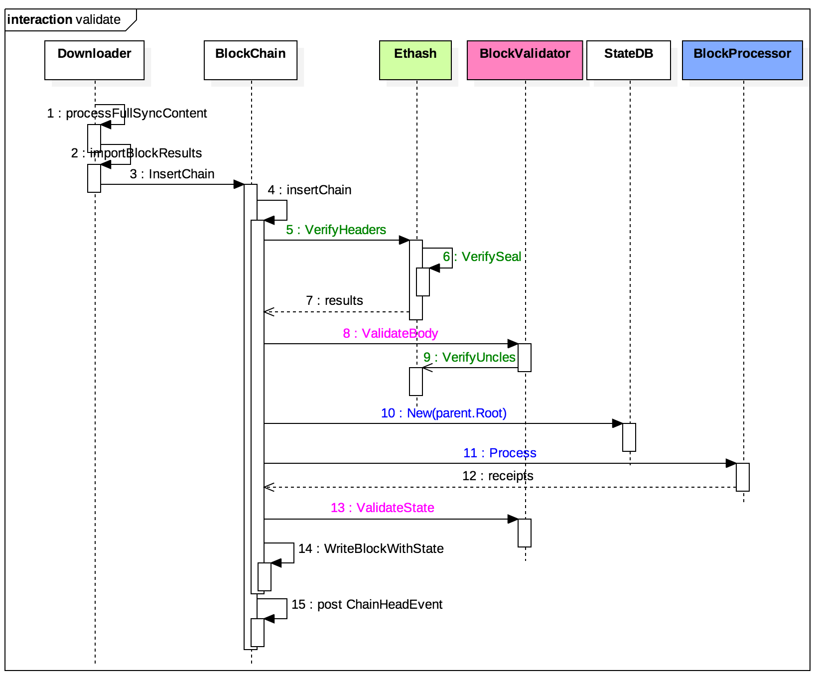
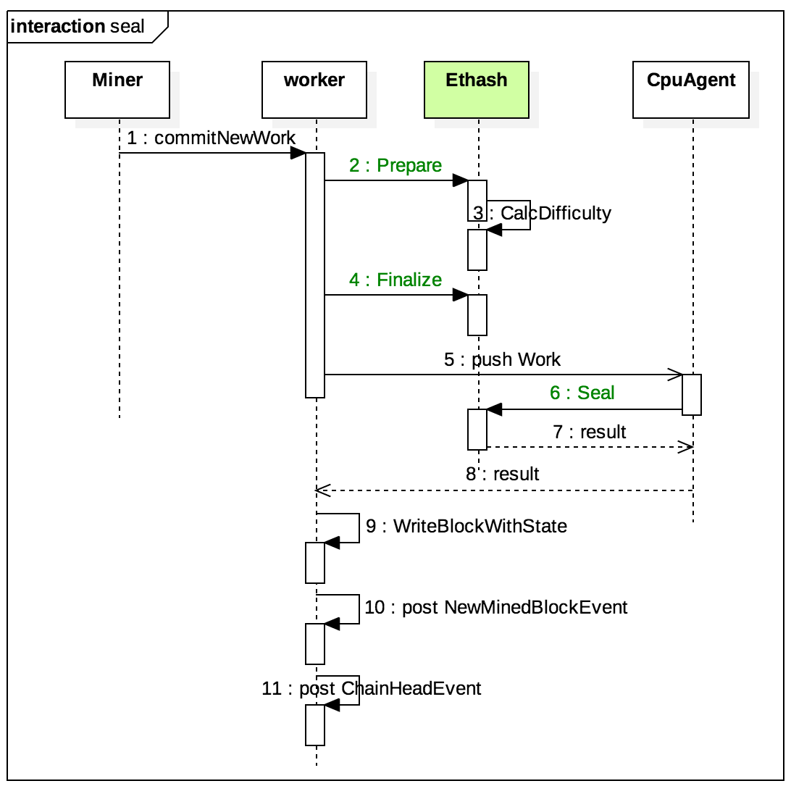

# 以太坊源码分析-共识

+ 在源码目录中，`consensus`提供了以太坊的一些共识算法，`miner`提供以太坊的区块创建和挖矿。
+ **挖矿(`mine`)**是指矿工节点互相竞争生成新区块以写入整个区块链获得奖励的过程。**共识(`consensus`)**是指区块链各个节点对下一个区块的内容形成一致的过程。在以太坊中, `miner`包向外提供挖矿功能，`consensus`包对外提供共识引擎接口。

`Engine`接口定义了共识引擎需要实现的所有函数，实际上按功能可以划分为2类：

区块验证类：以`Verify`开头，当收到新区块时，需要先验证区块的有效性
区块盖章类：包括`Prepare/Finalize/Seal`等，用于最终生成有效区块（比如添加工作量证明）
与区块验证相关联的还有2个外部接口：`Processor`用于执行交易，而`Validator`用于验证区块内容和状态。
另外，由于需要访问以前的区块链数据，抽象出了一个`ChainReader`接口，`BlockChain`和`HeaderChain`都实现了该接口以完成对数据的访问。

目前以太坊中实现了两套共识引擎：

`Clique`：基于`POA(Proof Of Authority)`算法，用于测试网络
`Ethash`：基于`POW(Proof Of Work)`算法，用于正式主网
本文主要分析`Ethash`。

## 区块验证流程



`Downloader`收到新区块后会调用`BlockChain`的`InsertChain()`函数`index, err := d.blockchain.InsertChain(blocks);`插入新区块，此函数实现语句为`func (bc *BlockChain) insertChain(chain types.Blocks, verifySeals bool) (int, error)`。在插入之前需要先要验证区块的有效性，基本分为4个步骤：

+ 验证区块头：调用`Ethash.VerifyHeaders()`
+ 验证区块内容：调用`BlockValidator.VerifyBody()`（内部还会调用`Ethash.VerifyUncles()`）
+ 执行区块交易：调用`BlockProcessor.Process()`（基于其父块的世界状态）
+ 验证状态转换：调用`BlockValidator.ValidateState()`

如果验证成功，则往数据库中写入区块信息，然后广播`ChainHeadEvent`事件。

## 区块盖章(Seal)流程




新产生的区块必须经过**盖章(`seal`)**才能成为有效区块，具体到Ethash来说，就是要执行`POW`计算以获得低于设定难度的`nonce`值。这个其实在之前的挖矿流程分析中已经接触过了，主要分为3个步骤：

+ 准备工作：调用`Ethash.Prepare()`计算难度值
+ 生成区块：调用`Ethash.Finalize()`打包新区块
+ 盖章：调用`Ethash.Seal()`进行`POW`计算，填充`nonce`值

## Ethash实现分析

### Ethash.VerifyHeaders()

``` go
// VerifyHeaders is similar to VerifyHeader, but verifies a batch of headers
// concurrently. The method returns a quit channel to abort the operations and
// a results channel to retrieve the async verifications.
func (ethash *Ethash) VerifyHeaders(chain consensus.ChainReader, headers []*types.Header, seals []bool) (chan<- struct{}, <-chan error) {
	// If we're running a full engine faking, accept any input as valid
	if ethash.config.PowMode == ModeFullFake || len(headers) == 0 {
		abort, results := make(chan struct{}), make(chan error, len(headers))
		for i := 0; i < len(headers); i++ {
			results <- nil
		}
		return abort, results
	}

	// Spawn as many workers as allowed threads
	workers := runtime.GOMAXPROCS(0)
	if len(headers) < workers {
		workers = len(headers)
	}

	// Create a task channel and spawn the verifiers
	var (
		inputs = make(chan int)
		done   = make(chan int, workers)
		errors = make([]error, len(headers))
		abort  = make(chan struct{})
	)
	for i := 0; i < workers; i++ {
		go func() {
			for index := range inputs {
				errors[index] = ethash.verifyHeaderWorker(chain, headers, seals, index)
				done <- index
			}
		}()
	}

	errorsOut := make(chan error, len(headers))
	go func() {
		defer close(inputs)
		var (
			in, out = 0, 0
			checked = make([]bool, len(headers))
			inputs  = inputs
		)
		for {
			select {
			case inputs <- in:
				if in++; in == len(headers) {
					// Reached end of headers. Stop sending to workers.
					inputs = nil
				}
			case index := <-done:
				for checked[index] = true; checked[out]; out++ {
					errorsOut <- errors[out]
					if out == len(headers)-1 {
						return
					}
				}
			case <-abort:
				return
			}
		}
	}()
	return abort, errorsOut
}
```

根据待验证区块的个数确定需要创建的线程数，最大不超过CPU个数。然后创建线程，每个线程会从`inputs`信道中获得待验证区块的索引号，然后调用`verifyHeaderWorker()`函数验证该区块，验证完后向`done`信道发送区块索引号。接下来启动一个循环，首先往`inputs`信道中依次发送区块索引号，然后再从`done`信道中依次接收子线程处理完成的事件，最后返回验证结果。

接下来我们就分析一下`ethash.verifyHeaderWorker()`主要做了哪些工作：

```go
func (ethash *Ethash) verifyHeaderWorker(chain consensus.ChainReader, headers []*types.Header, seals []bool, index int) error {
	var parent *types.Header
	if index == 0 {
		parent = chain.GetHeader(headers[0].ParentHash, headers[0].Number.Uint64()-1)
	} else if headers[index-1].Hash() == headers[index].ParentHash {
		parent = headers[index-1]
	}
	if parent == nil {
		return consensus.ErrUnknownAncestor
	}
	if chain.GetHeader(headers[index].Hash(), headers[index].Number.Uint64()) != nil {
		return nil // known block
	}
	return ethash.verifyHeader(chain, headers[index], parent, false, seals[index])
}
```


首先通过`ChainReader`拿到父块的`header`，然后调用`ethash.verifyHeader()`，这个函数就是真正去验证区块头了，具体细节由以太坊黄皮书的4.3.4节所定义。这个函数比较长，大概列一下有哪些检查项：

+ 时间戳超前当前时间不得大于15s（**为什么这么做，为什么是15s**）

+ 时间戳必须大于父块时间戳

+ 检查区块头难度，通过父块的难度值和当前块的时间戳计算出来的难度值必须和区块头难度值相同

+ 当前块`gas limit`和必须<= 2^63-1

+ 消耗的`gas`(即`gas used`)必须小于`gas limit`

+ 当前块`gas limit`与父块`gas limit`之差的绝对值必须在某一范围内，并且当前块`gas limit`要小于某值

  > ```go
  > // Verify that the gas limit remains within allowed bounds
  > diff := int64(parent.GasLimit) - int64(header.GasLimit)
  > if diff < 0 {
  >    diff *= -1
  > }
  > limit := parent.GasLimit / params.GasLimitBoundDivisor 
  > //params.GasLimitBoundDivisor = 1024
  > //params.MinGasLimit = 5000
  > if uint64(diff) >= limit || header.GasLimit < params.MinGasLimit {
  >    return fmt.Errorf("invalid gas limit: have %d, want %d += %d", header.GasLimit, parent.GasLimit, limit)
  > }
  > ```

+ 区块高度必须是父块高度+1

+ 调用`ethash.VerifySeal()`检查工作量证明

+ 验证硬分叉相关的数据

这里又出现一个`ethash.VerifySeal()`函数，这个函数主要是用来检查工作量证明，具体细节跟算法相关，后面有时间再详细分析。

## BlockValidator.ValidateBody()

```go
// ValidateBody validates the given block's uncles and verifies the block
// header's transaction and uncle roots. The headers are assumed to be already
// validated at this point.
func (v *BlockValidator) ValidateBody(block *types.Block) error {
	// Check whether the block's known, and if not, that it's linkable
	if v.bc.HasBlockAndState(block.Hash(), block.NumberU64()) {
		return ErrKnownBlock
	}
	// Header validity is known at this point, check the uncles and transactions
	header := block.Header()
	if err := v.engine.VerifyUncles(v.bc, block); err != nil {
		return err
	}
	if hash := types.CalcUncleHash(block.Uncles()); hash != header.UncleHash {
		return fmt.Errorf("uncle root hash mismatch: have %x, want %x", hash, header.UncleHash)
	}
	if hash := types.DeriveSha(block.Transactions()); hash != header.TxHash {
		return fmt.Errorf("transaction root hash mismatch: have %x, want %x", hash, header.TxHash)
	}
	if !v.bc.HasBlockAndState(block.ParentHash(), block.NumberU64()-1) {
		if !v.bc.HasBlock(block.ParentHash(), block.NumberU64()-1) {
			return consensus.ErrUnknownAncestor
		}
		return consensus.ErrPrunedAncestor
	}
	return nil
}
```

主要是用来验证区块内容的。

主要做了以下工作：

+ 判断当前数据库中是否已经包含了该区块
+ 验证叔块的有效性和哈希值
+ 验证交易哈希值
+ 检查数据库中是否已经存储父块和父块的状态树

这里出现一个`VerifyUncles()`函数，这个函数主要是用来检查叔块的有效性，下面简单分析。

## Ethash.VerifyUncles()

此函数主要是验证叔块的有效性。

```go
// VerifyUncles verifies that the given block's uncles conform to the consensus
// rules of the stock Ethereum ethash engine.
func (ethash *Ethash) VerifyUncles(chain consensus.ChainReader, block *types.Block) error {
	// If we're running a full engine faking, accept any input as valid
	if ethash.config.PowMode == ModeFullFake {
		return nil
	}
	// Verify that there are at most 2 uncles included in this block
	if len(block.Uncles()) > maxUncles {
		return errTooManyUncles
	}
	if len(block.Uncles()) == 0 {
		return nil
	}
	// Gather the set of past uncles and ancestors
	uncles, ancestors := mapset.NewSet(), make(map[common.Hash]*types.Header)

	number, parent := block.NumberU64()-1, block.ParentHash()
	for i := 0; i < 7; i++ {
		ancestor := chain.GetBlock(parent, number)
		if ancestor == nil {
			break
		}
		ancestors[ancestor.Hash()] = ancestor.Header()
		for _, uncle := range ancestor.Uncles() {
			uncles.Add(uncle.Hash())
		}
		parent, number = ancestor.ParentHash(), number-1
	}
	ancestors[block.Hash()] = block.Header()
	uncles.Add(block.Hash())

	// Verify each of the uncles that it's recent, but not an ancestor
	for _, uncle := range block.Uncles() {
		// Make sure every uncle is rewarded only once
		hash := uncle.Hash()
		if uncles.Contains(hash) {
			return errDuplicateUncle
		}
		uncles.Add(hash)

		// Make sure the uncle has a valid ancestry
		if ancestors[hash] != nil {
			return errUncleIsAncestor
		}
		if ancestors[uncle.ParentHash] == nil || uncle.ParentHash == block.ParentHash() {
			return errDanglingUncle
		}
		if err := ethash.verifyHeader(chain, uncle, ancestors[uncle.ParentHash], true, true); err != nil {
			return err
		}
	}
	return nil
}
```

以太坊规定每个区块打包的叔块不能超过2个。之后收集当前块前7层的祖先块和叔块，用于后面的验证。遍历当前块包含的叔块，做以下检查：

+ 如果祖先块中已经包含过了该叔块，返回错误
+ 如果发现该叔块其实是一个祖先块（即在主链上），返回错误
+ 如果叔块的父块不在这7层祖先中，返回错误
+ 如果叔块和当前块拥有共同的父块，返回错误（也就是说不能打包和当前块相同高度的叔块）
+ 最后验证一下叔块头的有效性

## state.New()

> 调用：statedb, err := state.New(parent.Root, bc.stateCache)

此函数根据父块根hash和bc.stateCache拿到父块的世界状态，比较复杂，后面有时间再详细分析。


## BlockProcessor.Process()

> 调用：receipts, logs, usedGas, err := bc.processor.Process(block, statedb, bc.vmConfig)

```go
// Process processes the state changes according to the Ethereum rules by running
// the transaction messages using the statedb and applying any rewards to both
// the processor (coinbase) and any included uncles.
//
// Process returns the receipts and logs accumulated during the process and
// returns the amount of gas that was used in the process. If any of the
// transactions failed to execute due to insufficient gas it will return an error.
func (p *StateProcessor) Process(block *types.Block, statedb *state.StateDB, cfg vm.Config) (types.Receipts, []*types.Log, uint64, error) {
   var (
      receipts types.Receipts
      usedGas  = new(uint64)
      header   = block.Header()
      allLogs  []*types.Log
      gp       = new(GasPool).AddGas(block.GasLimit())
   )
   // Mutate the block and state according to any hard-fork specs
   if p.config.DAOForkSupport && p.config.DAOForkBlock != nil && p.config.DAOForkBlock.Cmp(block.Number()) == 0 {
      misc.ApplyDAOHardFork(statedb)
   }
   // Iterate over and process the individual transactions
   for i, tx := range block.Transactions() {
      statedb.Prepare(tx.Hash(), block.Hash(), i)
      receipt, err := ApplyTransaction(p.config, p.bc, nil, gp, statedb, header, tx, usedGas, cfg)
      if err != nil {
         return nil, nil, 0, err
      }
      receipts = append(receipts, receipt)
      allLogs = append(allLogs, receipt.Logs...)
   }
   // Finalize the block, applying any consensus engine specific extras (e.g. block rewards)
   p.engine.Finalize(p.bc, header, statedb, block.Transactions(), block.Uncles())

   return receipts, allLogs, *usedGas, nil
}
```

 传进来的`StateDB`是父块的世界状态，执行交易会改变这些状态，为下一步验证状态转移相关的字段做准备。

此函数和挖矿中流程类似，主要做了以下工作：

+ 执行区块中的交易拿到`receipt`
+ 调用`engine.Finalize()`生成区块。

## BlockValidator.ValidateState()

> 调用：if err := bc.validator.ValidateState(block, statedb, receipts, usedGas); err != nil {

```go
// ValidateState validates the various changes that happen after a state
// transition, such as amount of used gas, the receipt roots and the state root
// itself. ValidateState returns a database batch if the validation was a success
// otherwise nil and an error is returned.
func (v *BlockValidator) ValidateState(block *types.Block, statedb *state.StateDB, receipts types.Receipts, usedGas uint64) error {
   header := block.Header()
   if block.GasUsed() != usedGas {
      return fmt.Errorf("invalid gas used (remote: %d local: %d)", block.GasUsed(), usedGas)
   }
   // Validate the received block's bloom with the one derived from the generated receipts.
   // For valid blocks this should always validate to true.
   rbloom := types.CreateBloom(receipts)
   if rbloom != header.Bloom {
      return fmt.Errorf("invalid bloom (remote: %x  local: %x)", header.Bloom, rbloom)
   }
   // Tre receipt Trie's root (R = (Tr [[H1, R1], ... [Hn, R1]]))
   receiptSha := types.DeriveSha(receipts)
   if receiptSha != header.ReceiptHash {
      return fmt.Errorf("invalid receipt root hash (remote: %x local: %x)", header.ReceiptHash, receiptSha)
   }
   // Validate the state root against the received state root and throw
   // an error if they don't match.
   if root := statedb.IntermediateRoot(v.config.IsEIP158(header.Number)); header.Root != root {
      return fmt.Errorf("invalid merkle root (remote: %x local: %x)", header.Root, root)
   }
   return nil
}
```

此函数主要是用来验证区块中和状态转换相关的字段是否正确，主要做了以下工作：

+ 判断刚刚执行交易消耗的gas值是否和区块头中的值相同
+ 根据刚刚执行交易获得的交易回执创建Bloom过滤器，判断是否和区块头中的Bloom过滤器相同
+ 判断交易回执的hash值是否和区块头中的值相同
+ 计算StateDB中的MPT的Merkle Root，判断是否和区块头中的值相同


至此，区块验证完毕，新区块被写入数据库并更新世界状态。


