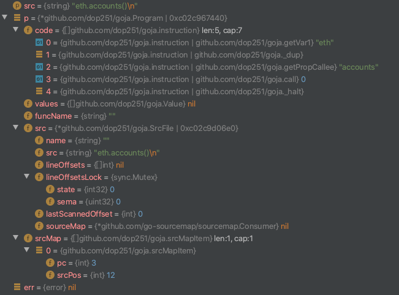
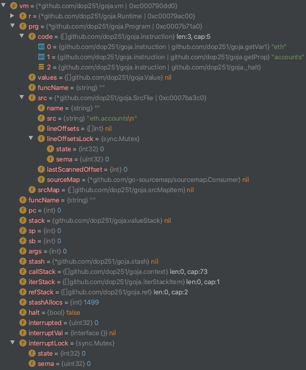

# 以太坊控制台源码分析

进行此项分析的目的是考虑到我们以后做自己的系统，就必须有自己的API，而控制台及RPC调用就是API的窗口，所以想要通过此次分析能够搞清楚从我们在控制台敲下指令之后到控制台显示下一条指令的输入标识符时系统内部到底做了什么事，但是这个有些难度，涉及到js虚拟机和rpc调用，所以⬇️

并没有分析完成，过于深入源码，遇到瓶颈。日期：2020.07.30

分析如下⬇️

当我们在控制台输入JavaScript命令时，命令会送入./console/console.go中的`Evaluate(statement string)`,并且指令就是`statement`。

```go
// Evaluate executes code and pretty prints the result to the specified output
// stream.
func (c *Console) Evaluate(statement string) {
	defer func() {
		if r := recover(); r != nil {
			fmt.Fprintf(c.printer, "[native] error: %v\n", r)
		}
	}()
	c.jsre.Evaluate(statement, c.printer)
}
```

可以看到除了一个defer之外，statement被直接送到jsre去执行，c.printer认为是控制台的标准输出对象。

下面看jsre的Evaluate函数

```go
// Evaluate executes code and pretty prints the result to the specified output stream.
func (re *JSRE) Evaluate(code string, w io.Writer) {
	//执行re.Do(func(){}) fun为回调函数
	re.Do(func(vm *goja.Runtime) {
		val, err := vm.RunString(code) /* FuM:在虚拟机中运行控制台的指令 */
		if err != nil {
			prettyError(vm, err, w)
		} else {
			// 在控制台输出结果
			prettyPrint(vm, val, w)
		}
		fmt.Fprintln(w)
	})
}
```

可以看到，statement成为code，而c.printer成为了io.Writer类型的w

此函数执行了re.Do(func(){})，注意func是作为参数传入的，并没有在这里立即执行，而是会在Do()中被调用，我们看下Do()做了什么事

```go
// Do executes the given function on the JS event loop.
func (re *JSRE) Do(fn func(*goja.Runtime)) {
	done := make(chan bool)
	req := &evalReq{fn, done}
	// 将要执行的指令函数fn加上done作为req写入re.evalQueue,re.evalQueue被本文件中的函数runEventLoop()所监听
	re.evalQueue <- req
	<-done
}
```

创建了一个通道名为done，可以看到第7行使用了<-done，而在第4行也把done作为参数传入了req并在第六行传入re.evalQueue。这样做是为了保证Do()函数能够把整个指令执行完毕之后再返回上一层，因为如果done中没有任何数据，第7行会一直阻塞等待，直到命令执行完毕。

所以我们只需要关注哪个协程监听了re.evalQueue，由命名可知这是一个执行队列。

经过全局搜索，找到了有且仅有一处监听了re.evalQueue通道，如注释中所说，被本文件中的函数runEventLoop()所监听。不难想到，runEventLoop()在以太坊服务启动时就已经执行，函数loop之前那一部分就已经在启动时执行完毕，只有loop那部分一直在循环监听相关通道。由loop之前的代码可以看出来，loop之前一直在声明匿名函数，后面在re.vm虚拟机中也在声明匿名函数。

```go
// This function runs the main event loop from a goroutine that is started
// when JSRE is created. Use Stop() before exiting to properly stop it.
// The event loop processes vm access requests from the evalQueue in a
// serialized way and calls timer callback functions at the appropriate time.

// Exported functions always access the vm through the event queue. You can
// call the functions of the goja vm directly to circumvent the queue. These
// functions should be used if and only if running a routine that was already
// called from JS through an RPC call.
func (re *JSRE) runEventLoop() {
	defer close(re.closed)

	r := randomSource()
	re.vm.SetRandSource(r.Float64)

	registry := map[*jsTimer]*jsTimer{}
	ready := make(chan *jsTimer)

	newTimer := func(call goja.FunctionCall, interval bool) (*jsTimer, goja.Value) {
		delay := call.Argument(1).ToInteger()
		if 0 >= delay {
			delay = 1
		}
		timer := &jsTimer{
			duration: time.Duration(delay) * time.Millisecond,
			call:     call,
			interval: interval,
		}
		registry[timer] = timer

		timer.timer = time.AfterFunc(timer.duration, func() {
			ready <- timer
		})

		return timer, re.vm.ToValue(timer)
	}

	setTimeout := func(call goja.FunctionCall) goja.Value {
		_, value := newTimer(call, false)
		return value
	}

	setInterval := func(call goja.FunctionCall) goja.Value {
		_, value := newTimer(call, true)
		return value
	}

	clearTimeout := func(call goja.FunctionCall) goja.Value {
		timer := call.Argument(0).Export()
		if timer, ok := timer.(*jsTimer); ok {
			timer.timer.Stop()
			delete(registry, timer)
		}
		return goja.Undefined()
	}
	re.vm.Set("_setTimeout", setTimeout)
	re.vm.Set("_setInterval", setInterval)
	re.vm.RunString(`var setTimeout = function(args) {
		if (arguments.length < 1) {
			throw TypeError("Failed to execute 'setTimeout': 1 argument required, but only 0 present.");
		}
		return _setTimeout.apply(this, arguments);
	}`)
	re.vm.RunString(`var setInterval = function(args) {
		if (arguments.length < 1) {
			throw TypeError("Failed to execute 'setInterval': 1 argument required, but only 0 present.");
		}
		return _setInterval.apply(this, arguments);
	}`)
	re.vm.Set("clearTimeout", clearTimeout)
	re.vm.Set("clearInterval", clearTimeout)

	var waitForCallbacks bool

loop:
	for {
		select {
		case timer := <-ready:
			// execute callback, remove/reschedule the timer
			var arguments []interface{}
			if len(timer.call.Arguments) > 2 {
				tmp := timer.call.Arguments[2:]
				arguments = make([]interface{}, 2+len(tmp))
				for i, value := range tmp {
					arguments[i+2] = value
				}
			} else {
				arguments = make([]interface{}, 1)
			}
			arguments[0] = timer.call.Arguments[0]
			call, isFunc := goja.AssertFunction(timer.call.Arguments[0])
			if !isFunc {
				panic(re.vm.ToValue("js error: timer/timeout callback is not a function"))
			}
			call(goja.Null(), timer.call.Arguments...)

			_, inreg := registry[timer] // when clearInterval is called from within the callback don't reset it
			if timer.interval && inreg {
				timer.timer.Reset(timer.duration)
			} else {
				delete(registry, timer)
				if waitForCallbacks && (len(registry) == 0) {
					break loop
				}
			}
			// 接收到要执行的指令
		case req := <-re.evalQueue:
			// run the code, send the result back
			req.fn(re.vm)
			close(req.done)
			if waitForCallbacks && (len(registry) == 0) {
				break loop
			}
		case waitForCallbacks = <-re.stopEventLoop:
			if !waitForCallbacks || (len(registry) == 0) {
				break loop
			}
		}
	}

	for _, timer := range registry {
		timer.timer.Stop()
		delete(registry, timer)
	}
}
```

loop内有三个监听

+ `case timer := <-ready case`，还不清楚作用

+ `req := <-re.evalQueue`,命令执行队列

+ `case waitForCallbacks = <-re.stopEventLoop`，停止监听信号

我们主要看`req := <-re.evalQueue`这一个case

```go
			// 接收到要执行的指令
		case req := <-re.evalQueue:
			// run the code, send the result back
			req.fn(re.vm)
			close(req.done)
			if waitForCallbacks && (len(registry) == 0) {
				break loop
			}
```

`req := &evalReq{fn, done}`

`fn`是刚才Do()中的回调函数，再看此函数

```go
// Evaluate executes code and pretty prints the result to the specified output stream.
func (re *JSRE) Evaluate(code string, w io.Writer) {
	//执行re.Do(func(){}) fun为回调函数
	re.Do(func(vm *goja.Runtime) {
		val, err := vm.RunString(code) /* FuM:在虚拟机中运行控制台的指令 */
		if err != nil {
			prettyError(vm, err, w)
		} else {
			// 在控制台输出结果
			prettyPrint(vm, val, w)
		}
		fmt.Fprintln(w)
	})
}
```

先通过vm.RunString(code)执行控制台指令，之后如果err就输出错误，没有err就输出结果，所以重点在vm.RunString(code)

```go
// RunString executes the given string in the global context.
func (r *Runtime) RunString(str string) (Value, error) {
	return r.RunScript("", str)
}
```

vm.RunString(code)相当简单，我们接着看r.RunScript("", str)

```go
// RunScript executes the given string in the global context.
func (r *Runtime) RunScript(name, src string) (Value, error) {
	p, err := Compile(name, src, false)

	if err != nil {
		return nil, err
	}

	return r.RunProgram(p)
}
```

还不清楚name的作用是什么，可以看到RunString()中对RunScript()传入的name为空字符串。

先对指令进行了编译得到p，然后运行r.RunProgram(p)

编译过程有些繁琐，通过调试可以看到最终结果。



接下来看r.RunProgram(p)

```go
// 这个函数虽然最后只有一个return ，但是这并不是说什么都不return，要return的值已经在函数声明中声明，即(result Value, err error)
// result和err两个变量可以在函数体中直接赋值使用，在return的时候会直接返回到上一次层
// RunProgram executes a pre-compiled (see Compile()) code in the global context.
func (r *Runtime) RunProgram(p *Program) (result Value, err error) {
	defer func() {
		if x := recover(); x != nil {
			if intr, ok := x.(*InterruptedError); ok {
				err = intr
			} else {
				panic(x)
			}
		}
	}()
	recursive := false
	if len(r.vm.callStack) > 0 {
		recursive = true
		r.vm.pushCtx()
	}
	r.vm.prg = p
	r.vm.pc = 0
	ex := r.vm.runTry()
	if ex == nil {
		result = r.vm.pop()
	} else {
		err = ex
	}
	if recursive {
		r.vm.popCtx()
		r.vm.halt = false
		r.vm.clearStack()
	} else {
		r.vm.stack = nil
	}
	return
}
```

此函数先检查了vm中的堆栈，然后执行p，result是要返回的结果，可以看到result = r.vm.pop()是弹出结果，那么执行过程在ex := r.vm.runTry()中，看下runTry()做了什么，ex是抛出的异常(Exception)。

```go
func (vm *vm) runTry() (ex *Exception) {
	return vm.try(vm.run)
}
```

vm.run是一个函数，会在后面解释，先看try(f func())

```go
func (vm *vm) try(f func()) (ex *Exception) {
	var ctx context
	vm.saveCtx(&ctx)

	ctxOffset := len(vm.callStack)
	sp := vm.sp
	iterLen := len(vm.iterStack)
	refLen := len(vm.refStack)

	defer func() {
		······
	}()

	f()
	return
}
```

主要就是最后执行的f()，也就是上面说的vm.run，vm.run如下

```go
func (vm *vm) run() {
	vm.halt = false
	interrupted := false
	ticks := 0
	for !vm.halt {
		if interrupted = atomic.LoadUint32(&vm.interrupted) != 0; interrupted {
			break
		}
		vm.prg.code[vm.pc].exec(vm)
		ticks++
		if ticks > 10000 {
			runtime.Gosched()
			ticks = 0
		}
	}

	if interrupted {
		vm.interruptLock.Lock()
		v := &InterruptedError{
			iface: vm.interruptVal,
		}
		atomic.StoreUint32(&vm.interrupted, 0)
		vm.interruptVal = nil
		vm.interruptLock.Unlock()
		panic(v)
	}
}
```

执行命令的语句在第9行vm.prg.code[vm.pc].exec(vm)，我们先看下vm里面都有什么内容



此时vm.prg.code[vm.pc]是getVar1类型的"eth"，于是到了下面这个函数

```go
func (n getVar1) exec(vm *vm) {
	name := string(n)
	var val Value
	for stash := vm.stash; stash != nil; stash = stash.outer {
		if v, exists := stash.getByName(name, vm); exists {
			val = v
			break
		}
	}
	if val == nil {
		val = vm.r.globalObject.self.getStr(name)
		if val == nil {
			vm.r.throwReferenceError(name)
		}
	}
	vm.push(val)
	vm.pc++
}
```

下面就是对eth这个指令的解析，遇到瓶颈😫

尝试直接增加新的API，可见[以太坊增加API](../以太坊增加API/以太坊增加API.md)一文。

