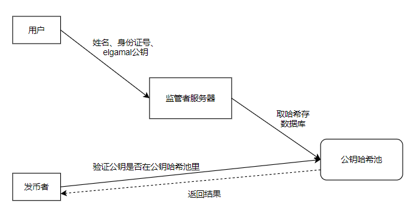
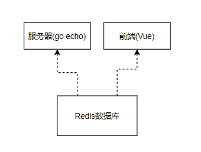

## 监管者模块

监管者作为整个链的监管者，同时作为一个节点和服务器存在，作为节点从区块链上同步最新的区块和交易信息，根据需要进行解密，获得区块链上的匿名解密数据。同时，提供一个服务器，供用户进行身份注册、发币者在用户需要购币时查询用户是否已进行身份登记。

#### 开发工作：

**1.0:服务器**

第一版先实现服务器相关的工作，包括用户身份注册、发币者请求验证两个主要功能

###### 功能流程：



###### 功能说明：

1初始化：

服务器开始运行时判断是否本地已经有公钥哈希池数据库存在，如果本地没有则重新创建

2注册：

收到用户发来的姓名、身份证号、elgamal公钥信息，将elgamal公钥取哈希，连着其他两个信息存放在公钥哈希池里

3.验证：

收到发币者的验证身份请求。收到公钥后，取哈希，在数据库中的哈希字段查询，看是否有匹配的，如果有，则返回验证通过，否则验证失败

###### 项目架构：



###### 接口说明：

##### 后端结构体：

```go
type Identity struct{
	Name string
    ID string
    ExtInfo string //新增个备注信息
}
```

##### Redis存储结构：

选用Redis hash结构

**Key**：从1开始自增序列

**Value**(field ,  value ):

Name :  ...

Number : ...

ExtInfo : ...

##### **启动命令**：根据命令行加载端口号和数据库目录

regulator -- datadir "" --port ""

简化：regulator -d "" -p ""

##### 前后端接口：

/register: ( post https)

输入：

```json
Name string
Number string
HashKey string
ExtInfo string
```
返回：

true/false bool

------

/verify:( post https)

输入：

HashKey string

输出：

true/false bool

##### 2.0：同步交易数据、解密与展示

预期用Vue框架写个前端，边同步交易信息边解密，展示出来就完事了