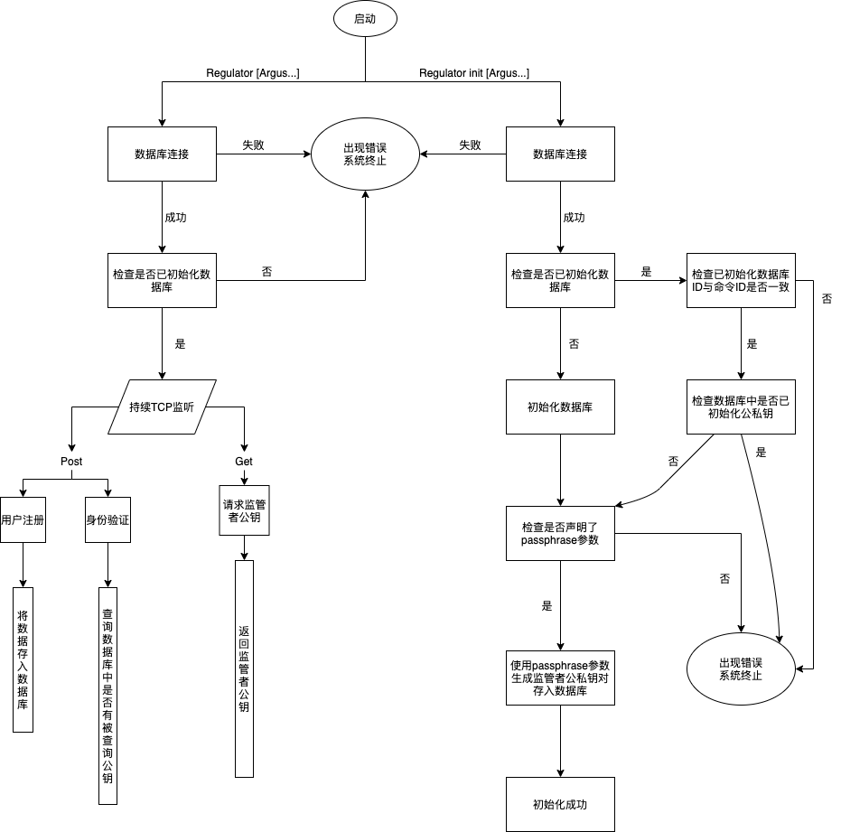

# 监管者模块

监管者作为整个链的监管者，同时作为一个节点和服务器存在，作为节点从区块链上同步最新的区块和交易信息，根据需要进行解密，获得区块链上的匿名解密数据。同时，提供一个服务器，供用户进行身份注册、发币者在用户需要购币时查询用户是否已进行身份登记。

## 项目架构

## 开发工作

### V1.0 服务器端

实现服务器相关的工作，即用户注册、发币者验证请求两个主要功能和数据库存储等。

#### 逻辑流程

#### 功能说明

1.初始化：

​	服务器开始运行时判断是否本地已经有公钥哈希池数据库存在，如果本地没有则重新创建。

2.注册：

​	收到用户发来的姓名、身份证号、elgamal公钥信息，将elgamal公钥取哈希，连着其他两个信息存放在公钥哈希池里。

3.验证：

​	收到发币者的验证身份请求。收到公钥后，取哈希，在数据库中的哈希字段查询，看是否有匹配的，如果有，则返回验证通过，否则验证失败。

#### 接口暴露

+ 服务器默认端口：1423

+ 服务器暴露HTTP接口

  + /register [POST]

    接收JSON参数：{"Name": "12","ID": "123","Hashky": "1234","ExtInfo": "12345"}

    上述参数中除"ExtInfo"外，其他均不能置空。如果字段名写错，认为字段置空。**如果ExtInfo写错，还查不出来。**

    接口功能：将用户注册信息存入数据库

    返回值："Fail!"或"Successful!"

  + /verify [POST]

    接收JSON参数{"Hashky": "1234"}，Hashky为用户公钥，此字段置空或写错，直接返回"False"。
  
    检查用户公钥是否在公钥池中
    
    返回值："True"或"False"
  
  + /regkey [GET]

    接收数字ChainID为参数，此参数必须正确填写，否则会返回相应错误。
  
    返回值：此链监管者的公钥

#### 启动命令

**regulator [Arguments...]**

Arguments选项如下

GLOBAL OPTIONS:
   --database value, --db value  Number of database for Redis (default: 0)
   --dataip value, --di value    Database ip address (default: "localhost")
   --dataport value, --dp value  Data port for Redis (default: 6379)
   --port value, -p value        Network listening port (default: 1423)
   --passwd value, --pw value    Redis password
   --help, -h                    show help
   --version, -v                 print the version

**regulator init [Arguments...]**

Arguments选项如下，其中passphrase必须声明

OPTIONS:
   --chainID value                 chainID to be stored in Redis (default: 1)
   --dataip value, --di value    Database ip address (default: "localhost")
   --database value, --db value    Number of database for Redis (default: 0)
   --dataport value, --dp value    Data port for Redis (default: 6379)
   --passwd value, --pw value      Redis password
   --passphrase value, --ph value  Used to generate public and private key

#### 启动流程

#### 使用方法

在Regulator目录下，使用命令`go build`生成名为`regulator`的可执行文件，配合参数运行此文件即可。服务端运行需要Redis数据库的支持，需要在运行`regulator`前启动redis服务，redis接口等信息可以在启动参数中配置。

### V2.0 前端展示

预期用Vue框架写个前端，边同步交易信息边解密，展示出来。

