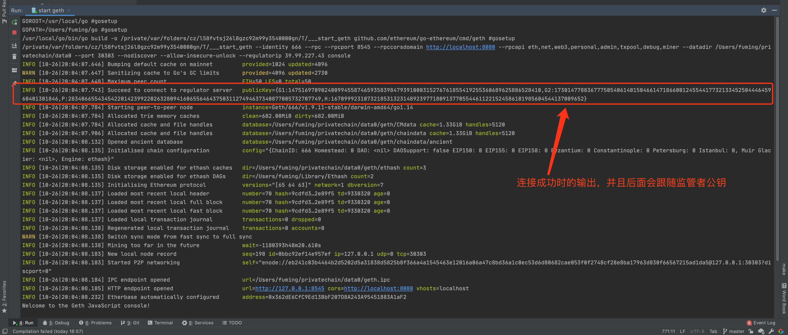

# Geth启动时连接监管者

目前在geth启动时，会连接监管者服务器，拿到监管者公钥。

在core/types/下新增regulator.go文件，用于监管者声明使用，目前文件内容如下：

```go
package types

import "math/big"

type Regulator struct {
	PubK pubKey
	IP   string
	Port int
}

type pubKey struct {
	G1 *big.Int
	G2 *big.Int
	P  *big.Int
	H  *big.Int
}

```

> 后期此对象的函数都可以在这里添加。

在启动时注册node服务时会去连接监管者服务器做一系列操作。监管者对象也存储在node->Regulator中。

#### 新增启动参数

+ `regulatorip`，监管者服务器IP，默认值是127.0.0.1
+ `regulatorport`，监管者服务器端口，默认值是1423

> 我已经把监管者后端服务部署到一个IP为39.99.227.43的云服务器上，端口为默认端口，所以启动时声明--regulatorip 39.99.227.43即可。方便大家编程和调试。

在启动时，此行为会以log的方式显示在console中，如下：

连接成功时的log：



连接失败时的log：

