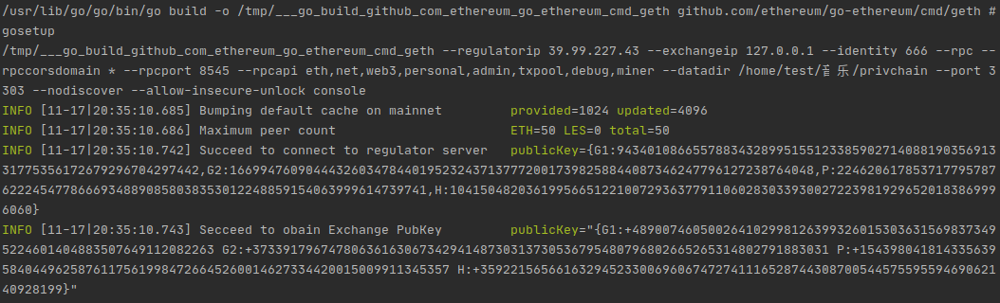

# 交易签名和zkp验签

交易分为两种 ID = 1为 购币交易；ID = 0 为转账交易；如果交易不是1或0则报错

## 购币交易的验签

#### 链启动时连接交易所：

/cmd/geth/main:

**新增变量**Flag:

```go
exchangeFlags = []cli.Flag{
   utils.ExchangeIPFlag,
   utils.ExchangePortFlag,
}
```

**修改函数**init:

```go
app.Flags = append(app.Flags, exchangeFlags...)
```

cmd/utils/flags.go

**新增变量**：

```go
ExchangeIPFlag = cli.StringFlag{
   Name:  "exchangeip",
   Usage: "exchange IP address",
   Value: "127.0.0.1",
}
ExchangePortFlag = cli.IntFlag{
   Name:  "exchangeport",
   Usage: "exchange server port",
   Value: 1323,
}
```

**新增函数**：从上下文ctx中获取exchange的pubKey并加载到eth服务器的设置cfg中

```go
func setExchange(ctx *cli.Context, cfg *eth.Config) 
```

输入：ctx *cli.Context, cfg *eth.Config 输入都为指针，在设置的时候直接在内存更改内容

**修改函数**：SetEthConfig中增加步骤setExchange

eth/backend.go:

**修改函数**：New eth服务时增加把exchange写进txPoolconfig里

```go
config.TxPool.Exchange = config.Exchange
```

eth/config.go:

**增加变量**：

```go
Exchange types.Exchange
```


启动链之前启动[交易所](https://github.com/xdlianrong/Geth-Comments/tree/master/exchange)，交易所现在是在链启动后3秒自动界所下账户。

和[监管者](https://github.com/xdlianrong/Geth-Comments/blob/master/dev/Geth%E5%90%AF%E5%8A%A8%E6%97%B6%E8%BF%9E%E6%8E%A5%E7%9B%91%E7%AE%A1%E8%80%85.md)连接类似，新增交易所Exchange，启动参数

--exchangeip 默认127.0.0.1

--exchangeport 默认8545

#### 对购币交易的验签：

core/tx_pool.go:

**新增函数**验证购币签名，使用交易所服务器的公钥

```go
func (pool *TxPool) validateSign(tx *types.Transaction) error
```

输入：以TxPool为对象，TxPool中加载出config里的exchange，对tx验证签名

**新增错误类型**ErrVerifySig

```go
ErrVerifySig = errors.New("verify puchase signature failed")
```

**修改函数** add  :  ID为1时验证购币签名

```
if err := pool.validateSign(tx); err != nil {
   log.Trace("Discarding invalid transaction", "hash", hash, "err", err)
   invalidTxMeter.Mark(1)
   return false, err
}
```

common/hexutil/json.go：

**新增函数：**将hexutil.Bytes转化为[]byte，方便使用

```go
func (b Bytes) Btob() []byte
```

## 对转账交易的验零知识证明：

core/types/tansaction.go:

**增加函数**：增加交易中字段转化为进行零知识证明字段的api:

```go
func (tx *Transaction) EVS() zkp.CypherText
func (tx *Transaction) EVR() zkp.CypherText
func (tx *Transaction) CMsFP() zkp.FormatProof
func (tx *Transaction) CMrFP() zkp.FormatProof
func (tx *Transaction) BP() zkp.BalanceProof
func (tx *Transaction) EVO() zkp.CypherText
func (tx *Transaction) ERPK() zkp.CypherText
func (tx *Transaction) ESPK() zkp.CypherText
func (tx *Transaction) EvoEP() zkp.EqualityProof
func (tx *Transaction) ErpkEP() zkp.EqualityProof
func (tx *Transaction) EspkEP() zkp.EqualityProof
```

core/txpool.go：

**增加错误类型：**各种零知识证明验证不通过的类型

```go
ErrVerifyEvSFormatProof = errors.New("verify EvS FormatProof failed")

ErrVerifyEvRFormatProof = errors.New("verify EvR FormatProof failed")

ErrVerifyBalanceProof = errors.New("verify BalanceProof failed")

ErrVerifyTotalEqualityProof = errors.New("verify total equality proof failed")

ErrVerifySpkEqualityProof = errors.New("verify Spk equality proof failed")

ErrVerifyRpkEqualityProof = errors.New("verify Rpk equality proof failed")

ErrIDFormat = errors.New("ID is not 1 or 0, or ID format is wrong")
```

**增加函数**：验证零知识证明

```go
func (pool *TxPool) verifyzkp(tx *types.Transaction) error
```

输入：以TxPool为对象，TxPool中加载出config里的regulator，对tx验证零知识证明，分别验证6项，有不通过的会具体报错，都通过后会打印一条INFO，之后交易整个通过审查又会有一条INFO

**修改函数：**add中判断ID=0验证购币签名，ID=0验证零知识证明，都不是就报错

```
if tx.ID() == 1 {
   // sig fail abondon
   if err := pool.validateSign(tx); err != nil {
      ...
   }
} else if tx.ID()==0 {
   //verify zkp
   if err := pool.verifyzkp(tx); err != nil {
      ...
   }
} else {
      err := ErrIDFormat
      ...
}
```

## 正确的输出：

连接交易所服务器的正确输出：



转账交易验证零知识证明输出：

