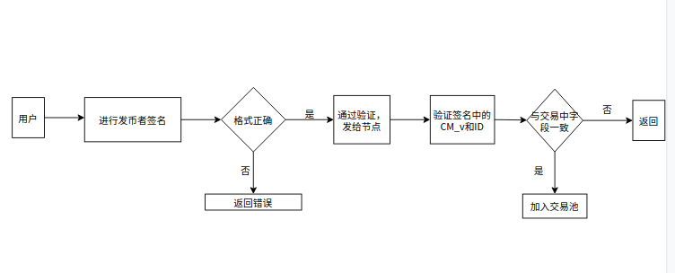

### 概述

发币者签名模块设计，主要是在发币者已经签名好的发币交易中SIG字段还原出ID和承诺，比对和交字段中的ID和承诺字段是否一致。

设计考虑，发币者账户进行发币交易的上链，与链交互时对交易签名前进行一些步骤的增加，用发币者的私钥对其中相应字段进行签名并放到交易里。之后普通的对交易的签名不变，不再增加对发币交易的签名

### 模块架构



### 功能设计

签名：给定的交易和发币者私钥对一个交易中的ID，CM_v进行签名操作

验签：给定的交易，从签名中还原出发币者公钥，并比对ID，CM_v验证，看是否一致

### 接口

###### core/types/transaction_signing.go

1.修改函数

```go
func SignTx(tx *Transaction, s Signer, prv *ecdsa.PrivateKey) (*Transaction, error) {
...
   //add
   i := tx.CmV()+tx.ID()
   b := make([]byte, 8)
   binary.BigEndian.PutUint64(b, i)
   msg := crypto.Keccak256(b)
   Sig, err := crypto.Sign(msg, prv)
   tx.data.Sig = binary.BigEndian.Uint64(Sig)
...
}
```

修改SignTx函数，使得在对交易进行正常的签名之后对CMV和ID部分签名，而且其结果不影响r,s,v的值，r，s，v仍然是对以前未改变的交易字段的签名


###### **core/tx_pool.go**

2.增加类型

```go
ErrVerifySignatureFailed = errors.New("verify signature failed")
```

交易池进行验证出现错误的时候自定义的错误类型和信息，并加入日志


3.增加函数

```go
func (pool *TxPool) validateSign(tx *types.Transaction, local bool) error
```

增加对交易字段的Sig验证，看购币的签名是否有效


4.修改函数

```go
func (pool *TxPool) add(tx *types.Transaction, local bool) (replaced bool, err error) {
    ...
    // add
    if err := pool.validateSign(tx, local);err != nil{
		log.Trace("Sig verify failed", "hash", hash)
		return false, err
	}
    ...
}
```

修改add函数，在交易进入交易池时增加一部验证Sig，调用(3)validateSign


5.增加和修改远程交易进入交易池时的验证，和本地类似