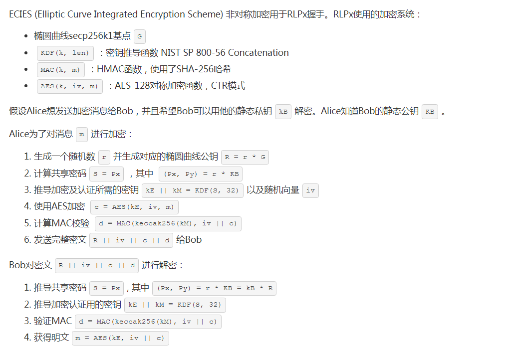
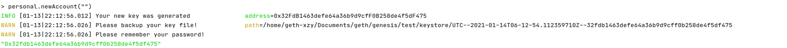
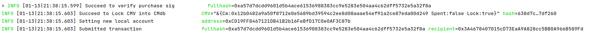
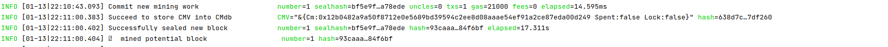
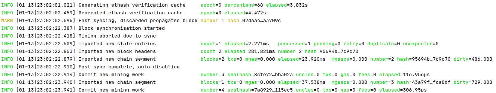
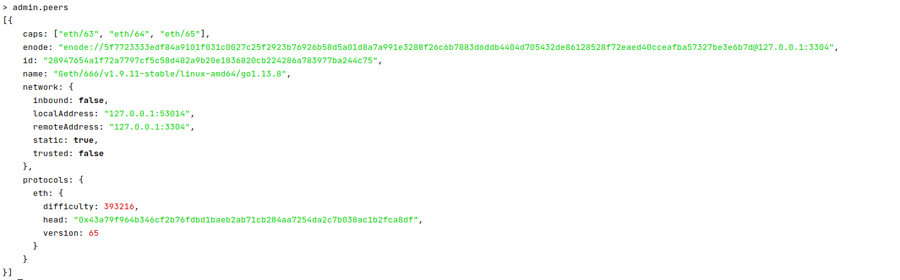

# 国密替换

## 1 配置创始区块启动国密

本方案使用自助可控的方式启动国密链，在genesis.json中加入参数"cryptoType"，0为非国密，1为国密。缺省为非国密。

下面是使用方法：

```json
{
  "config": {
    "chainId": 665,
    "homesteadBlock": 0,
    "eip150Block": 0,
    "eip150Hash": "0x0000000000000000000000000000000000000000000000000000000000000000",
    "eip155Block": 0,
    "eip158Block": 0,
    "byzantiumBlock": 0,s
    "constantinopleBlock": 0,
    "petersburgBlock": 0,
    "istanbulBlock": 0,
    "ethash": {},
    "cryptoType": 1   /*密码类型字段*/
  },
  "nonce": "0x0",
  "timestamp": "0x5ddf8f3e",
  "extraData": "0x0000000000000000000000000000000000000000000000000000000000000000",
  "gasLimit": "0x47b760",
  "difficulty": "0x00002",
  "mixHash": "0x0000000000000000000000000000000000000000000000000000000000000000",
  "coinbase": "0x0000000000000000000000000000000000000000",
  "alloc": { },
  "number": "0x0",
  "gasUsed": "0x3",
  "parentHash": "0x0000000000000000000000000000000000000000000000000000000000000000"
}
```

在每次配置创世区块后，将CryptoType写入数据库，每次启动区块链配置全节点的时候，将CryptoType写入读出，并开启国密开关。

下面是新的创世区块的config子字段的新增字段

```go
type ChainConfig struct {
	......
	CryptoType          uint8 `json:"cryptoType"`
    ......
}
```

在读取创世区块json文件序列化的地方新增了一些字段，可以参考（core/gen_genesis.go）

## 2 设计目标

| 非国密                  | 国密 |
| ----------------------- | ---- |
| ECC（ecdsa/ecdh/ecies） | SM2  |
| SHA3（SHA256）          | SM3  |
| AES（AES-128）          | SM4  |

(注：国密算法SM2, SM3, SM4均基于[国产密码学标准](http://www.gmbz.org.cn/main/bzlb.html)开发)

## 3 数据结构差异

| 算法类型   | 标准版                                         | 国密版                                             |
| :--------- | :--------------------------------------------- | :------------------------------------------------- |
| 签名       | ECDSA (公钥长度: 512 bits, 私钥长度: 256 bits) | SM2 (公钥长度：512 bits, 私钥长度：256 bits)       |
| 哈希       | SHA3 (哈希串长度: 256 bits)                    | SM3 (哈希串长度: 256 bits)                         |
| 对称加解密 | AES (加密秘钥长度: 128bits)                    | SM4 (对称密钥长度: 128 bits)                       |
| 交易长度   | 520bits(其中标识符8bits,签名长度512bits)       | 1024bits(128字节，其中公钥512bits,签名长度512bits) |

## 4 替换方案

### 4.1 底层密码配置

在（crypto/config.go）中

```go
const (
   CRYPTO_ECC_SH3_AES = 0 //原始标准加密算法
   CRYPTO_SM2_SM3_SM4 = 1 //国密标准算法
)
var CryptoType = CRYPTO_ECC_SH3_AES //缺省为国际标准
```

并提供了以下功能函数

```go
func SetCryptoType(cryptoType uint8) // 配置密码类型
func GetCryptoType()(int) // 密码类型查询
func BaseCheck(cryptoType byte) error // 密码类型错误检验
```

### 4.2 哈希函数

原生哈希函数采用sha3的keccak256标准，里面有256bit和512bit的hash函数。

因为sm3仅提供256bit输出，所以本方案仅将SHA-256替换为sm3，在底层封装如下（crypto/crypto.go）

```go
func Keccak256(data ...[]byte) []byte 
func Keccak256Hash(data ...[]byte) (h common.Hash)
```

下面的函数封装，先采用散列压缩，再采用EIP55编码的方法，对新生成的地址进行16进制编码。原函数在（common/types.go）中，将其封装在（crypto/crypto.go）中。

```go
func AddressToHex(a common.Address) string 
```

### 4.3 公钥密码

原生公钥密码采用ECC标准，椭圆曲线采用secp256k1曲线。并且封装了加解密，签名验签，密钥协商协议，在p2p节点通信的时候ecies集成加密方案。本方案将上述椭圆曲线替换为sm2p256v1。

注：加解密和密钥协商协议等封装在crypto/ecies包中，现在将其进一步封装在crypto/crypto.go中，并对应加入sm2的对应实现。

#### 4.2.1 国密节点配置

国密节点采用sm2椭圆曲线上的一个点（将横纵坐标拼接以后得到相应的节点）。在运行p2p网络的时候启动，并且验证节点的可靠性（即该点是否在sm2p256v1上）。

新增国密节点配置（params/bootnodes.go）

```go
var MainnetGMBootnodes = []string{
  "enode://c9107dd7157cee6325e20f1ad6a5edeeffa130db06e0b365dca5e524c840b27ca2394e7e0f7dd69ca3eeb19d22cead58685a53347eee21297670df5ae156b353@101.132.183.35:30313", // CN
}
```

设置启动节点类型（crypto/crypto.go）

```go
func SetNode() (urls []string)
```

#### 4.2.2 地址生成

1. 采用ECDSA的密钥生成算法，将私钥（32字节）映射成公钥（65字节）
2. 通过SHA256算法压缩65字节的公钥为32字节
3. 取后20字节为用户地址公钥

将ECDSA的密钥生成算法替换为SM2密钥生成算法，散列压缩由SHA256更改为SM3

下面是（crypto/crypto.go)中所有的密钥生成算法与对应生成地址的处理函数。

```go
func ToECDSAUnsafe(d []byte) *ecdsa.PrivateKey 
func toECDSA(curve elliptic.Curve, d []byte, strict bool) (*ecdsa.PrivateKey, error) 
func UnmarshalPubkey(pub []byte) (*ecdsa.PublicKey, error) 
func FromECDSAPub(pub *ecdsa.PublicKey) []byte 
func GenerateKey() (*ecdsa.PrivateKey, error) 

func PubkeyToAddress(p ecdsa.PublicKey) common.Address 
```

#### 4.2.3 加解密

公钥加解密主要应用在rlpx协议中。

把ecdsa的加解密替换为sm2的加解密，将底层加解密过程封装在（crypto/crypto.go）中。

```go
func Encrypt(pub *ecdsa.PublicKey, m, s1, s2 []byte) (ct []byte, err error) 
func Decrypt(pri *ecdsa.PrivateKey, c, s1, s2 []byte) (m []byte, err error) 
```

#### 4.2.4 签名与验签

ecdsa签名算法中有从签名内容中直接恢复公钥的方法，但是sm2没有，因此为了可以使有验证需求的用户获取签名方公钥，因此把签名者的公钥写进交易中。

下面是对整个系统中签名长度的拓展（该拓展的实现同样影响了ecdsa签名整体长度，给系统造成了一定开销，后面再想办法）,（crypto/crypto.go）

```go
const SignatureLength = 64 + 1 + 32 // 65 -----> 97
```

交易字段的添加和对应方法的添加（core/types/transaction.go）

```go
type txdata struct {
	...
	PK    []byte  `json:"pk"   gencodec:"required"`
    ...
}

func (tx *Transaction) Pk() []byte 
```

下面是对签名的修改，在本sm2算法中将公钥写到了签名的后32字节，因此在签名和验签的时候要对如下函数或方法进行修改（core/types/transaction_signing.go）

```go
func (s EIP155Signer) SignatureValues(tx *Transaction, sig []byte) (R, S, V *big.Int, err error) 
func recoverPlain(sighash common.Hash, R, S, Vb *big.Int, homestead bool, pk []byte) (common.Address, error) 
```

下面是对底层签名验签密码的修改，包括了从签名恢复公钥，签名算法，验签算法，椭圆曲线点（公钥）序列化算法（crypto/signature_cgo.go）

```go
func Ecrecover(hash, sig []byte) ([]byte, error) 
func SigToPub(hash, sig []byte) (*ecdsa.PublicKey, error) 

func Sign(digestHash []byte, prv *ecdsa.PrivateKey) (sig []byte, err error) 

func VerifySignature(pubkey, digestHash, signature []byte) bool 
func ValidateSignatureValues(v byte, r, s *big.Int, homestead bool) bool /*该函数在crypto.go中*/

func DecompressPubkey(pubkey []byte) (*ecdsa.PublicKey, error) 
func CompressPubkey(pubkey *ecdsa.PublicKey) []byte 
```

#### 4.2.5 密钥协商协议

ecdh密钥协商协议，Diffie–Hellman密钥协商过程在椭圆曲线密码体制上的应用。在本区块链系统中应用在rlpx握手中，初始状态（密码）是使用ECDH密钥协商来确定的，后面共享通信加密密钥的过程要用到集成加密方案ECIES。

RLPx协议属于会话层的协议，主要功能是在节点之间建立并维持通信，节点的发现和节点之间数据流的传输主要是由传输层的UDP和TCP协议完成。RLPx协议实现了完备的前向安全性，即现有的密钥泄漏不会导致之前信道上的信息被破解，因为RLPx协议每次建立的连接都使用了不同的密钥。

把ecdh协议替换为sm2的密钥协商协议，将底层密钥协商过程封装在（crypto/crypto.go）中。

```go
func GenerateShared(pri *ecdsa.PrivateKey, pub *ecdsa.PublicKey, skLen, macLen int) (sk []byte, err error) 
```

#### 4.2.6 集成加密方案

集成加密方案ecies利用在节点通信的rlpx协议中，最终通信双发共享协商密钥，通过此密钥加密P2P通信信息。



椭圆曲线更改为sm2p256v1 ,主要是对rlpx握手过程中ecdsa公私钥生成算法替换为sm2公私钥生成算法。

数据结构修改如下（p2p/rlpx.go）

```go
type encHandshake struct {
	initiator            bool
	remote               *ecdsa.PublicKey  // remote-pubk
	initNonce, respNonce []byte            // nonce
	randomPrivKey        *ecdsa.PrivateKey // ecdhe-random
	remoteRandomPub      *ecdsa.PublicKey  // ecdhe-random-pubk
}
// secrets represents the connection secrets
// which are negotiated during the encryption handshake.
type secrets struct {
	Remote                *ecdsa.PublicKey
	AES, MAC              []byte
	EgressMAC, IngressMAC hash.Hash
	Token                 []byte
}
```

下面是两种不同的握手过程，分别由发送者和接收者发起。（p2p/rlpx.go）具体内容参考源码。

```go
func receiverEncHandshake(conn io.ReadWriter, prv *ecdsa.PrivateKey) (s secrets, err error)
func initiatorEncHandshake(conn io.ReadWriter, prv *ecdsa.PrivateKey, remote *ecdsa.PublicKey) (s secrets, err error) 
```

### 4.4 对称密码

对称密码应用在节点同步的ecies集成加密方案中，主要把AES-128分组密码算法更换为SM4算法, 采用CTR模式

下面是（crypto/ecies/params.go）中的内容

```go
ECIES_SM4_SM3256 = &ECIESParams{
		Hash:      sm3.New,
		hashAlgo:  crypto.SHA256,
		Cipher:    sm4.NewCipher,
		BlockSize: sm4.BlockSize,
		KeyLen:    16,
	}
```

## 5 国密算法测试

### 5.1 账户生成



### 5.2 交易发送



### 5.3 区块打包挖矿



### 5.4 节点同步

节点一挖矿：


节点二同步结果：



节点二节点信息注册：



## 6 使用说明

使用时仅需要在创世区块中添加"cryptoType": 1 字段开启国密链（具体可以参照1中所述），其他步骤和以前配置启动一致。如果字段不填，区块链缺省采用国际标准密码算法。
