# 组网测试

对我们的项目进行组网测试，commit哈希为45513afd8cd5abf469c787b9a33229bd8f807790。

[TOC]

## 环境配置

+ 两台云服务器
  + 节点A，IP：39.105.58.136，OS：Linux 4.18.0-147.5.1.el8_1.x86_64，go-version：go version go1.13.15 linux/amd64
  + 节点B，IP：39.99.227.43  ，OS：Linux 3.10.0-862.14.4.el7.x86_64，go-version：go1.15.2 linux/amd64
+ 监管者和交易所分别部署至IP地址为39.99.227.43、39.105.58.136的服务器上。
+ 注意交易所启动时发币方账户不能写错，位数出错会报错。

### 节点初始化

------------------------------------------------------------------------------**在两台服务器均执行以下操作**---------------------------------------------------------------------------

安装screen。

将项目clone至`/root/Geth-Comments/`，执行`make geth`产生二进制文件，路径为`/root/Geth-Comments/go-ethereum-release-1.9/build/bin/geth`。

新建目录`/root/fuming/privatechain`，作为本次测试的数据目录。

新建文件`genesis.json`，内容如下：

```json
{
  "config": {
    "chainId": 666,
    "homesteadBlock": 0,
    "eip150Block": 0,
    "eip150Hash": "0x0000000000000000000000000000000000000000000000000000000000000000",
    "eip155Block": 0,
    "eip158Block": 0,
    "byzantiumBlock": 0,
    "constantinopleBlock": 0,
    "petersburgBlock": 0,
    "istanbulBlock": 0,
    "ethash": {}
  },
  "nonce": "0x0",
  "timestamp": "0x5fc496af",
  "extraData": "0x0000000000000000000000000000000000000000000000000000000000000000",
  "gasLimit": "0x47b760",
  "difficulty": "0x00002",
  "mixHash": "0x0000000000000000000000000000000000000000000000000000000000000000",
  "coinbase": "0x0000000000000000000000000000000000000000",
  "alloc": {"0x0000000000000000000000000000000000000001": {
    "balance": "65000000000000000"
  },
  "0x0000000000000000000000000000000000000002": {
    "balance": "65000000000000000"
  }},
  "number": "0x0",
  "gasUsed": "0x0",
  "parentHash": "0x0000000000000000000000000000000000000000000000000000000000000000"
}
```

新建目录`data0`作为geth的数据目录。

新建脚本`init.sh`，作geth初始化使用，内容如下：

```shell
/root/Geth-Comments/go-ethereum-release-1.9/build/bin/geth --datadir /root/fuming/privatechain/data0 --regulatorip 39.99.227.43 --exchangeip 39.105.58.136 init genesis.json
```

新建脚本`startChain.sh`，作geth启动使用，内容如下：

```shell
screen -S geth /root/Geth-Comments/go-ethereum-release-1.9/build/bin/geth --identity "666" --rpc --rpcport "8545" --rpcaddr "0.0.0.0" --rpccorsdomain "http://localhost:8080" --rpcapi "eth,net,web3,personal,admin,txpool,debug,miner" --datadir /root/fuming/privatechain/data0 --port "30303" --nodiscover --allow-insecure-unlock --regulatorip 39.99.227.43 --exchangeip 39.105.58.136 console
```

运行`init.sh`后执行`startChain.sh`启动geth。

通过`personal.newAccount()`创建新账户。

服务器防火墙开启8545 30303等端口。

------------------------------------------------------------------------------**在两台服务器均执行以下操作**---------------------------------------------------------------------------

### 区块同步

节点B挖矿，挖出少量块后停止。

在节点Aconsole通过`admin.addPeer`添加远程节点。

节点会同步数据，同步完成后可以进行查询。

结果如下：

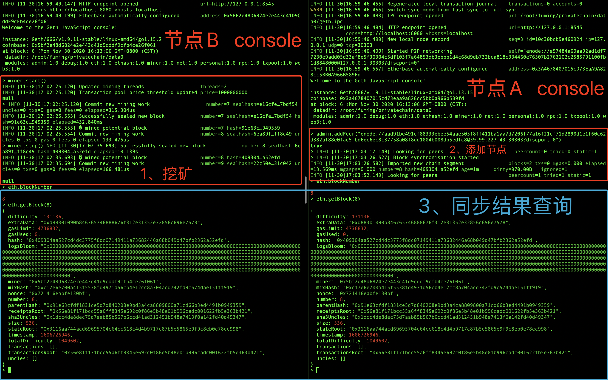

### 交易同步

#### 购币交易

产生用户信息Alice：

```
公钥：
P:23158503204866606878247683869141083298862329779186781781739485292503178313119
G1:1541430036556726082748542036328279607656335063574518437670897322914489863204
G2:23151252049300677509918839321017513805845621921309221446892902279112552935265
H:10858392270853510287273630415394871733794130524623080170584039543033853377923
私钥：
X:22565038426189670711636265246428364679397428085395524658084418094861316723156
```

注册：

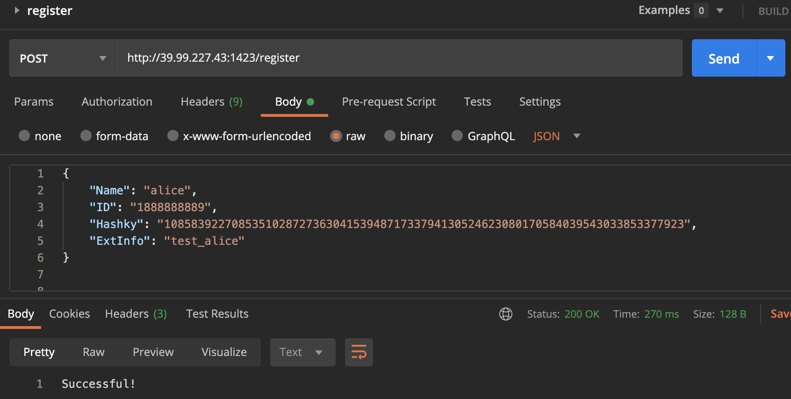

向交易所发送金额为100的购币请求，得到购币承诺cmv和此次购币的随机数密文（用户公钥加密后的密文）下图中明文为“0x3130323133313339303433323635343137393931”：

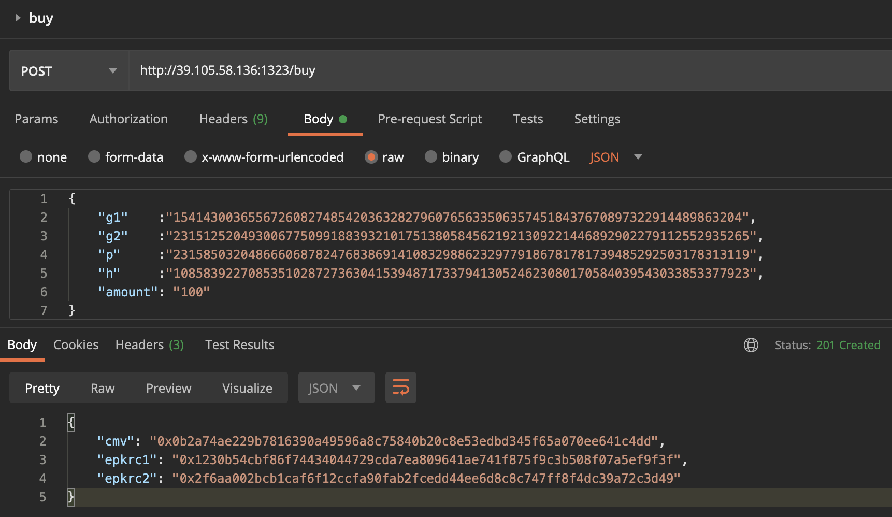

在交易所console也可以看到交易所在其节点发出了购币交易：

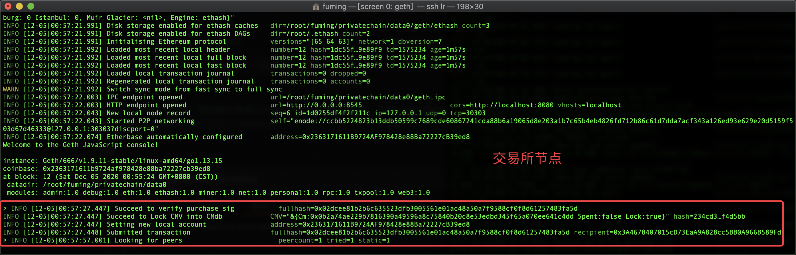

购币承诺被写入承诺池并置为锁定状态，当挖矿打包此交易时，此承诺状态会被解锁。在其他节点也可以看到此交易被同步。


接下来挖矿使此交易（哈希为0x02dcee81b2b6c635523dfb3005561e01ac48a50a7f9588cf0f8d61257483fa5d）生效：

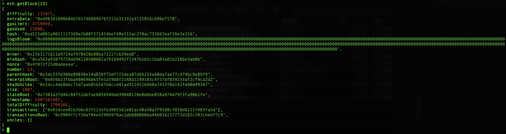

同时在其他节点可以看到同步后承诺被解锁：

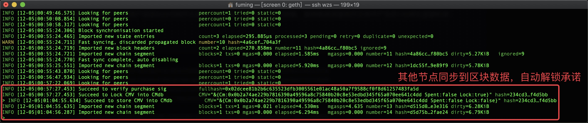

#### 转账交易（花费一次承诺）

我们的项目废弃了以太坊原有的账户模型，代码中还账户模型但不再有任何影响。

本次转账使用接下来将要产生的用户信息Bob对购币交易中产生的用户信息Alice进行转账，被转账承诺是购币交易中产生的100单位金额的承诺。

产生用户信息Bob：

```
公钥：
P:23158503204866606878247683869141083298862329779186781781739485292503178313119
G1:9298292652558831425267252200765367451602983462361117298129230823094271573829
G2:6180763306755706556892942433112244414464748362537851039508246128021857490356
H:20439173173154845936799344559252178663696648880071003203561343546044904594198
私钥：
X:12242307708001631664959677375917652456109202229169068070931043359776541839024
```

并发送至监管者进行注册。

两节点账户如下：

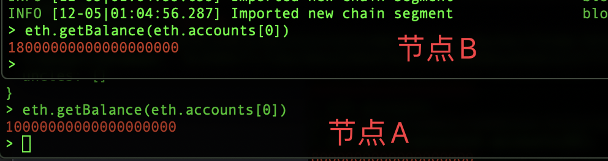

用户的公钥信息是将P、G1、G2、H分别转化为64位16进制数，并按此顺序拼接得到的结果。

故

>  Alice公钥：33333f914834ced561c145797d9b5782719dbd1b43a668d4b01151f9c0e67d9f148ea5aafa45e0def3aa623791870b4ddcf5d3386ec202e7ef503f0158a77f450daa3024bbce1f3a436214f3f22d5ce4400bf2d9261f91d1f39399ee2fe5d5b42d30297c7d0213b3f94c648eba052e0ed462675fc91d0e3c23d27021588b5b16

> Bob公钥：33333f914834ced561c145797d9b5782719dbd1b43a668d4b01151f9c0e67d9f03686b21b97930755446e511338a0d9540d8751bbd9d76a08cceca0493d48c24332f24f0f94b8233c97da3af8f76b8b17ab80baad732227c4b52e8c1e828ef611801a1d9f9ec9114936943edc8b1b8ee8548e4d784ff0ca8628e0093a08bfd83

产生交易信息（节点A(from)向节点B(to)转账）：转账2（0x2）价值单位，找零98（0x62）价值单位

```json
{
    "jsonrpc": "2.0",
    "method": "eth_sendTransaction",
    "params": [
        {
            "from": "0x2363171611b9724af978428e88ba72227cb39ed8",
            "to": "0xca7a9d77579378a8a2c3d1e708dc8ff07e550798",
            "gas": "0x76c0",
            "gasPrice": "0x9184e72a000",
            "value": "0x1",
            "id":"0x0",
            "data": "0xd46e8dd67c5d32be8d46e8dd67c5d32be8058bb8eb970870f072445675058bb8eb970870f072445675",
            "spk": "33333f914834ced561c145797d9b5782719dbd1b43a668d4b01151f9c0e67d9f148ea5aafa45e0def3aa623791870b4ddcf5d3386ec202e7ef503f0158a77f450daa3024bbce1f3a436214f3f22d5ce4400bf2d9261f91d1f39399ee2fe5d5b42d30297c7d0213b3f94c648eba052e0ed462675fc91d0e3c23d27021588b5b16",
            "rpk": "33333f914834ced561c145797d9b5782719dbd1b43a668d4b01151f9c0e67d9f03686b21b97930755446e511338a0d9540d8751bbd9d76a08cceca0493d48c24332f24f0f94b8233c97da3af8f76b8b17ab80baad732227c4b52e8c1e828ef611801a1d9f9ec9114936943edc8b1b8ee8548e4d784ff0ca8628e0093a08bfd83",
            "s": "0x2",
            "r": "0x62",
            "vor":"0x3130323133313339303433323635343137393931",
            "cmo":"0x0b2a74ae229b7816390a49596a8c75840b20c8e53edbd345f65a070ee641c4dd"
        }
    ],
    "id": 67
}
```

解锁账户后，对节点A RPC端口发送此交易信息。

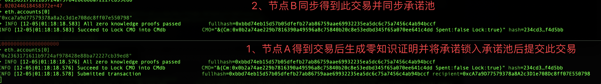

可以看到本次交易hash为0xbbd74eb15d57b05dfefb27ab86759aae69932235ea5dc6c75a7456c4ab94bccf

挖矿并同步，可以看到被花费的交易已经被置为“已花费”，而发出的和找零的两个承诺都被加入承诺池，并可以花费。

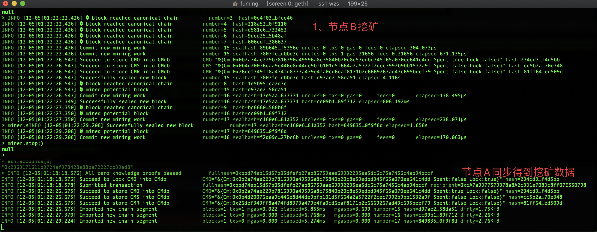

查看具体交易内容：

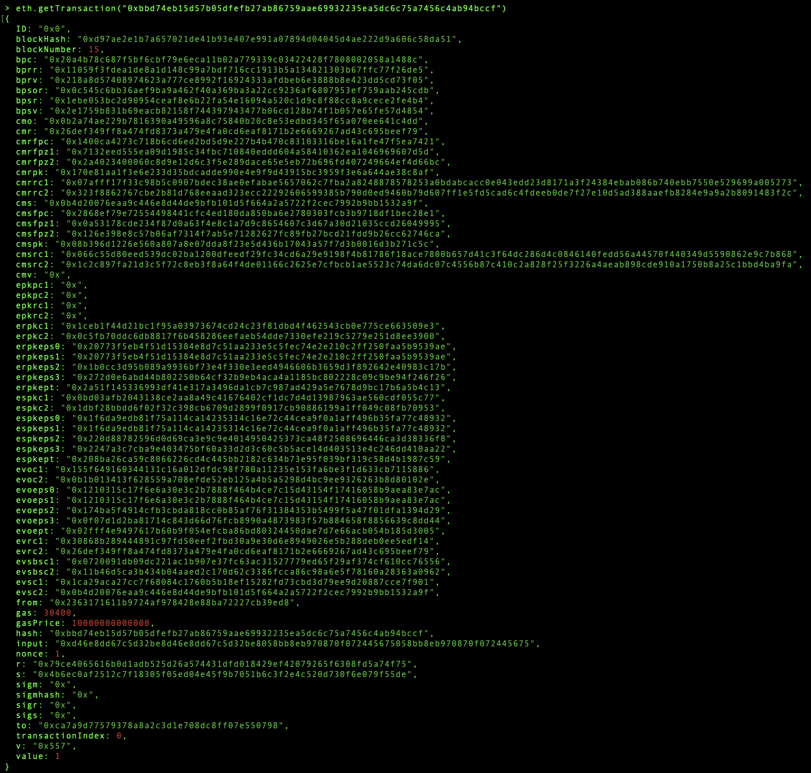

对于交易中的数据，接收方（Alice）进行如下操作：

+ 用自己的私钥解密evsbsc1和evsbsc2得到交易金额：

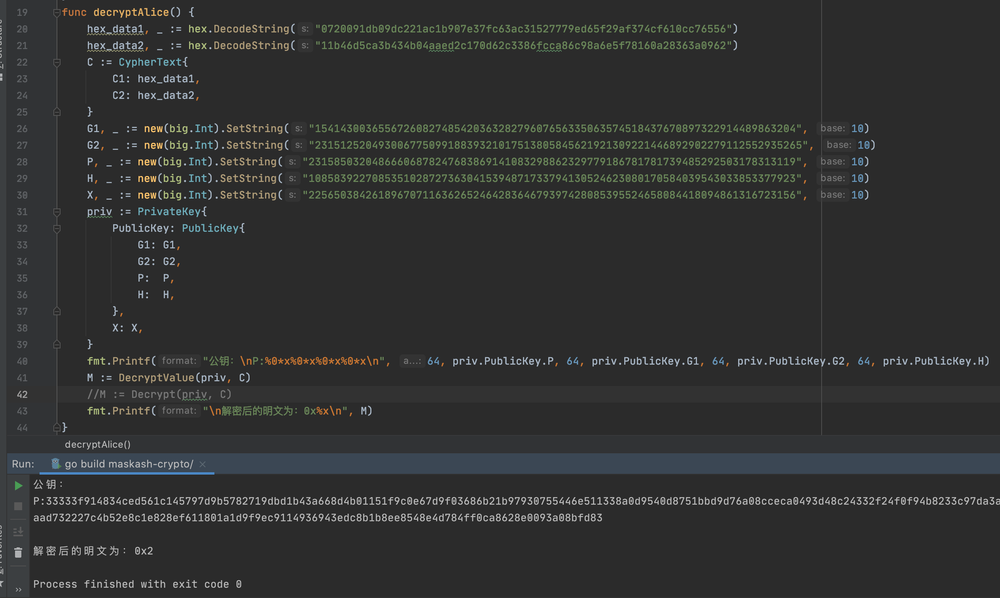

从交易中可以看到找零承诺cmr与发送额承诺cms，并且有接收方公钥加密的cms随机数r的密文cmsrc1和cmsrc2，发送方公钥加密的cmr随机数r的密文cmrrc1和cmrrc2。

使用发送方Bob的私钥对cmrrc1和cmrrc2解密，得到随机数r：0x0199c584efd4e7638b56b65e850be82cb2ce03c51d35dbb61c2dea6534e6cee0

使用接收方Alice的私钥对cmsrc1和cmsrc2解密，得到随机数r：0x2b9affd4edd6d065197197cef3da7f461ccc1a84e8d3ec23dbbd1a94252380e9

所以

发送方Bob花费了一个金额为100价值单位的承诺，承诺为0x0b2a74ae229b7816390a49596a8c75840b20c8e53edbd345f65a070ee641c4dd，其随机数为0x3130323133313339303433323635343137393931

Bob发出2价值单位，故Bob得到98价值单位的找零承诺，承诺值为0x26def349ff8a474fd8373a479e4fa0cd6eaf8171b2e6669267ad43c695beef79，其随机数为0x0199c584efd4e7638b56b65e850be82cb2ce03c51d35dbb61c2dea6534e6cee0

Alice得到2价值单位的找零承诺，承诺值为0x0b4d20076eaa9c446e8d44de9bfb101d5f664a2a5722f2cec7992b9bb1532a9f，其随机数为0x2b9affd4edd6d065197197cef3da7f461ccc1a84e8d3ec23dbbd1a94252380e9

#### 转账交易（花费二次承诺）

为了证明交易产生的新承诺可以消费，作出如下验证。

使用Alice得到的2价值单位的承诺，向bob发起转账：

产生交易信息（节点A(from)向节点B(to)转账）：

```json
{
    "jsonrpc": "2.0",
    "method": "eth_sendTransaction",
    "params": [
        {
            "from": "0x2363171611b9724af978428e88ba72227cb39ed8",
            "to": "0xca7a9d77579378a8a2c3d1e708dc8ff07e550798",
            "gas": "0x76c0",
            "gasPrice": "0x9184e72a000",
            "value": "0x1",
            "id":"0x0",
            "data": "0xd46e8dd67c5d32be8d46e8dd67c5d32be8058bb8eb970870f072445675058bb8eb970870f072445675",
            "spk": "33333f914834ced561c145797d9b5782719dbd1b43a668d4b01151f9c0e67d9f03686b21b97930755446e511338a0d9540d8751bbd9d76a08cceca0493d48c24332f24f0f94b8233c97da3af8f76b8b17ab80baad732227c4b52e8c1e828ef611801a1d9f9ec9114936943edc8b1b8ee8548e4d784ff0ca8628e0093a08bfd83",
            "rpk": "33333f914834ced561c145797d9b5782719dbd1b43a668d4b01151f9c0e67d9f148ea5aafa45e0def3aa623791870b4ddcf5d3386ec202e7ef503f0158a77f450daa3024bbce1f3a436214f3f22d5ce4400bf2d9261f91d1f39399ee2fe5d5b42d30297c7d0213b3f94c648eba052e0ed462675fc91d0e3c23d27021588b5b16",
            "s": "0x1",
            "r": "0x1",
            "vor":"0x2b9affd4edd6d065197197cef3da7f461ccc1a84e8d3ec23dbbd1a94252380e9",
            "cmo":"0x0b4d20076eaa9c446e8d44de9bfb101d5f664a2a5722f2cec7992b9bb1532a9f"
        }
    ],
    "id": 67
}
```

解锁账户后，对节点A RPC端口发送此交易信息。

节点A控制台输出如下：

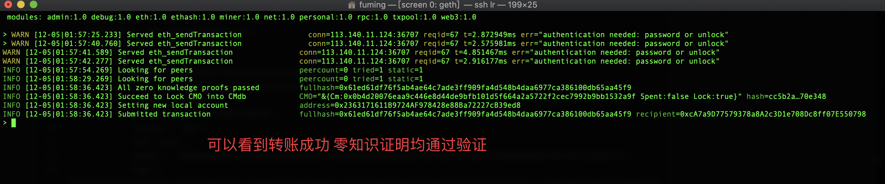

被花费承诺可以通过零知识证明，剩余步骤与上述花费一次承诺的过程相同，不再赘述。

