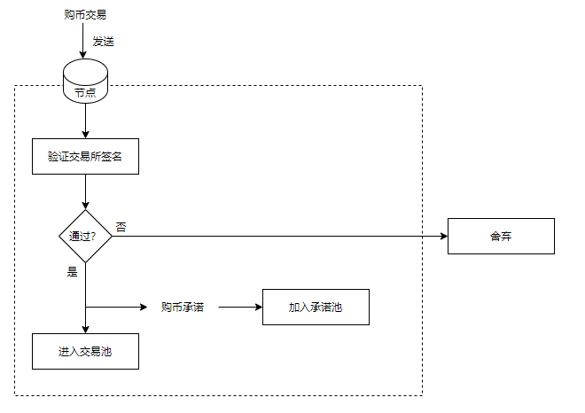
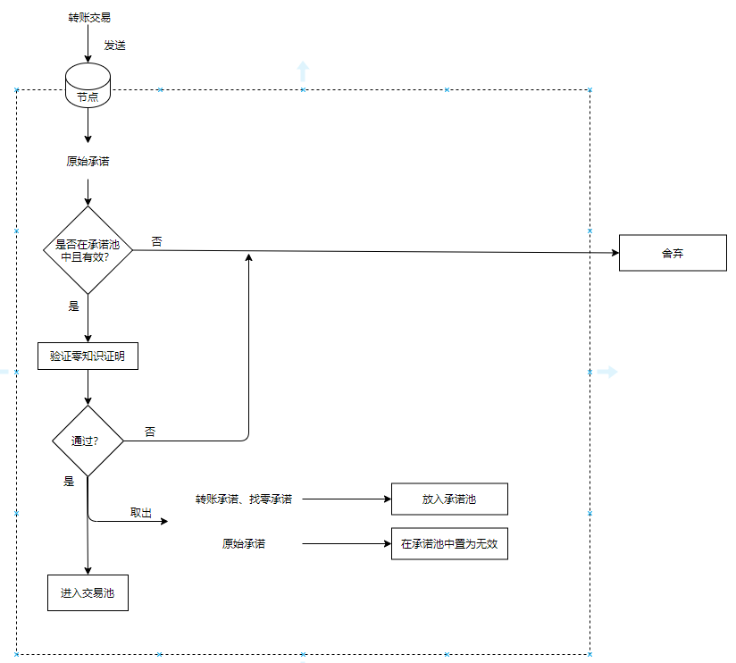
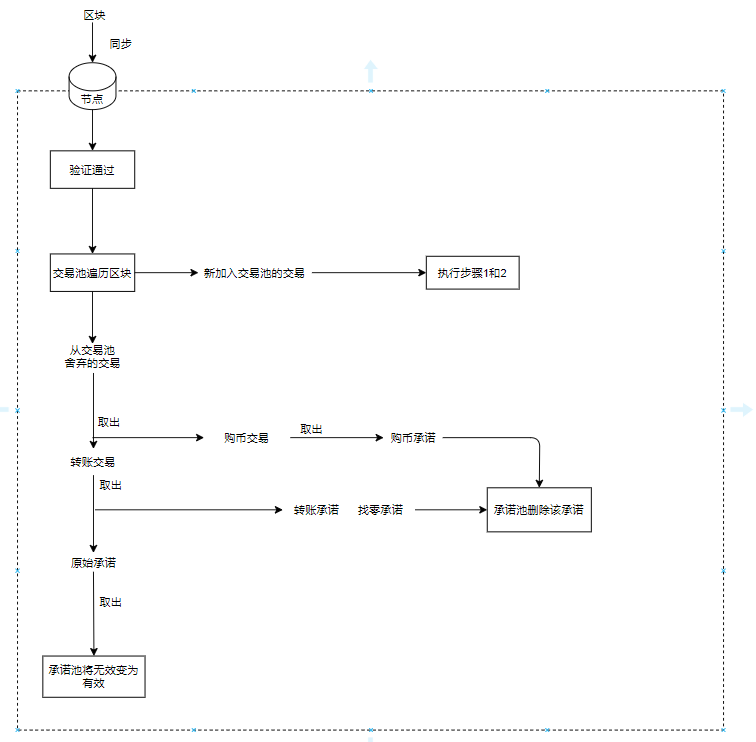

## 任务1：对购币交易的原签名删除，和验证签名的重构、验证零知识证明

## **任务2：条件触发交易池和承诺池交互**

为了矿工挖矿，每个全节点，

#### **1购币交易进入交易池的时候，**

验证签名，若通过则购币承诺**加入**到承诺池里

#### **2转账交易进入交易池的时候，**

1验证花费的CM_o是否在承诺池中？

2验证零知识证明

3将CM_o于承诺池中**置为无效**，将转账结果和找零承诺CM_o，CM_r**加入到承诺池**里

#### **3节点同步区块后**

将交易池里由于已经由他人打包区块带来所有交易的状态改变，影响到承诺池的，进行回退操作：包括**增加、删除、无效置为有效**

记录其他人的问题：交易分为ID为01的购币与转账交易判断，验证零知识证明、验证购币签名、承诺池的拓展、试试我们的链能不能用智能合约