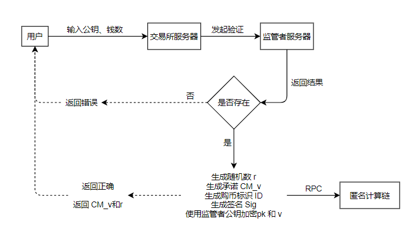

# 交易所模块

假设用户是通过向发行者购买的方式获得初始数字货币的，然后才能进行转账交易。购币的核心操作：发行者将用户购得的数字货币承诺的哈希值添加到系统的承诺池中。

其中cm形式为pederson承诺。

## 功能流程：



##### 其中和以前方案的冲突：

将生成签名的步骤移到这一步

## 功能说明：

### 初始化

通过输入端口号初始化程序（缺省1323），发行者输入任意字符串用来初始化公私钥

### 发行者生成公私钥

通过GenerateKeys算法生成发行者公私钥，如果本地文件中已经有了公私钥配置，则不再生成

输入：任意字符串

输出：公钥，私钥

### 接收用户响应

设置监听端口，接收用户发来的publickey和amount判断publickey合法

将publickey发送http请求至监管者服务器（:1423/verify）,若返回false跳出程序，返回ture进入下一步

### 承诺生成

先生成uint64位随机数r，利用承诺生成算法CommitByUint64

输入：监管者公钥struct，amount，r

输出：CM_v，规范后的r

### ElGamal加密

调用加密算法Encrypt

输入：监管者公钥struct，用户publickey与amount的拼接字符串作为明文

输出：交易所服务器E( pk , v )。(C1，C2)

### 发行者签名

调用加密算法Sign

输入：发行者私钥，用户发来的amount

输出：Signature

### sendTranscation

将交易信息打包通过rpc方式发送上链。

如果上链成功。

返回用户交易回执（CM_v，r）

##### RPC接口：

eth_sendTransaction：暂时先见./dev/RPC接口文档，之后应该要修改接口以判断购币还是转账交易

## 监听接口

服务器端口号：缺省1323

路由```/buy```暴露给用户，用户输入json样例如下

```json
{
    "publickey" : "0x35763484753468478343432",
    "amount" : "423412"
}
```

## 启动命令

GLOBAL OPTIONS:
   --port value, -p value      the port of this server (default: "1323")
   --help, -h                           show help


