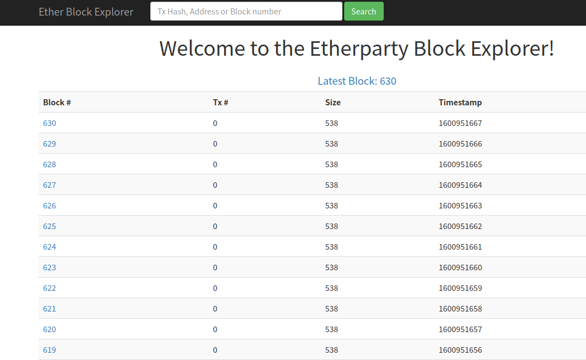
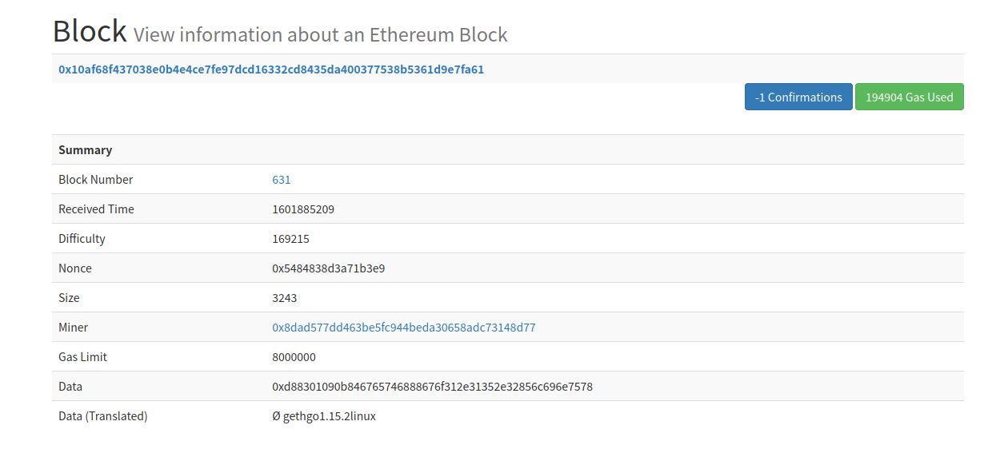
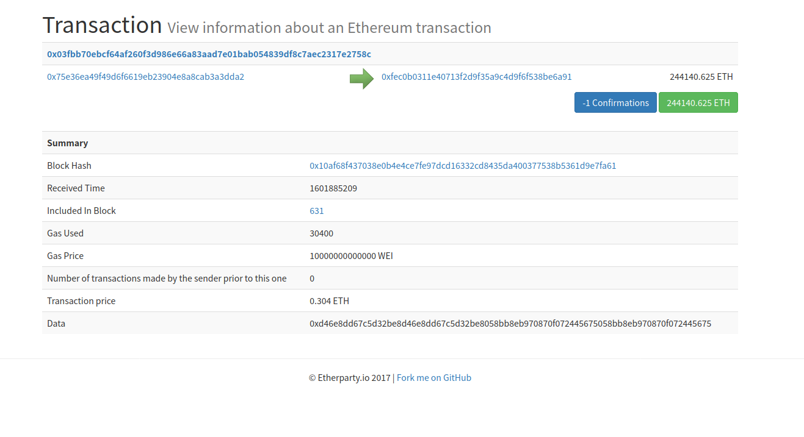

### 区块链浏览器

做一个适配匿名计算链的区块链浏览器：先仿照https://github.com/etherparty/explorer完成普通的浏览器，再讨论如何美化；

另外，监管者到时候最好也可以复用这个页面，实现解密操作

##### 框架：Vue

##### 功能：仿照开源浏览器先实现三个页面：

main :  显示总体的信息

blockInfos ： 显示一个区块信息

transactionInfos ： 显示一个交易的信息

##### 示例：

main

block

transaction

