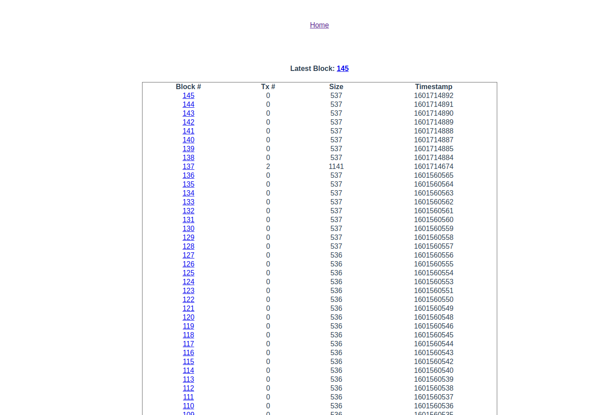
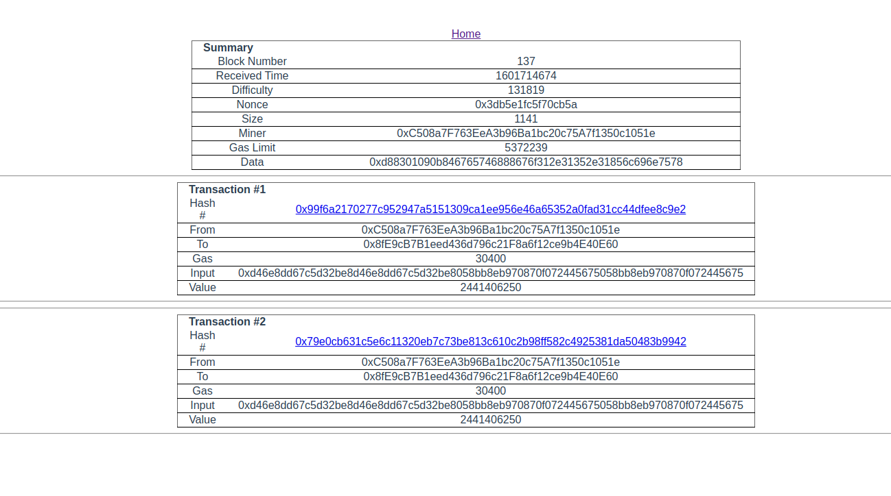
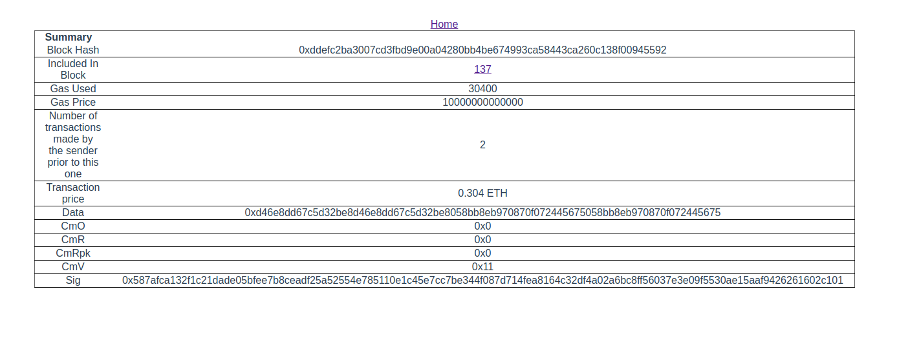
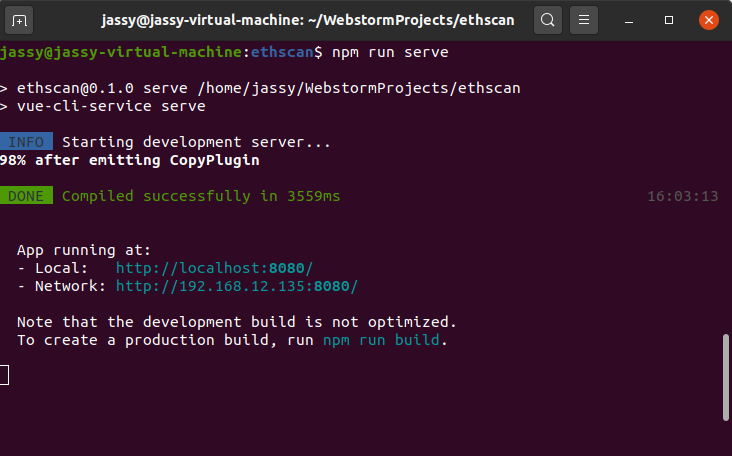
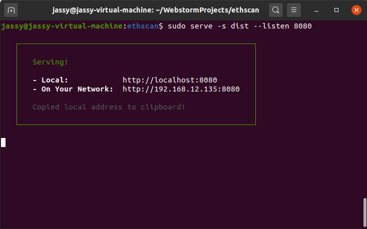

# 区块链浏览器

做一个适配匿名计算链的区块链浏览器：先仿照https://github.com/etherparty/explorer完成普通的浏览器，再讨论如何美化；

另外，监管者到时候最好也可以复用这个页面，实现解密操作

## 框架：Vue 

环境：

+ node@v10.0.0
+ npm@v5.6.0

## 开发工作

### v1.0 

#### 初步仿照开源浏览器explorer先实现三个页面

main :  显示总体的信息

block ： 显示一个区块信息及该区块下的交易信息简要

transaction ： 显示一个交易的完整信息

main



block



transaction



#### 启动方法

首先进入explorer目录

```
cd explorer/
```

安装依赖：

```node
npm install
```

运行：

```
npm run serve
```



或者通过 `npm run build`编译生成静态资源dist（已同步推送到github中）

```
npm run build
```

先安装静态部署工具serve

```
npm install -g serve
```

然后通过serve指定一个端口部署

```
serve -s dist --listen 8080
```




