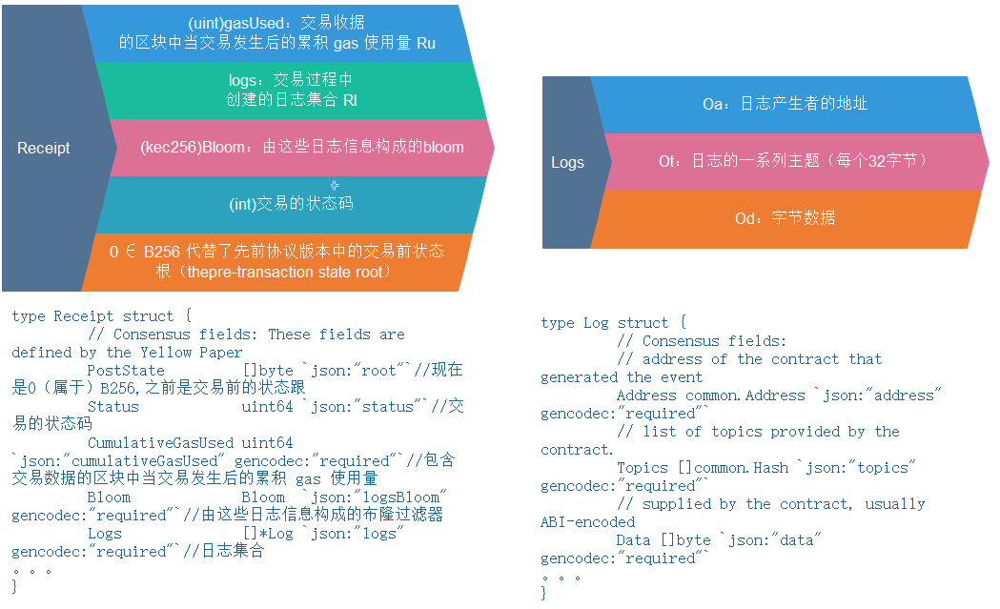
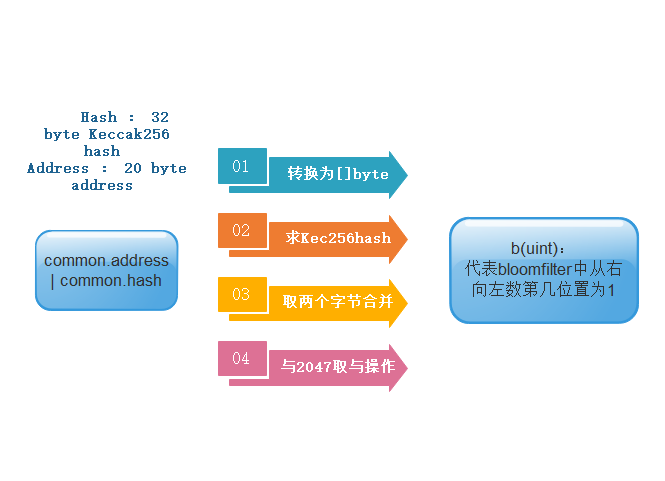
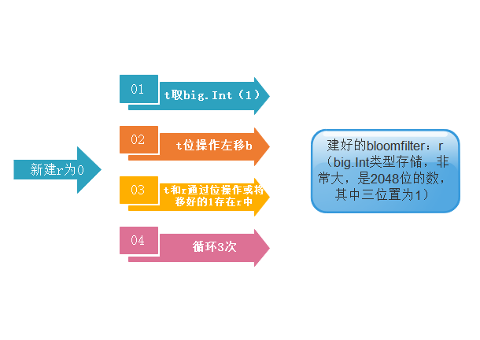

###### 布隆过滤器简介

Bloom filter(布鲁姆过滤器)是用于测试元素成员资格的空间高效概率数据结构。数据结构以牺牲规定的假阳性率为代价实现了巨大的数据压缩。

###### 原理

一个Bloom过滤器作为一个m位的数组全部设置为0。选择一组k个随机散列函数，在Bloom过滤器中添加元素时，元素将分别进行哈希散列，而对于每个k个输出，该索引处的相应的Bloom过滤器位将被设置为1。通过使用与之前相同的散列函数来完成Bloom过滤器的查询。如果在bloom过滤器中访问的所有k个比特被设置为1，则这很可能表明该元素位于该集合中。删除元素只能通过废除Bloom过滤器并从头重新创建来完成。

Bloom过滤器是由底层数组和哈希函数组合在一起工作的，根据对误报率要求的不同，可以选择一个哈希函数，也可以选2个、3个，一般情况下选3个。与哈希表不同，为节省空间，Bloom过滤器的底层数组的每一位是一个比特，1表示有映射，0表示无映射。数组的长度与问题规模、哈希函数、误报率等因素有关，根据数据集规模的不同，可选用适当的哈希函数与适合的数组大小。因为具体问题的不同，很难说那种实现是最好的。

###### 举例

下面举例说明Bloom过滤器的工作过程。

  

数据集{x,y,z}，底层数组长度m=18，初始值全部为0，哈希函数个数k=3，分别为H1、H2 、H3。

首先把数据集的每个元素分别通过3个不同的哈希函数映射到底层数组中，将数组中对应位置的值置为1。可以看到有哈希碰撞发生，这里不用解决哈希碰撞。

当要判断一个元素是否在数据集中时，例如w，则依次计算3个哈希值，找数组中的映射值，如果映射值有一个为0则，元素不存在数据集中，如果3个对应映射值全部为1，则元素很大概率在数据集中，不能完全确定（因为哈希碰撞的存在）。图中，元素w的其中一个哈希映射为0，所以w一定不在数据集中。

###### 缺点

因为哈希碰撞的原因，底层数组对应映射值为1，有可能是其他元素与要查找的元素发生碰撞，实际上，该元素并不存在在数据集中。所以Bloom过滤器存在误报率。

Bloom过滤器，只有插入、查找操作，没有删除操作。

###### 以太坊中的布隆过滤器

**1.其中的两个带有bloom的结构：**

收据中的布隆过滤器是所有日志信息的布隆过滤器的并集

```go
type Receipt struct {
	// Consensus fields: These fields are defined by the Yellow Paper
	PostState         []byte `json:"root"`//现在是0（属于）B256,之前是交易前的状态跟
	Status            uint64 `json:"status"`//交易的状态码
	CumulativeGasUsed uint64 `json:"cumulativeGasUsed" gencodec:"required"`//包含交易数据的区块中当交易发生后的累积 gas 使用量
	Bloom             Bloom  `json:"logsBloom"         gencodec:"required"`//由这些日志信息构成的布隆过滤器
	Logs              []*Log `json:"logs"              gencodec:"required"`//日志集合

	// Implementation fields: These fields are added by geth when processing a transaction.//执行领域，在执行交易时被geth添加，存储在区块链数据库
	// They are stored in the chain database.
	TxHash          common.Hash    `json:"transactionHash" gencodec:"required"`
	ContractAddress common.Address `json:"contractAddress"`
	GasUsed         uint64         `json:"gasUsed" gencodec:"required"`

	//Inclusion information: These fields provide information about the inclusion of the
	//transaction corresponding to this receipt.//提供与此收据有关的交易记录
	BlockHash        common.Hash `json:"blockHash,omitempty"`
	BlockNumber      *big.Int    `json:"blockNumber,omitempty"`
	TransactionIndex uint        `json:"transactionIndex"`
}
```

区块中的布隆过滤器是所有收据中的布隆过滤器的并集

```go
// Header represents a block header in the Ethereum blockchain.
type Header struct {
	ParentHash  common.Hash    `json:"parentHash"       gencodec:"required"` //父区块头的kec256位哈希
	UncleHash   common.Hash    `json:"sha3Uncles"       gencodec:"required"` //叔块哈希
	Coinbase    common.Address `json:"miner"            gencodec:"required"` //矿工
	Root        common.Hash    `json:"stateRoot"        gencodec:"required"` //状态树树根
	TxHash      common.Hash    `json:"transactionsRoot" gencodec:"required"` //交易树树根
	ReceiptHash common.Hash    `json:"receiptsRoot"     gencodec:"required"` //收据树树根
	Bloom       Bloom          `json:"logsBloom"        gencodec:"required"` //所有交易的收据数据中可索引信息（产生日志的地址和日志主题）组成的Bloom过滤器
	Difficulty  *big.Int       `json:"difficulty"       gencodec:"required"` //区快难度水平
	Number      *big.Int       `json:"number"           gencodec:"required"` //祖先的数量，创世是0
	GasLimit    uint64         `json:"gasLimit"         gencodec:"required"` //gas开支上限
	GasUsed     uint64         `json:"gasUsed"          gencodec:"required"` //用掉的gas之和
	Time        uint64         `json:"timestamp"        gencodec:"required"` //unix时间戳
	Extra       []byte         `json:"extraData"        gencodec:"required"` //32字节以内的任意数据
	MixDigest   common.Hash    `json:"mixHash"`								 //kec256哈希值与nonce一起证明当前区块承载了足够的计算量
	Nonce       BlockNonce     `json:"nonce"`								 //64位的值，用来与mixhash一起证明当前区块承载了足够多的的计算量
}
```

**2.布隆过滤器的构成**



**3.布隆过滤器的实现**

在NewBlock函数中有一段对收据进行收据树构建和布隆过滤器构建的操作

```go
	if len(receipts) == 0 {
		b.header.ReceiptHash = EmptyRootHash
	} else {
		b.header.ReceiptHash = DeriveSha(Receipts(receipts))
		b.header.Bloom = CreateBloom(receipts)
	}
```

其中DeriveSha已经在Block模块讲过，遍历收据树/交易树构建mpt树并取树根哈希。

涉及到的Bloom调用关系：

```go
/*/core/types/bloom9.go*/
//这个作用是遍历收据，将收据中的日志信息构建布隆过滤器，求并集。
func CreateBloom(receipts Receipts) Bloom {
	bin := new(big.Int)
	for _, receipt := range receipts {
		bin.Or(bin, LogsBloom(receipt.Logs))
	}

	return BytesToBloom(bin.Bytes())
}
//这个函数是具体对收据中的logs求布隆过滤器，这个函数有两层循环，先遍历每一个log，取出其中的地址执行bloom9过滤器函数得到结果，再对每一个log中的topic循环进行bloom9过滤得到结果，将所有过滤后的布隆过滤器结果保存并返回
func LogsBloom(logs []*Log) *big.Int {
	bin := new(big.Int)
	for _, log := range logs {
		bin.Or(bin, bloom9(log.Address.Bytes()))
		for _, b := range log.Topics {
			bin.Or(bin, bloom9(b[:]))
		}
	}

	return bin
}
//把输入映射到digest中的三个位置
func bloom9(b []byte) *big.Int {
	b = crypto.Keccak256(b)//对信息生成一个256位的哈希值，返回32字节

	r := new(big.Int)//最后要返回的bloomfilter，先初始化为零
    //对b字节中的前六个字节，每两个字节组成一组，拼接在一起，进行和2047的位层面的and操作,也就是对2048取余，得到位于0-2047区间的一个数，因为bloomfilter的长度是2048位。循环的第一行取t为1，最后一行把1左移b这么多位，然后合并到上一轮得到的bloomfilter里，经过三轮，把三个位置置位1后返回bloomfilter
    for i := 0; i < 6; i += 2 {
		t := big.NewInt(1)
		b := (uint(b[i+1]) + (uint(b[i]) << 8)) & 2047
		r.Or(r, t.Lsh(t, b))
	}

	return r
}
//查询bin这个bloom里是否含有这个topic，先用bloom9对topic转换成bytes slice，之后先执行bloom和topic构成的临时bloomfilter的交集操作，看和topic的bloomfilter是否相等
func BloomLookup(bin Bloom, topic bytesBacked) bool {
	bloom := bin.Big()
	cmp := bloom9(topic.Bytes())

	return bloom.And(bloom, cmp).Cmp(cmp) == 0
}
```

Bloom9函数（布隆过滤器的原始实现）：

[(附：big包、多种int类型和位运算简介)](./golang基础：big包和位运算.md)





实际检索时，虽然bloomfilter是用big.Int存储的，但int包中比较两个数和判断包含关系时用的是位运算，所以虽然难以显示位的形式显示bloomfilter，但用big.Int形式存储bloomfilter恰到好处。

测试代码如下：

```go
package main

import (
	"fmt"
	"github.com/imroc/biu"
	"math/big"
)

func bloom9() *big.Int {

	b := []byte("3A72978C1084E2d44D1Fa06DdC4A2d57")
	fmt.Println()
	fmt.Println(len(b)==32)
	fmt.Println(b)
	b1 := uint(b[0])
	b2 := uint(b[1])
	fmt.Println(uint(b[0]),uint(b[1]))
	fmt.Println(biu.ToBinaryString(b1))
	fmt.Println(biu.ToBinaryString(b2))
	fmt.Println()

	r := new(big.Int)

	for i := 0; i < 6; i += 2 {

		t := big.NewInt(1)
		fmt.Println("t:",t)
		tmp := (uint(b[i+1]) + (uint(b[i]) << 8))

		b := (uint(b[i+1]) + (uint(b[i]) << 8)) & 2047
		fmt.Println("进行+操作后的uint数字",tmp)
		fmt.Println("进行+操作后的位表示",biu.ToBinaryString(tmp))
		fmt.Println("2047的位表示：",biu.ToBinaryString(uint(2047)))
		fmt.Println("和2047进行与操作后： ",biu.ToBinaryString(b))

		r.Or(r, t.Lsh(t, b))
		fmt.Println("r: ",r)
		fmt.Println()
	}

	return r
}


//进行布隆过滤器实操，假设输入的是32字节的topic类型 0xabcd68033A72978C1084E2d44D1Fa06DdC4A2d57

func main(){
	bloom9()
}
```

结果：

```
true
[51 65 55 50 57 55 56 67 49 48 56 52 69 50 100 52 52 68 49 70 97 48 54 68 100 67 52 65 50 100 53 55]
51 65
[00000000 00000000 00000000 00000000 00000000 00000000 00000000 00110011]
[00000000 00000000 00000000 00000000 00000000 00000000 00000000 01000001]

0
t: 1
进行+操作后的uint数字 13121
进行+操作后的位表示 [00000000 00000000 00000000 00000000 00000000 00000000 00110011 01000001]
2047的位表示： [00000000 00000000 00000000 00000000 00000000 00000000 00000111 11111111]
和2047进行与操作后：  [00000000 00000000 00000000 00000000 00000000 00000000 00000011 01000001]
r:  57277807836949922408837567867349676981443478344341305058882899404622128010705808318690568531649256750858719018437999440148793721514146753400890052083129159241025748615958424204533602522957957552490080016463490494951861107213475167230717574212948590592

t: 1
进行+操作后的uint数字 14130
进行+操作后的位表示 [00000000 00000000 00000000 00000000 00000000 00000000 00110111 00110010]
2047的位表示： [00000000 00000000 00000000 00000000 00000000 00000000 00000111 11111111]
和2047进行与操作后：  [00000000 00000000 00000000 00000000 00000000 00000000 00000111 00110010]
r:  314233160182030736919751647047283290074158037244463871560980478788853316627874708750078214927865002494324613164753036777329719824205199439641013233466169838342774747631715248648272107024198456863680846183894703107928994710112002923069118082222231268172316199217641800603788442740611117876684040992433870125828443074830556275747757471100557196447769555568234660880002738894725057172944300128715707792997028959370378366499845797661040563264104785434051255235127701702797547234944876551769642325371880354786760476631936450661453927975692274855249413926813696

t: 1
进行+操作后的uint数字 14647
进行+操作后的位表示 [00000000 00000000 00000000 00000000 00000000 00000000 00111001 00110111]
2047的位表示： [00000000 00000000 00000000 00000000 00000000 00000000 00000111 11111111]
和2047进行与操作后：  [00000000 00000000 00000000 00000000 00000000 00000000 00000001 00110111]
r:  314233160182030736919751647047283290074158037244463871560980478788853316627874708750078214927865002494324613164753036777329719824205199439641013233466169838342774747631715248648272107024198456863680846183894703107928994710112002923069118082222231268172316199217641800603788442740611117876684040992433870125828443074830556275747757471100557196447769555568234660880002738894725057172944300128715707792997028959370378366499845797661040563264104785434051255235127705874647226767972381229546412187778354188194030704469377753477094205748594190168823677524639744

```

