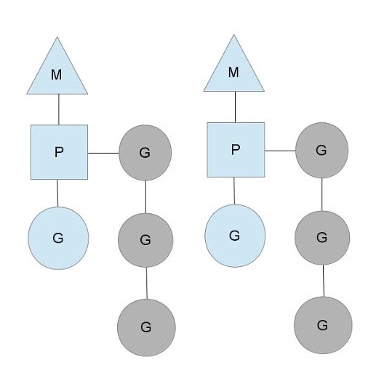
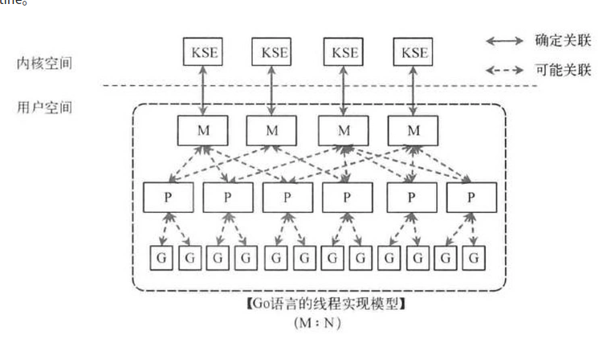
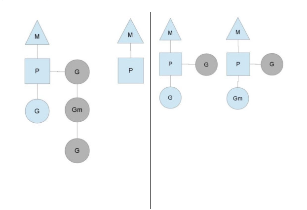
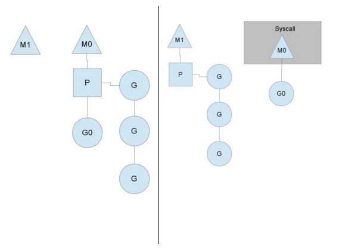

##### 1.DO NOT COMMUNICATE BY SHARING MEMORY; INSTEAD, SHARE MEMORY BY COMMUNICATING.

“不要以共享内存的方式来通信，相反，要通过通信来共享内存。”

普通的线程并发模型，就是像Java、C++、或者Python，他们线程间通信都是通过共享内存的方式来进行的。非常典型的方式就是，在访问共享数据（例如数组、Map、或者某个结构体或对象）的时候，通过锁来访问，因此，在很多时候，衍生出一种方便操作的数据结构，叫做“线程安全的数据结构”。例如Java提供的包”java.util.concurrent”中的数据结构。Go中也实现了传统的线程并发模型。

Go的CSP并发模型，是通过`goroutine`和`channel`来实现的。

- `goroutine` 是Go语言中并发的执行单位。有点抽象，其实就是和传统概念上的”线程“类似，可以理解为”线程“。
- `channel`是Go语言中各个并发结构体(`goroutine`)之前的通信机制。 通俗的讲，就是各个`goroutine`之间通信的”管道“，有点类似于Linux中的管道。

2.

一个**M**会对应一个内核线程，一个**M**也会连接一个上下文**P**，一个上下文**P**相当于一个“处理器”，一个上下文连接一个或者多个Goroutine。

每有一个go语句被执行，runqueue队列就在其末尾加入一个goroutine，一旦上下文运行goroutine直到调度点，它会从其runqueue中弹出goroutine，设置堆栈和指令指针并开始运行goroutine。

3.

在Goroutine中则不需这些额外的开销，所以一个Golang的程序中可以支持10w级别的Goroutine。

每个 goroutine (协程) 默认占用内存远比 Java 、C 的线程少（*goroutine：*2KB ，线程：8MB）

4.

每个P中的`Goroutine`不同导致他们运行的效率和时间也不同，在一个有很多P和M的环境中，不能让一个P跑完自身的`Goroutine`就没事可做了，因为或许其他的P有很长的`goroutine`队列要跑，得需要均衡。
该如何解决呢？

Go的做法倒也直接，从其他P中偷一半！

5.P的必要性

我的理解是，如果没有P，当内核线程M0执行类似于同时执行代码和系统调用被阻塞的操作如syscall时，就会产生上下文丢失，有了P就可以新建一个内核线程并把上下文环境P分配给新的M1，而如果没有P的话，此时执行到一半的各类上下文环境和资源就会丢失。

6.缺点：调度分配不公平

