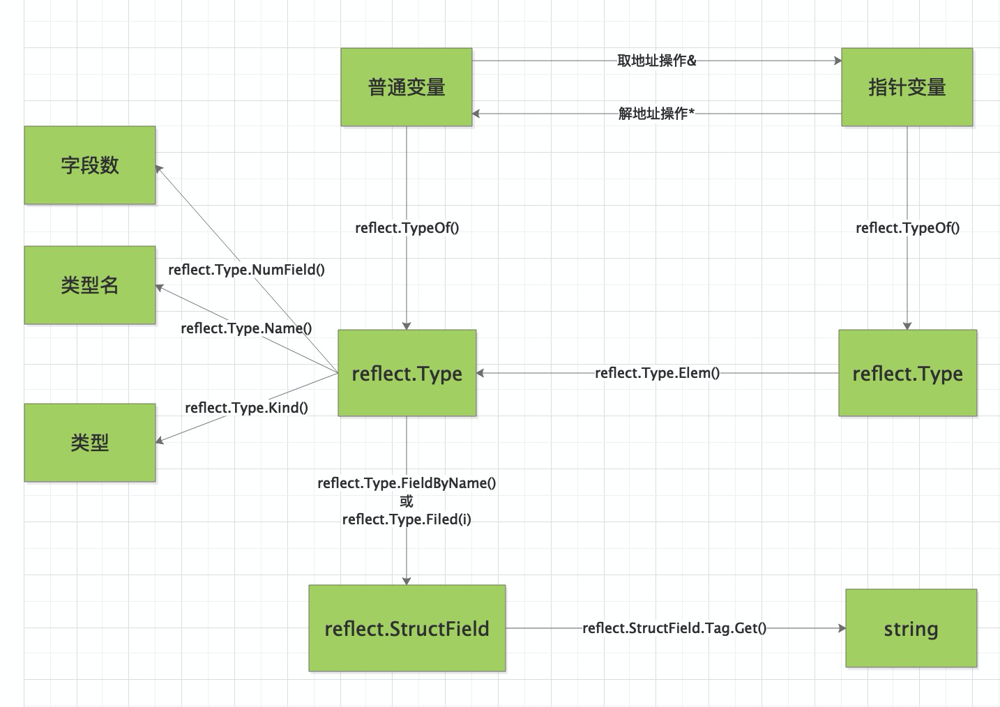

**反射是指在程序运行期对程序本身进行访问和修改的能力**。程序在编译时，变量被转换为内存地址，变量名不会被编译器写入到可执行部分。在运行程序时，程序无法获取自身的信息。

支持反射的语言可以在程序编译期将变量的反射信息，如字段名称、类型信息、结构体信息等整合到可执行文件中，并给程序提供接口访问反射信息，这样就可以在程序运行期获取类型的反射信息，并且有能力修改它们。

**Go程序在运行期使用reflect包访问程序的反射信息**。

reflect包实现了运行时反射，允许程序操作任意类型的对象。典型用法是用静态类型interface{}保存一个值，通过调用TypeOf获取其动态类型信息，该函数返回一个Type类型值。调用ValueOf函数返回一个Value类型值，该值代表运行时的数据。Zero接受一个Type类型参数并返回一个代表该类型零值的Value类型值。

Go 程序的反射系统无法获取到一个可执行文件空间中或者是一个包中的所有类型信息，需要配合使用标准库中对应的词法、语法解析器和抽象语法树（AST）对源码进行扫描后获得这些信息。

示例：

