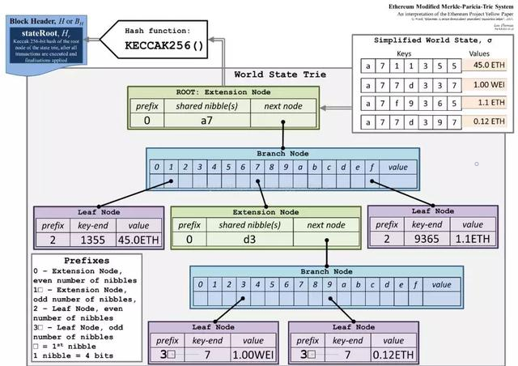

MPT树在我的一个笔记中已经将过了（[以太坊中的数据结构](./以太坊中的数据结构)）

在/trie目录下，geth给出了通用的MPT树的具体实现，下面分析一下代码。

 可以将 Trie 看做一个黑盒，分析下它暴露了什么接口。


[TOC]


##### 1.各个模块的大概作用

database.go：数据库是在trie数据结构和磁盘数据库之间的中间写入层。 目的是在内存中积累trie写操作，并且仅定期刷新一对尝试写入磁盘的内容，垃圾收集剩余的内容。

encoding.go：和hex编码有关

iterator.go：迭代器

node.go：定义了trie的四种节点和对节点的编码，数值类型操作，错误处理等。

proof.go：默克尔证明

secure_trie.go：SecureTrie使用密钥散列来包装Trie。 在安全的尝试下，所有访问操作使用keccak256对密钥进行哈希处理。 这样可以防止通过创建较长的节点链来调用代码，这会增加访问时间。与常规树相反，SecureTrie只能使用新建，并且必须具有附加的数据库。 该数据库还存储每个键的原像。不能并发使用。

sync.go：同步是主要的状态Trie同步调度程序，它提供了要检索的未知trie哈希，接受与所述哈希关联的节点数据并逐步重建trie，直到全部完成。

sync_bloom.go：快速同步过程中使用的Bloom筛选器，用于快速确定磁盘上是否已经存在Trie节点。 

trie.go：主要的定义

##### 2.一些比较重要的接口

###### 定义trie的结构：

trie/go:树的结构，empty定义

```go
var (
	// emptyRoot is the known root hash of an empty trie.
	emptyRoot = common.HexToHash("56e81f171bcc55a6ff8345e692c0f86e5b48e01b996cadc001622fb5e363b421")

	// emptyState is the known hash of an empty state trie entry.
	emptyState = crypto.Keccak256Hash(nil)
)

type Trie struct {
	db   *Database
	root node
	// Keep track of the number leafs which have been inserted since the last
	// hashing operation. This number will not directly map to the number of
	// actually unhashed nodes
	unhashed int
}
```

node.go:定义规范化mpt树的叶子节点



```go
type node interface {
	fstring(string) string
	cache() (hashNode, bool)
}

type (
	fullNode struct { //可以携带多个子节点的节点
		Children [17]node // Actual trie node data to encode/decode (needs custom encoder)
		flags    nodeFlag
	}
	shortNode struct { //只带一个子节点的节点
		Key   []byte
		Val   node
		flags nodeFlag
	}
	hashNode  []byte //hashNode 是 fullNode 或 shortNode 对象的 RLP 编码的32 byte 的哈希值，表明该节点还没有载入内存
	valueNode []byte //表示真正带有值的节点
)
```

trie.go：与mpt树有关的基本操作

###### 新建MPT树

```go
func New(root common.Hash, db *Database) (*Trie, error) {
	if db == nil {
		panic("trie.New called without a database")
	}
	trie := &Trie{
		db: db,
	}
	if root != (common.Hash{}) && root != emptyRoot {
		rootnode, err := trie.resolveHash(root[:], nil)
		if err != nil {
			return nil, err
		}
		trie.root = rootnode
	}
	return trie, nil
}
```

###### 增删查改

```go
func (t *Trie) tryGet(origNode node, key []byte, pos int) (value []byte, newnode node, didResolve bool, err error)

func (t *Trie) TryUpdate(key, value []byte) 

func (t *Trie) insert(n node, prefix, key []byte, value node) (bool, node, error)

func (t *Trie) delete(n node, prefix, key []byte) (bool, node, error) 
```

###### 解析哈希

```go
func (t *Trie) resolveHash(n hashNode, prefix []byte)
->
func (db *Database) node(hash common.Hash) node
->
func mustDecodeNode(hash, buf []byte) node 
->
// decodeNode parses the RLP encoding of a trie node.
func decodeNode(hash, buf []byte) (node, error) {
	if len(buf) == 0 {
		return nil, io.ErrUnexpectedEOF
	}
	elems, _, err := rlp.SplitList(buf)
	if err != nil {
		return nil, fmt.Errorf("decode error: %v", err)
	}
	switch c, _ := rlp.CountValues(elems); c {
	case 2:
		n, err := decodeShort(hash, elems)
		return n, wrapError(err, "short")
	case 17:
		n, err := decodeFull(hash, elems)
		return n, wrapError(err, "full")
	default:
		return nil, fmt.Errorf("invalid number of list elements: %v", c)
	}
}
```

###### 将mpt树写入内存

```go
func (t *Trie) Commit(onleaf LeafCallback) (root common.Hash, err error) 
```

###### 获取根哈希

```go
func (t *Trie) hashRoot(db *Database) (node, node, error)
```

###### rlp编码

database.go

```go
func (n *cachedNode) rlp() []byte {
	if node, ok := n.node.(rawNode); ok {
		return node
	}
	blob, err := rlp.EncodeToBytes(n.node)
	if err != nil {
		panic(err)
	}
	return blob
}
```

###### 默克尔证明

proof.go: prove方法用来获取指定 key 的默克尔证明。这个方法会遍历整个 MPT，获取从根节点到叶子节点这条路径上的所有节点的 hash 值列表。对于 key 不匹配的情况，则会返回一个最长匹配的列表。 

```go
func (t *SecureTrie) Prove(key []byte, fromLevel uint, proofDb ethdb.KeyValueWriter) error {
	return t.trie.Prove(key, fromLevel, proofDb)
}

func (t *Trie) Prove(key []byte, fromLevel uint, proofDb ethdb.KeyValueWriter) error {
	// Collect all nodes on the path to key.
	key = keybytesToHex(key)
	var nodes []node
	tn := t.root
	for len(key) > 0 && tn != nil {
		switch n := tn.(type) {
		case *shortNode:
			if len(key) < len(n.Key) || !bytes.Equal(n.Key, key[:len(n.Key)]) {
				// The trie doesn't contain the key.
				tn = nil
			} else {
				tn = n.Val
				key = key[len(n.Key):]
			}
			nodes = append(nodes, n)
		case *fullNode:
			tn = n.Children[key[0]]
			key = key[1:]
			nodes = append(nodes, n)
		case hashNode:
			var err error
			tn, err = t.resolveHash(n, nil)
			if err != nil {
				log.Error(fmt.Sprintf("Unhandled trie error: %v", err))
				return err
			}
		default:
			panic(fmt.Sprintf("%T: invalid node: %v", tn, tn))
		}
	}
	hasher := newHasher(false)
	defer returnHasherToPool(hasher)

	for i, n := range nodes {
		if fromLevel > 0 {
			fromLevel--
			continue
		}
		var hn node
		n, hn = hasher.proofHash(n)
		if hash, ok := hn.(hashNode); ok || i == 0 {
			// If the node's database encoding is a hash (or is the
			// root node), it becomes a proof element.
			enc, _ := rlp.EncodeToBytes(n)
			if !ok {
				hash = hasher.hashData(enc)
			}
			proofDb.Put(hash, enc)
		}
	}
	return nil
}
```

 VerifyProof 方法以 roothash，key，proof 证明为参数，验证 key 是否存在于 MPT 的某条路径里，如果 key 确实存在，返回这个节点的索引 i，err 字段是 nil，否则返回 error。 

```go
func VerifyProof(rootHash common.Hash, key []byte, proofDb ethdb.KeyValueReader) (value []byte, nodes int, err error) {
	key = keybytesToHex(key)
	wantHash := rootHash
	for i := 0; ; i++ {
		buf, _ := proofDb.Get(wantHash[:])
		if buf == nil {
			return nil, i, fmt.Errorf("proof node %d (hash %064x) missing", i, wantHash)
		}
		n, err := decodeNode(wantHash[:], buf)
		if err != nil {
			return nil, i, fmt.Errorf("bad proof node %d: %v", i, err)
		}
		keyrest, cld := get(n, key)
		switch cld := cld.(type) {
		case nil:
			// The trie doesn't contain the key.
			return nil, i, nil
		case hashNode:
			key = keyrest
			copy(wantHash[:], cld)
		case valueNode:
			return cld, i + 1, nil
		}
	}
}
```

###### 编码

 MPT 的 key 值实际上有三种编码方法，Raw 编码，Hex 编码，HP 编码，Raw 编码即原始的字节数组，这种方式的问题是它的一个字节的范围很大，fullNode 的子树这么多会影响检索效率，当树节点需要存储到数据库时，会根据16进制来进行编码，Hex 编码和 HP 编码没本质区别，可以理解为 Hex 编码是存在于内存的中间形式，在以太坊的黄皮书了介绍的是 Hex Prefix Encoding，即 HP 编码。 

**RAW编码**

 原生的 key 字节数组，不做修改，这种方式是 MPT 对外提供 API 的默认方式，如果数据需要插入到树里，Raw 编码需要转换为 Hex 编码。 

**Hex编码**

Hex 编码用于对内存里的树节点 key 进行编码，当树节点需要持久化到数据库时，Hex 编码被转换为 HP 编码。

具体来说，这个编码的每个字节包含 key 的半个字节，尾部加一个 byte 的『终结符』16，表示这是 hex 格式。节点被加载到内存时 key 使用的是这种编码，因为方便访问。

encoding.go

```go
func keybytesToHex(str []byte) []byte {
	l := len(str)*2 + 1
	var nibbles = make([]byte, l)
	for i, b := range str {
		nibbles[i*2] = b / 16
		nibbles[i*2+1] = b % 16
	}
	nibbles[l-1] = 16
	return nibbles
}
```

**HP编码**

```go
func hexToCompact(hex []byte) []byte {
	terminator := byte(0)
	if hasTerm(hex) {
		terminator = 1
		hex = hex[:len(hex)-1]
	}
	buf := make([]byte, len(hex)/2+1)
	buf[0] = terminator << 5 // the flag byte
	if len(hex)&1 == 1 {
		buf[0] |= 1 << 4 // odd flag
		buf[0] |= hex[0] // first nibble is contained in the first byte
		hex = hex[1:]
	}
	decodeNibbles(hex, buf[1:])
	return buf
}

```

全称是 Hex Prefix 编码，hex 编码解决了 key 是 keybytes 形式的数据插入 MPT 的问题，但这种方式有数据冗余的问题，对于 shortNode，目前 hex 格式下的 key，长度会是原来 keybytes 格式下的两倍，这一点对于节点的哈希计算影响很大，compact 编码用于对 hex 格式进行优化。compact encoding 的主要思路是将 Hex 格式字符串先恢复到 keybytes 格式，同时加入当前编码的标记位，表示奇偶不同长度的 hex 格式。

具体来说，compact 编码首先会将 hex 尾部标记的 byte 去掉，然后将原来 hex 编码的包含的 key 的半个字节（称为 nibble）一一合并为1 byte，最后如果 hex 格式编码有效长度为奇数，在头部增加 0011xxxx，其中 xxxx 为第一个 nibble，否则在头部增加 00100000。节点在写入数据库时使用的是 compact 编码，因为可以节约磁盘。