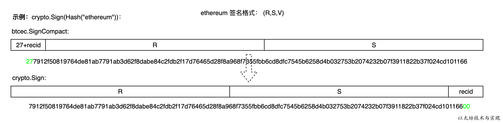

###### 以太坊中交易的结构有 r s v 字段

```go
type txdata struct {
	AccountNonce uint64          `json:"nonce"    gencodec:"required"`//由交易发送者发出的的交易的数量，由 Tn 表示
	Price        *big.Int        `json:"gasPrice" gencodec:"required"`//为执行这个交易所需要进行的计算步骤消 耗的每单位 gas 的价格，以 Wei 为单位，由 Tp 表 示。
	GasLimit     uint64          `json:"gas"      gencodec:"required"`//用于执行这个交易的最大 gas 数量。这个值须在交易开始前设置，且设定后不能再增加，由Tg 表示。
	Recipient    *common.Address `json:"to"       rlp:"nil"` // nil means contract creation 160 位的消息调用接收者地址；对与合约创建交易，用 ∅ 表示 B0 的唯一成员。此字段由 Tt 表示
	Amount       *big.Int        `json:"value"    gencodec:"required"`//转移到接收者账户的 Wei 的数量；对于合约 创建，则代表给新建合约地址的初始捐款。由 Tv 表示。
	Payload      []byte          `json:"input"    gencodec:"required"`//如果目标账户包含代码，该代码会执行，payload就是输入数据。
																	  //如果目标账户是零账户（账户地址是0），交易将创建一个新合约。
																	  //这个合约地址不是零地址，而是由合约创建者的地址和该地址发出过的交易数量（被称为nonce）计算得到。
																	  //创建合约交易的payload被当作EVM字节码执行。执行的输出做为合约代码被永久存储。这意味着，为了创建一个合约，
																	  //你不需要向合约发送真正的合约代码，而是发送能够返回真正代码的代码。
	                                                                  //
	// Signature values											      //
	V *big.Int `json:"v" gencodec:"required"`//v, r, s: 与交易签名相符的若干数值，用于确定交易的发送者，由 Tw，Tr 和 Ts 表示。
	R *big.Int `json:"r" gencodec:"required"`
	S *big.Int `json:"s" gencodec:"required"`

	// This is only used when marshaling to JSON.
	Hash *common.Hash `json:"hash" rlp:"-"`
}
```


###### 签名的函数

其实还是用secp256k1进行的签名，只是把比特币中签名的数据格式稍作改变

```go
//crypto/signature_nocgo.go:60
func Sign(hash []byte, prv *ecdsa.PrivateKey) ([]byte, error) {
    //检查哈希的长度是否为32字节
	if len(hash) != 32 {
		return nil, fmt.Errorf("hash is required to be exactly 32 bytes (%d)", len(hash))
	}
    //检查私钥的曲线符合secp256k1
	if prv.Curve != btcec.S256() {
		return nil, fmt.Errorf("private key curve is not secp256k1")
	}
    //传入私钥，签名的内容，私钥选项为非压缩，签名的返回为[27 + recid] [R] [S]
    //
	sig, err := btcec.SignCompact(btcec.S256(), (*btcec.PrivateKey)(prv), hash, false)
	if err != nil {
		return nil, err
	}
	//比特币中第一个字节的值等于27+recid，因此 recid= sig[0]-27
	v := sig[0] - 27 
    //调整顺序为r s v
	copy(sig, sig[1:])
	sig[64] = v
	return sig, nil
}
```




简单地说，就是传入要签名的数据和私钥对结果进行签名，得到r s v 格式的签名结果，签名结果是65字节的字节数组。一个字节是8位，一个字符是4位，所以转化为字符串时长度为130.

**在交易签名时，V 值不再是recid, 而是 recid+ chainID*2+ 35(老版签名是recud+27)**

###### 验签的函数

```go
func main()  {
	decodeHex:= func(s string) []byte {
		b,err:=hex.DecodeString(s)
		if err!=nil{
			log.Fatal(err)
		}
		return b
	}
	dataHash := sha256.Sum256([]byte("ethereum"))
	sig:=decodeHex(
"7912f50819764de81ab7791ab3d62f8dabe84c2fdb2f17d76465d28f8a968f7355fbb6cd8dfc7545b6258d4b032753b2074232b07f3911822b37f024cd10116600")
	pubkey:=decodeHex(
	"037db227d7094ce215c3a0f57e1bcc732551fe351f94249471934567e0f5dc1bf7")

	ok:=crypto.VerifySignature(pubkey,dataHash[:],sig[:len(sig)-1])
	fmt.Println("verify pass?",ok)
}
```

传入公钥，签名数据，验证是否验签通过。

关键点在于调用校验签名函数时，第三个参数sig 送入的是 `sig[:len(sig)-1]` 去掉了末尾的一个字节。这是因为函数`VerifySignature`要求 `sig`参数必须是`[R] [S]`格式，因此需要去除末尾的`[V]`。

实际在区块链中，为了安全性签名中加入了特性数据，比如签名类型(环签、单私钥签名等)、链标识符等。

###### 以太坊中区块中的交易的签名和验签

签名解析

```go
//core/types/transaction_signing.go
//tx是交易 s是签名器，根据区块高度不同有两个版本的签名器， prv是私匙
func SignTx(tx *Transaction, s Signer, prv *ecdsa.PrivateKey) (*Transaction, error) {
    //先对交易数据取哈希
   h := s.Hash(tx)
    //用私钥对交易签名
   sig, err := crypto.Sign(h[:], prv)
   if err != nil {
      return nil, err
   }
    //将签名信息赋给交易
   return tx.WithSignature(s, sig)
}

//将签名信息赋给交易
func (tx *Transaction) WithSignature(signer Signer, sig []byte) (*Transaction, error) {
 r, s, v, err := signer.SignatureValues(tx, sig)
 if err != nil {
    return nil, err
 }
 cpy := &Transaction{data: tx.data}
 //分别赋值给rsv   
 cpy.data.R, cpy.data.S, cpy.data.V = r, s, v
 return cpy, nil
} 
```

验签解析

```go
//core/types/transaction_signing.go:127
func (s EIP155Signer) Sender(tx *Transaction) (common.Address, error) {
    //看是不是老版交易
   if !tx.Protected() { 
      return HomesteadSigner{}.Sender(tx)
   }
    //看chainid是否和签名器所指示的链id一致
   if tx.ChainId().Cmp(s.chainId) != 0 { 
      return common.Address{}, ErrInvalidChainId
   }
    //
   V := new(big.Int).Sub(tx.data.V, s.chainIdMul)
   V.Sub(V, big8)
   return recoverPlain(s.Hash(tx), tx.data.R, tx.data.S, V, true)
}

func recoverPlain(sighash common.Hash, R, S, Vb *big.Int, homestead bool) (common.Address, error) {
	if Vb.BitLen() > 8 {
		return common.Address{}, ErrInvalidSig
	}
	V := byte(Vb.Uint64() - 27)
	if !crypto.ValidateSignatureValues(V, R, S, homestead) {
		return common.Address{}, ErrInvalidSig
	}
	// encode the signature in uncompressed format
	r, s := R.Bytes(), S.Bytes()
	sig := make([]byte, crypto.SignatureLength)
	copy(sig[32-len(r):32], r)
	copy(sig[64-len(s):64], s)
	sig[64] = V
	// recover the public key from the signature
	pub, err := crypto.Ecrecover(sighash[:], sig)
	if err != nil {
		return common.Address{}, err
	}
	if len(pub) == 0 || pub[0] != 4 {
		return common.Address{}, errors.New("invalid public key")
	}
	var addr common.Address
	copy(addr[:], crypto.Keccak256(pub[1:])[12:])
	return addr, nil
}
```

