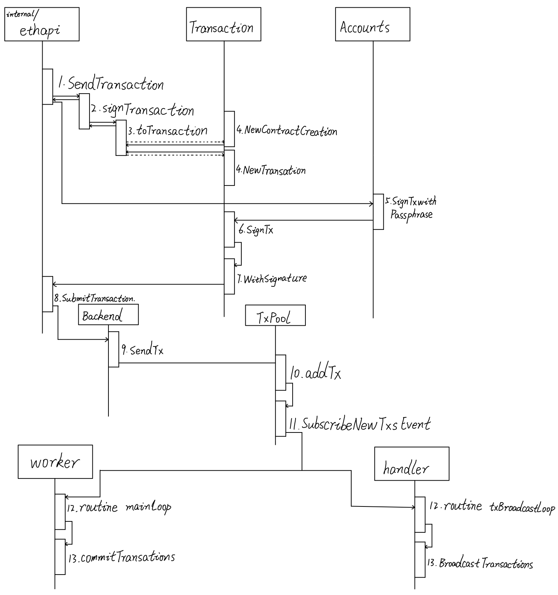

### 1.sendTransaction API 

api位于internal/ethapi/api.go中，调用rpc接口后执行。[rpc服务](./以太坊RPC通信.md)

```go
// SendTransaction will create a transaction from the given arguments and
// tries to sign it with the key associated with args.To. If the given passwd isn't
// able to decrypt the key it fails.
func (s *PrivateAccountAPI) SendTransaction(ctx context.Context, args SendTxArgs, passwd string) (common.Hash, error) {
	if args.Nonce == nil {
		// Hold the addresse's mutex around signing to prevent concurrent assignment of
		// the same nonce to multiple accounts.
		s.nonceLock.LockAddr(args.From)
		defer s.nonceLock.UnlockAddr(args.From)
	}
	signed, err := s.signTransaction(ctx, &args, passwd)
	if err != nil {
		log.Warn("Failed transaction send attempt", "from", args.From, "to", args.To, "value", args.Value.ToInt(), "err", err)
		return common.Hash{}, err
	}
	return SubmitTransaction(ctx, s.b, signed)
}
```


### 2.执行signTransaction

internal/ethapi/api.go

```go
// signTransaction sets defaults and signs the given transaction
// NOTE: the caller needs to ensure that the nonceLock is held, if applicable,
// and release it after the transaction has been submitted to the tx pool
func (s *PrivateAccountAPI) signTransaction(ctx context.Context, args *SendTxArgs, passwd string) (*types.Transaction, error) {
	// Look up the wallet containing the requested signer
    // 先获得进行操作的账户地址
	account := accounts.Account{Address: args.From}
    //根据账户信息返回钱包
	wallet, err := s.am.Find(account)
	if err != nil {
		return nil, err
	}
	// Set some sanity defaults and terminate on failure
    // 设置一些默认值
	if err := args.setDefaults(ctx, s.b); err != nil {
		return nil, err
	}
	// Assemble the transaction and sign with the wallet
    // 装配交易
	tx := args.toTransaction()

	return wallet.SignTxWithPassphrase(account, passwd, tx, s.b.ChainConfig().ChainID)
}
```

找钱包操作accounts/manager.go

遍历当前的钱包，如果有包含account的就返回，如果没找到就返回err

```go
// Find attempts to locate the wallet corresponding to a specific account. Since
// accounts can be dynamically added to and removed from wallets, this method has
// a linear runtime in the number of wallets.
func (am *Manager) Find(account Account) (Wallet, error) {
	am.lock.RLock()
	defer am.lock.RUnlock()

	for _, wallet := range am.wallets {
		if wallet.Contains(account) {
			return wallet, nil
		}
	}
	return nil, ErrUnknownAccount
}
```

accounts/accounts.go 中SignTxWithPassphrase操作是个接口,根据manager对于账户的寻找返回的钱包类型，在不同的钱包下有不同的实现

```go
SignTxWithPassphrase(account Account, passphrase string, tx *types.Transaction, chainID *big.Int) (*types.Transaction, error)
```


在大部分情况下使用的是keystore下的普通账户类型钱包，接下来调用以下函数：

```go
func (ks *KeyStore) SignTxWithPassphrase(a accounts.Account, passphrase string, tx *types.Transaction, chainID *big.Int) (*types.Transaction, error) {
	_, key, err := ks.getDecryptedKey(a, passphrase)
	if err != nil {
		return nil, err
	}
	defer zeroKey(key.PrivateKey)

	// Depending on the presence of the chain ID, sign with EIP155 or homestead
	if chainID != nil {
		return types.SignTx(tx, types.NewEIP155Signer(chainID), key.PrivateKey)
	}
	return types.SignTx(tx, types.HomesteadSigner{}, key.PrivateKey)
}
```

根据账户和密码拿到私钥，根据chainID决定使用的签名方式，之后调用SignTx函数types/transaction_signing.go

```go
func SignTx(tx *Transaction, s Signer, prv *ecdsa.PrivateKey) (*Transaction, error) {
	h := s.Hash(tx)
	sig, err := crypto.Sign(h[:], prv)
	if err != nil {
		return nil, err
	}
	return tx.WithSignature(s, sig)
}
```

关于签名的讲解在 [签名与验签](./交易签名和验签.md)一文中.

签名后返回一个signed对象 

internal/ethapi/api.go 

```
（SendTransaction函数）
signed, err := s.signTransaction(ctx, &args, passwd)
```

然后提交给

```
（SendTransaction函数）
return SubmitTransaction(ctx, s.b, signed)
```

### 3.SubmitTransaction

```go
// SubmitTransaction is a helper function that submits tx to txPool and logs a message.
func SubmitTransaction(ctx context.Context, b Backend, tx *types.Transaction) (common.Hash, error) {
    //执行sendTx操作，如果出错返回
	if err := b.SendTx(ctx, tx); err != nil {
		return common.Hash{}, err
	}
    //如果交易的接受者为nil则将其视为创建合约
	if tx.To() == nil {
        //创建签名器
		signer := types.MakeSigner(b.ChainConfig(), b.CurrentBlock().Number())
        //利用签名器解码出发送者地址
		from, err := types.Sender(signer, tx)
		if err != nil {
			return common.Hash{}, err
		}
		addr := crypto.CreateAddress(from, tx.Nonce())
		log.Info("Submitted contract creation", "fullhash", tx.Hash().Hex(), "contract", addr.Hex())
	} else {
      //交易的接收者不是nil则视为普通交易
		log.Info("Submitted transaction", "fullhash", tx.Hash().Hex(), "recipient", tx.To())
	}
	return tx.Hash(), nil
}
```

sendTx是一个接口，对于轻节点和全节点分别实现

全节点将交易作为本地交易插入到交易池

eth/eth_backend.go

```go
func (b *EthAPIBackend) SendTx(ctx context.Context, signedTx *types.Transaction) error {
	return b.eth.txPool.AddLocal(signedTx)
}
```

core/tx_pool.go

```go
func (pool *TxPool) AddLocal(tx *types.Transaction) error {
    //和非本地交易有不同，可以在交易池代码中理解
   errs := pool.AddLocals([]*types.Transaction{tx})
   return errs[0]
}
```

轻节点是下载区块链头部的存在，不维护本地交易（此处留个坑，不是很确定）

les/api_backend.go

```go
func (b *LesApiBackend) SendTx(ctx context.Context, signedTx *types.Transaction) error {
   return b.eth.txPool.Add(ctx, signedTx)
}
```

core/tx_pool.go

```go
// Add adds a transaction to the pool if valid and passes it to the tx relay
// backend
func (pool *TxPool) Add(ctx context.Context, tx *types.Transaction) error {
	pool.mu.Lock()
	defer pool.mu.Unlock()

	data, err := rlp.EncodeToBytes(tx)
	if err != nil {
		return err
	}
	//add函数在交易池里解析过
	if err := pool.add(ctx, tx); err != nil {
		return err
	}
	//fmt.Println("Send", tx.Hash())
	pool.relay.Send(types.Transactions{tx})

	pool.chainDb.Put(tx.Hash().Bytes(), data)
	return nil
}
```

关于交易池有两篇文章 [交易池分析1](./以太坊交易池.md) , [交易池分析2](./以太坊交易池（2）.md)

### 4.交易执行

（此处留个坑，还没分析交易执行的信号是什么)

miner/worker.go (func commitNewWork)

```go
	if len(localTxs) > 0 {
		txs := types.NewTransactionsByPriceAndNonce(w.current.signer, localTxs)
		if w.commitTransactions(txs, w.coinbase, interrupt) {
			return
		}
	}
	if len(remoteTxs) > 0 {
		txs := types.NewTransactionsByPriceAndNonce(w.current.signer, remoteTxs)
		if w.commitTransactions(txs, w.coinbase, interrupt) {
			return
		}
	}
```

可以看到，先执行本地交易，再执行的远程交易

（参考Fum/以太坊源码分析-挖矿）

miner/worker.go

```go
func (w *worker) commitTransactions(txs *types.TransactionsByPriceAndNonce, coinbase common.Address, interrupt *int32) bool{}
```

此函数对交易执行环境进行了一些检查，然后进入for循环对交易依次执行，第61行`logs, err := w.commitTransaction(tx, coinbase)`执行了一个交易，下面我们看`commitTransaction()`函数。

miner/worker.go

```go
//此函数执行单个交易
func (w *worker) commitTransaction(tx *types.Transaction, coinbase common.Address) ([]*types.Log, error) {
   snap := w.current.state.Snapshot()

   receipt, err := core.ApplyTransaction(w.chainConfig, w.chain, &coinbase, w.current.gasPool, w.current.state, w.current.header, tx, &w.current.header.GasUsed, *w.chain.GetVMConfig())
   if err != nil {
      w.current.state.RevertToSnapshot(snap)
      return nil, err
   }
   w.current.txs = append(w.current.txs, tx)
   w.current.receipts = append(w.current.receipts, receipt)

   return receipt.Logs, nil
}
```

此函数先创建状态树快照。然后运行

```go
receipt, err := core.ApplyTransaction(w.chainConfig, w.chain, &coinbase, w.current.gasPool, w.current.state, w.current.header, tx, &w.current.header.GasUsed, *w.chain.GetVMConfig())`。
```

`ApplyTransaction()`函数进行具体的交易执行（包括转账和智能合约的相关动作），交付gas，这里的gas包括支付给矿工的gas和refundGas。

`ApplyTransaction()`函数返回拿到收据`receipt`，如果执行出错就将状态树回滚至刚才创建的快照。执行成功之后记录此已执行交易及其收据，并返回`receipt.Logs`。交易执行完后，执行`w.commit(uncles, nil, false, tstart)`开始出块。

miner/worker.go

```go
func (w *worker) commit(uncles []*types.Header, interval func(), update bool, start time.Time) error {
		receipts := make([]*types.Receipt, len(w.current.receipts))
	for i, l := range w.current.receipts {
		receipts[i] = new(types.Receipt)
		*receipts[i] = *l
	}
	s := w.current.state.Copy()
	block, err := w.engine.FinalizeAndAssemble(w.chain, w.current.header, s, w.current.txs, uncles, w.current.receipts)
    	if err != nil {
		return err
	}
	if w.isRunning() {
		if interval != nil {
			interval()
		}
    ...
}
```

此函数首先深拷贝收据，以避免不同任务之间的交互。构建状态树 `w.current.state` 的副本`s`。**调用共识引擎的方法 `FinalizeAndAssemble() `，根据当前链的状态配置新块的一些参数，累积区块和叔块的奖励，设置最终状态并组装区块得到block。**之后运行可能存在的中断函数(第17行)。


对FinalizeAndAssemble函数的解析：

FinalizeAndAssemble是一个接口，可以执行它的对象有NoRewoardEngine,  Clique,  Ethash

1.在consensus/clique/clique/go中的说明如下：

*FinalizeAndAssemble implements consensus.Engine, ensuring no uncles are set ，nor block rewards given, and returns the final block.*

不设置叔块，也不给奖励。POA共识引擎

2.在cmd/geth/retesteth.go中可以使用NoRewoardEngine执行此方法，估计是测试用的.

3.在consensus/ethash/consensus.go中说明如下:

*FinalizeAndAssemble implements consensus.Engine, accumulating the block and uncle rewards, setting the final state and assembling the block.*

装配区块，设叔块和区块奖励，设置世界状态

这个应该是现在使用的函数，看下具体实现：

```go
func (ethash *Ethash) FinalizeAndAssemble(chain consensus.ChainReader, header *types.Header, state *state.StateDB, txs []*types.Transaction, uncles []*types.Header, receipts []*types.Receipt) (*types.Block, error) {
	// Accumulate any block and uncle rewards and commit the final state root
    //先计算各种奖励
	accumulateRewards(chain.Config(), state, header, uncles)
	//计算世界状态
    header.Root = state.IntermediateRoot(chain.Config().IsEIP158(header.Number))
	//世界状态计算完转载区块
	// Header seems complete, assemble into a block and return
	return types.NewBlock(header, txs, uncles, receipts), nil
}
```

IntermediateRoot：

core/state/statedb.go:

主要通过循环 updateRoot updateStateObject 两个操作更新状态树

```go
// IntermediateRoot computes the current root hash of the state trie.
// It is called in between transactions to get the root hash that
// goes into transaction receipts.
func (s *StateDB) IntermediateRoot(deleteEmptyObjects bool) common.Hash {
	// Finalise all the dirty storage states and write them into the tries
	s.Finalise(deleteEmptyObjects)

	for addr := range s.stateObjectsPending {
		obj := s.stateObjects[addr]
		if obj.deleted {
			s.deleteStateObject(obj)
		} else {
			obj.updateRoot(s.db)
			s.updateStateObject(obj)
		}
	}
	if len(s.stateObjectsPending) > 0 {
		s.stateObjectsPending = make(map[common.Address]struct{})
	}
	// Track the amount of time wasted on hashing the account trie 统计时间
	if metrics.EnabledExpensive {
		defer func(start time.Time) { s.AccountHashes += time.Since(start) }(time.Now())
	}
	return s.trie.Hash()
}
```

NewBlock函数：新增区块和构建交易树、回执树，参考文章[交易与回执分析](./区块中的交易和回执代码分析.md) 

```go
//NewBlock creates a new block. The input data is copied,
//changes to header and to the field values will not affect the
//block.
//
//The values of TxHash, UncleHash, ReceiptHash and Bloom in header
//are ignored and set to values derived from the given txs, uncles
//and receipts.
func NewBlock(header *Header, txs []*Transaction, uncles []*Header, receipts []*Receipt) *Block {
	。。。
	return b
}
```

