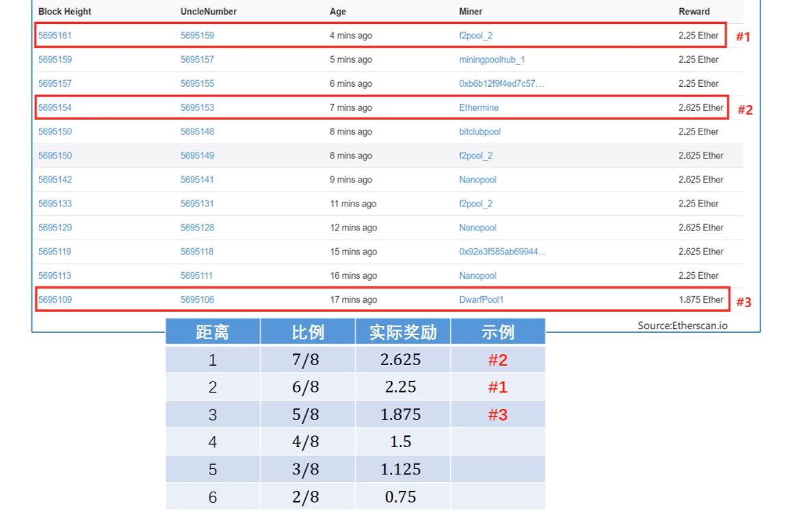

前提条件：

比特币选用最长的链作为有效链。出块时间大概为10分钟，orphan block的出现较少。然而以太坊出块已经缩短为十几秒一个块，如果也只选用最长的链作为有效链，那么会大大地影响矿工的积极性。而且比特币的这种方式很可能会造成算力与奖励的不对等。

核心思想：对挖到无效的区块矿工给予奖励

挖到叔父区块根据离主区块的距离，得到7/8 6/8 ...... 2/8 的区块奖励

包括一个叔父区块得到1/32的区块奖励

GHOST协议只给七代以内奖励： 鼓励分叉尽快合并

GHOST协议只给分叉后第一个区块奖励：防止分叉攻击

