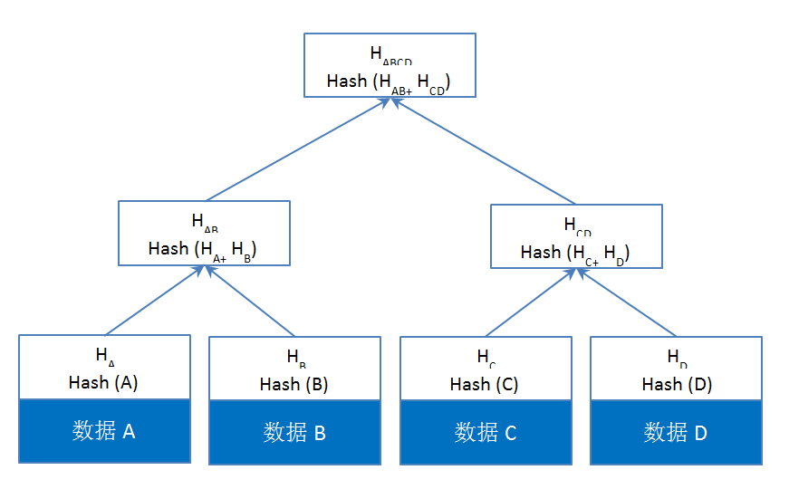

<details>
<summary>详细信息</summary>

### 1.区块

区块主要由三部分组成：区块头（Block Header），叔块（Uncle），区块体（body）

#### 区块头

区块头的结构体定义：

```go
type Header struct { 
    ParentHash  common.Hash    `json:"parentHash"       gencodec:"required"`  
    UncleHash   common.Hash    `json:"sha3Uncles"       gencodec:"required"`  
    Coinbase    common.Address `json:"miner"            gencodec:"required"`  
    Root        common.Hash    `json:"stateRoot"        gencodec:"required"` 
    TxHash      common.Hash    `json:"transactionsRoot" gencodec:"required"`              ReceiptHash common.Hash    `json:"receiptsRoot"     gencodec:"required"`
    Bloom       Bloom          `json:"logsBloom"        gencodec:"required"` 
    Difficulty  *big.Int       `json:"difficulty"       gencodec:"required"`
    Number      *big.Int       `json:"number"           gencodec:"required"` 
    GasLimit    uint64         `json:"gasLimit"         gencodec:"required"` 
    GasUsed     uint64         `json:"gasUsed"          gencodec:"required"`
    Time        uint64         `json:"timestamp"        gencodec:"required"` 
    Extra       []byte         `json:"extraData"        gencodec:"required"`  
    MixDigest   common.Hash    `json:"mixHash"` 
    Nonce       BlockNonce     `json:"nonce"`
}
```


释义如下：


ParentHash  common.Hash   父区块的哈希值
UncleHash	common.Hash	叔父区块列表的哈希值
Coinbase	common.Address	打包该区块的矿工的地址，用于接收矿工费
Root	common.Hash	状态树的根哈希值
TxHash	common.Hash	交易树的根哈希值
ReceiptHash	common.Hash	收据树的根哈希值
Bloom	Bloom	交易收据日志组成的Bloom过滤器
Difficulty	*Big.Int	本区块的难度
Number	*Big.Int	本区块块号，区块号从0号开始算起
GasLimit	uint64	本区块中所有交易消耗的Gas上限，这个数值不等于所有交易的中Gas limit字段的和
GasUsed	uint64	本区块中所有交易使用的Gas之和
Time	*big.Int	区块产生的unix时间戳，一般是打包区块的时间，这个字段不是出块的时间戳
Extra	[]byte	区块的附加数据
MixDigest	common.Hash	哈希值，与Nonce的组合用于工作量计算
Nonce	BlockNonce	区块产生时的随机值


与比特币一样，以太坊中区块和区块之间用哈希指针向连，通过哈希可以追溯到最初的区块。

轻节点只保存区块头。

#### 叔块

##### 孤块(orphan block)

在比特币协议中，最长的链被认为是绝对的正确。如果一个块不是最长链的一部分，那么它被称为是“孤块”。一个孤立的块是一个块，它也是合法的，但是发现的稍晚，或者是网络传输稍慢，而没有能成为最长的链的一部分。在比特币中，孤块没有意义，随后将被抛弃，发现这个孤块的矿工也拿不到采矿相关的奖励。

##### 最重的链(heaviest)

Ethereum的GHOST协议，不认为孤块没有价值，而是会给与发现孤块的矿工以回报。在以太坊中，孤块被称为“叔块”(uncle block)，它们可以为主链的安全作出贡献。

相对来说，比特币有很长的块间隔时间。在比特币区块中，平均约10分钟可以得到一个确认(也就是发现一个新的后续区块)。但是自从比特币成立以来，大量关于块链技术的研究已经发展起来。这些研究表明，更短的块间隔确实是可能的，而且在很多应用场景下是需要的。然而，随着拥有更快的出块速度，孤块的增加而带来的昂贵的成本和浪费也随之增加。

GHOST协议支付报酬给叔块，这激励了矿工在新发现的块中去引用叔块。引用叔块使主链更重。在比特币，最长的链是主链。在以太坊中，主链是指最重的链。

##### 叔块的好处

解决了两个问题：

1. 以太坊十几秒的出块间隔，大大增加了孤块的产生，并且降低了安全性。通过鼓励引用叔块，使引用主链获得更多的安全保证(因为孤块本身也是合法的)
2. 比特币中，采矿中心化(大量的集中矿池)成为一个问题。给与叔块报酬，可以一定程度上缓解这个问题。

##### 叔块的引用

区块可以不引用，或者最多引用两个叔块
叔块必须是区块的前2层~前7层的祖先的直接的子块
被引用过的叔块不能重复引用
引用叔块的区块，可以获得挖矿报酬的1/32，也就是5*1/32=0.15625 Ether。最多获得2*0.15625=0.3125 Ether
被引用的叔块，其矿工的报酬和叔块与区块之间的间隔层数有关系。

| 间隔层数 | 报酬比例 | 报酬  |
| -------- | -------- | ----- |
| 1        | 7/8      | 4.375 |
| 2        | 6/8      | 3.75  |
| 3        | 5/8      | 3.125 |
| 4        | 4/8      | 2.5   |
| 5        | 3/8      | 1.875 |
| 6        | 2/8      | 1.25  |

#### 区块体

```go
type Body struct {
    Transactions []*Transaction  
    Uncles       []*Header
}
```

Body是一个简单的（可变的、非安全的）数据容器，用于存储和移动块的数据内容（事务和uncles）。

#### 完整的区块定义

```go
type Block struct {   
    header       *Header  
    uncles       []*Header 
    transactions Transactions 
    // caches   hash atomic.Value   size atomic.Value  
    // Td is used by package core to store the total difficulty   
    // of the chain up to and including the block.   td *big.Int  
    // These fields are used by package eth to track  
    // inter-peer block relay.   ReceivedAt   time.
    Time   ReceivedFrom interface{}
}
```

### 2.MPT树

#### trie

trie也叫字典树，前缀树，因为它的搜索快捷的特性被单词搜索系统使用，故又称单词查找树。它是一种树形结构的数据结构。之所以快速，是因为它用空间代替了速度。

如给出字符串"abc","ab","bd","dda"，根据该字符串序列构建一棵Trie树。则构建的树如下: 


#### Patricia Trie

又叫做基数树，压缩前缀树或紧凑前缀树（compact prefix tree)，是一种更节省空间的前缀树。它与 Trie 的区别是，如果某个节点只有一个子树，那么这个子树跟父节点合并，这样可以缩短 Trie 里不必要的深度，节约存储空间，加快搜索节点的速度。 


 以太坊中每个用户地址是160位存储，如果使用不压缩的trie会造成非常大的存储浪费，维护状态树会变得异常困难。所以使用压缩前缀树。 

#### Merkle Tree

比特币中，交易列表使用非排序的默克尔树存储，其和二叉树的区别主要是使用哈希指针代替了二叉树中的指针。



#### Merkle Patricia Tree (Trie)

Merkle Patricia Tree 默克尔-帕特里夏树是一种融合了默克尔树和前缀树两种结构优点的，经过改良的数据结构，在以太坊中用来组织交易信息、账户状态及其变更、收据相关的数据。

以太坊中的MPT树是经过改良的，模范化的MPT树。


树中的节点分类：

空节点 

分支节点 

叶子节点 

扩展节点 

```go
type node interface {	
    fstring(string) string	
    cache() (hashNode, bool)	
    canUnload(cachegen, cachelimit uint16) bool
}

type (	
    
    fullNode struct {	
        Children [17]node		
        flags    nodeFlag	
    }	
    shortNode struct {	
        Key   []byte		
        Val   node		flags nodeFlag	
    }	
    hashNode  []byte
    valueNode []byte
)

type nodeFlag struct
{	
    hash  hashNode	
    gen   uint16	
    dirty bool
}
```

###### fullNode

fullNode 是一个可以携带多个子节点的节点。它有一个 node 数组类型的成员变量 Children，数组的前16个空位分别对应十六进制的0-9a-f，对于每个子节点，根据其 key 值的十六进制表示一一对应，Children 数组的第17位，fullNode 用来存储数据。

对应黄皮书中的分支节点。

###### shortNode

shortNode 是一个仅有一个子节点的节点。成员变量 Val 指向一个子节点，成员变量 Key 是一个由任意长度的字符串，这体现了压缩前缀树的特点，通过合并只有一个子节点的父节点和其子节点来缩短 Trie 的深度。

对应黄皮书里的扩展节点和叶子节点，通过 `shortNode.Val` 的类型来对应。

###### valueNode

valueNode 在 MPT 结构中存储真正的数据。充当 MPT 的叶子节点，不带子节点。

valueNode 是一个字节数组，但是它实现了 `fstring(string) string`, `cache() (hashNode, bool)`, `canUnload(cachegen, cachelimit uint16) bool` 这三个接口（实际上 fullNode，shortNode，hashNode 也实现了这三个接口），因此可以作为 fullNode，shortNode 中的 `node` 使用。valueNode 可以承接数据，携带的的是数据的 RLP 哈希值，长度为 32 byte，RLP 编码的值存在 LevelDB 里。

###### hashNode

hashNode 是 fullNode 或 shortNode 对象的 RLP 编码的32 byte 的哈希值，表明该节点还没有载入内存。遍历 MPT 时有时会遇到一个 hashNode，表明原来的 node 需要动态加载，hashNode 以 nodeFlag 结构体的成员 hash 的形式存在，如果 fullNode 或 shortNode 的成员变量发生变化，那么就需要更新它的 hashNode，在增删改的过程结束了都会调用 `trie.Hash()`，整个 MPT 自底向上变量，对所有清空的 hashNode 重新赋值，最终得到根节点的 hashNode，也就是整个 MPT 结构的哈希值。

fullNode 体现了 Trie 的特点，shortNode 实现了 PatriciaTrie 的特性（当然也实现了 Trie 的特性），hashNode 既实现了 MPT 节点的动态加载，也实现了默克尔树的功能。

</details>
