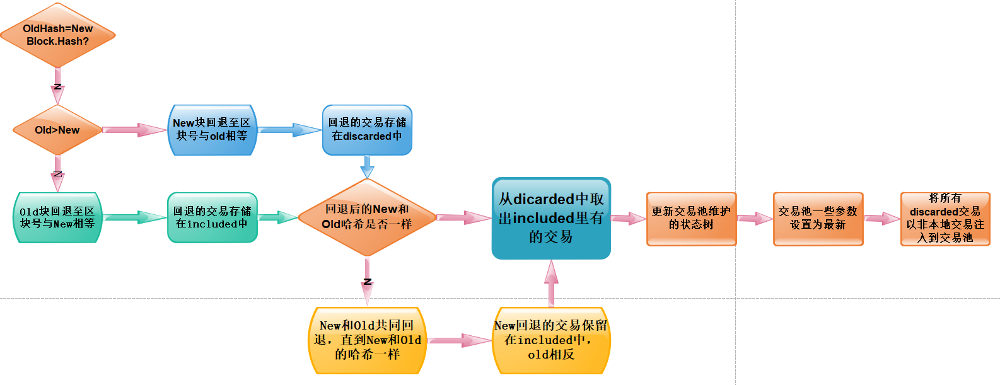

### 以太坊交易池构建

#### 初始化都做了哪些事情？

###### 1.基础设置和通道创建

```go
	pool := &TxPool{
	//基础设置 config，signer签名器，链配置等
		config:          config,
		chainconfig:     chainconfig,
		chain:           chain,
		signer:          types.NewEIP155Signer(chainconfig.ChainID),
	//创建pending queue 和all交易列表	
		pending:         make(map[common.Address]*txList),
		queue:           make(map[common.Address]*txList),
		beats:           make(map[common.Address]time.Time),
		all:             newTxLookup(),
	//创建各种通道	
		chainHeadCh:     make(chan ChainHeadEvent, chainHeadChanSize),
		reqResetCh:      make(chan *txpoolResetRequest),
		reqPromoteCh:    make(chan *accountSet),
		queueTxEventCh:  make(chan *types.Transaction),
		reorgDoneCh:     make(chan chan struct{}),
		reorgShutdownCh: make(chan struct{}),
	//gasPrice设置	
		gasPrice:        new(big.Int).SetUint64(config.PriceLimit),
	}
```

###### 2.检查本地交易 将本地地址加载入交易池，按价格排序

```go
	pool.locals = newAccountSet(pool.signer)
	for _, addr := range config.Locals {
		log.Info("Setting new local account", "address", addr)
		pool.locals.add(addr)
	}
	pool.priced = newTxPricedList(pool.all)
```

###### 3.进行一次重置操作

`pool.reset(nil, chain.CurrentBlock().Header())`

###### 4.开启重置轮询

```go
go pool.scheduleReorgLoop()
```

###### 5.加载日志

```go
	// If local transactions and journaling is enabled, load from disk
	if !config.NoLocals && config.Journal != "" {
		pool.journal = newTxJournal(config.Journal)

		if err := pool.journal.load(pool.AddLocals); err != nil {
			log.Warn("Failed to load transaction journal", "err", err)
		}
		if err := pool.journal.rotate(pool.local()); err != nil {
			log.Warn("Failed to rotate transaction journal", "err", err)
		}
	}
```

###### 6.从区块链订阅事件并启动主事件循环。

```go
	pool.chainHeadSub = pool.chain.SubscribeChainHeadEvent(pool.chainHeadCh)
	pool.wg.Add(1)
	go pool.loop()
```

### 轮询事件

##### 主事件：不间断监听以下通道的事件并作出回应

pool.chainHeadCh

pool.chainHeadSub.Err()

report.C

evict.C

journal.C

```go
// loop is the transaction pool's main event loop, waiting for and reacting to
// outside blockchain events as well as for various reporting and transaction
// eviction events.循环是事务池的主事件循环，它等待和响应外部区块链事件以及各种报告和事务逐出事件。
func (pool *TxPool) loop() {
	defer pool.wg.Done()

	var (
		prevPending, prevQueued, prevStales int
		// Start the stats reporting and transaction eviction tickers
		report  = time.NewTicker(statsReportInterval)
		evict   = time.NewTicker(evictionInterval)
		journal = time.NewTicker(pool.config.Rejournal)
		// Track the previous head headers for transaction reorgs
		head = pool.chain.CurrentBlock()
	)
	defer report.Stop()
	defer evict.Stop()
	defer journal.Stop()

	for {
		select {
		// Handle ChainHeadEvent
		case ev := <-pool.chainHeadCh:
			if ev.Block != nil {
				pool.requestReset(head.Header(), ev.Block.Header())
				head = ev.Block
			}

		// System shutdown.
		case <-pool.chainHeadSub.Err():
			close(pool.reorgShutdownCh)
			return

		// Handle stats reporting ticks
		case <-report.C:
			pool.mu.RLock()
			pending, queued := pool.stats()
			stales := pool.priced.stales
			pool.mu.RUnlock()

			if pending != prevPending || queued != prevQueued || stales != prevStales {
				log.Debug("Transaction pool status report", "executable", pending, "queued", queued, "stales", stales)
				prevPending, prevQueued, prevStales = pending, queued, stales
			}

		// Handle inactive account transaction eviction
		case <-evict.C:
			pool.mu.Lock()
			for addr := range pool.queue {
				// Skip local transactions from the eviction mechanism
				if pool.locals.contains(addr) {
					continue
				}
				// Any non-locals old enough should be removed
				if time.Since(pool.beats[addr]) > pool.config.Lifetime {
					for _, tx := range pool.queue[addr].Flatten() {
						pool.removeTx(tx.Hash(), true)
					}
				}
			}
			pool.mu.Unlock()

		// Handle local transaction journal rotation
		case <-journal.C:
			if pool.journal != nil {
				pool.mu.Lock()
				if err := pool.journal.rotate(pool.local()); err != nil {
					log.Warn("Failed to rotate local tx journal", "err", err)
				}
				pool.mu.Unlock()
			}
		}
	}
}
```

##### 重置事件：scheduleReorgLoop调度reset和promoteExecutables的运行。上面的代码不应该直接调用这些方法，而是使用requestReset和requestPromoteExecutables请求它们运行。

从以下通道接收信号，每次接受任意信号开始新的循环

pool.reqResetCh

pool.reqPromoteCh

pool.queueTxEventCh

curDone

pool.reorgShutdownCh

每次循环判断：

1.接收到了curDone

2.接受到了pool.reqResetCh信号

便执行reset重置操作

```go
// scheduleReorgLoop schedules runs of reset and promoteExecutables. Code above should not
// call those methods directly, but request them being run using requestReset and
// requestPromoteExecutables instead.
func (pool *TxPool) scheduleReorgLoop() {
	defer pool.wg.Done()

	var (
		curDone       chan struct{} // non-nil while runReorg is active
		nextDone      = make(chan struct{})
		launchNextRun bool
		reset         *txpoolResetRequest
		dirtyAccounts *accountSet
		queuedEvents  = make(map[common.Address]*txSortedMap)
	)
	for {
		// Launch next background reorg if needed
		if curDone == nil && launchNextRun {
			// Run the background reorg and announcements
			go pool.runReorg(nextDone, reset, dirtyAccounts, queuedEvents)

			// Prepare everything for the next round of reorg
			curDone, nextDone = nextDone, make(chan struct{})
			launchNextRun = false

			reset, dirtyAccounts = nil, nil
			queuedEvents = make(map[common.Address]*txSortedMap)
		}

		select {
		case req := <-pool.reqResetCh:
			// Reset request: update head if request is already pending.
			if reset == nil {
				reset = req
			} else {
				reset.newHead = req.newHead
			}
			launchNextRun = true
			pool.reorgDoneCh <- nextDone

		case req := <-pool.reqPromoteCh:
			// Promote request: update address set if request is already pending.
			if dirtyAccounts == nil {
				dirtyAccounts = req
			} else {
				dirtyAccounts.merge(req)
			}
			launchNextRun = true
			pool.reorgDoneCh <- nextDone

		case tx := <-pool.queueTxEventCh:
			// Queue up the event, but don't schedule a reorg. It's up to the caller to
			// request one later if they want the events sent.
			addr, _ := types.Sender(pool.signer, tx)
			if _, ok := queuedEvents[addr]; !ok {
				queuedEvents[addr] = newTxSortedMap()
			}
			queuedEvents[addr].Put(tx)

		case <-curDone:
			curDone = nil

		case <-pool.reorgShutdownCh:
			// Wait for current run to finish.
			if curDone != nil {
				<-curDone
			}
			close(nextDone)
			return
		}
	}
}
```


### 交易池重置

reset函数的执行流程：

