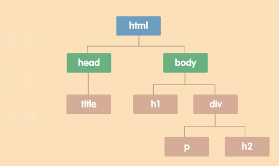
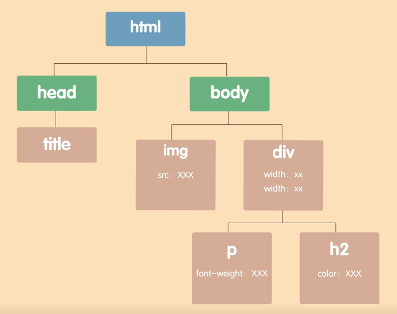
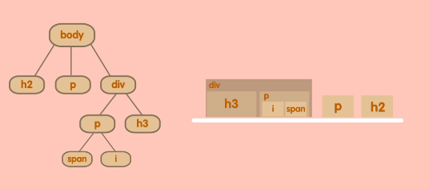
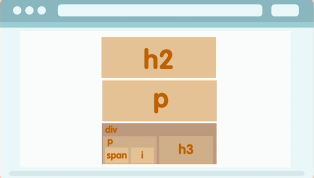
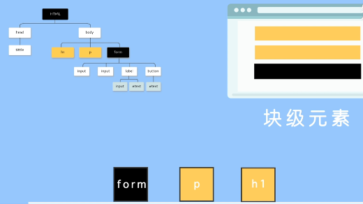
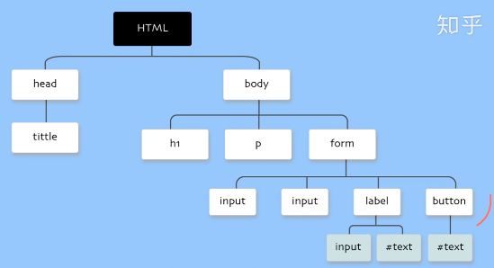
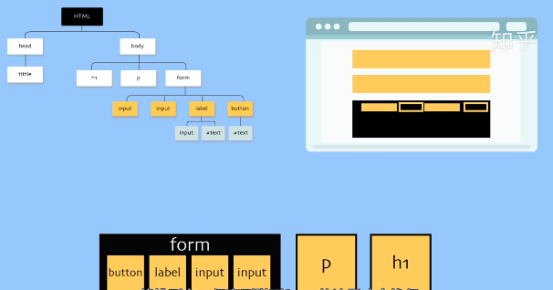
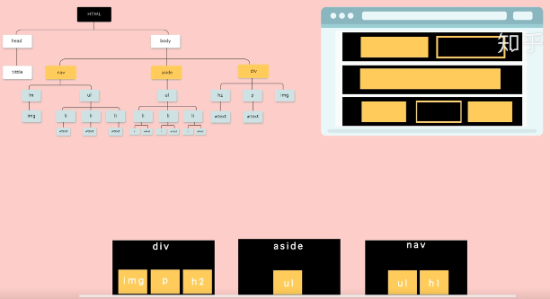

浏览器和服务器通过几次握手后，得到服务器传回给浏览器的代码，浏览器接收到代码后进行解析，之后进行三大步骤：DOM构造、布局以及绘制页面，最终变为人人可见的网页

#### 1.DOM构造

浏览器首先将收到的html代码通过html解析器构建为一颗DOM树

接着将接收到的CSS代码通过css解析器构建出样式表规则，将这些规则分别放到对应的DOM树节点上。

得到一颗带有样式属性的DOM树

#### 2.布局

浏览器按从上到下，从左到右的顺序，读取DOM树的文档节点，顺序存放到一条虚拟的传送带上，

嵌套放（可以嵌套的层级是没有限制的），形成文档流，文档流排完之后开始获取计算节点的坐标和大小等CSS属性，作为盒子的包装说明，之后将盒子在页面上一一摆放，将节点布局到页面。

#### 3.绘制页面

最后将布局到页面上的内容绘制出来

举例：

