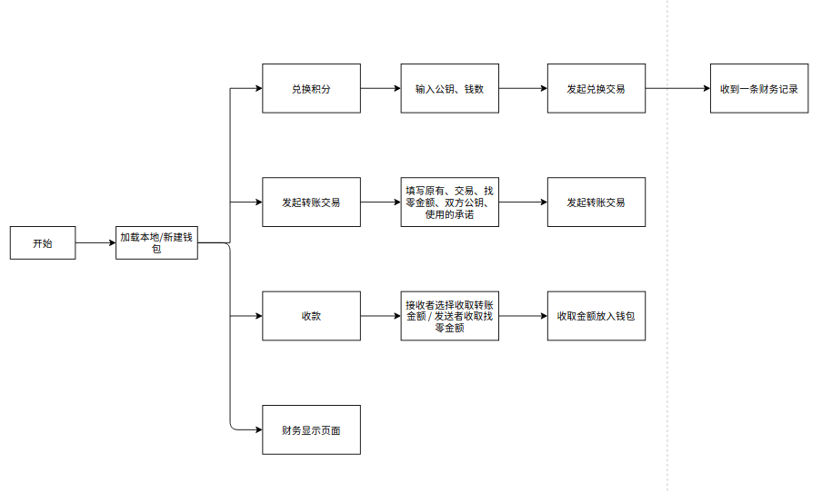

# 匿名计算链钱包

匿名计算链钱包为匿名计算链的一个子项目，服务于用户，用于安全计算过程和匿名交易。

钱包每个用户单独使用，无中心化的网络服务器参与，完成用户使用匿名计算链的基本功能。

## 功能模块

钱包包括四个主要的功能模块：

初始化、兑换（购币交易）、转账交易、收款、财务显示

### 初始化

初始化钱包提供两个功能：新建钱包和加载已有钱包

##### 新建钱包：

指定一个本地路径持久化保存钱包，同时加载、进行数据读写

##### 加载钱包：

制定一个本地路径加载已有钱包，进行数据读写

### 兑换

受到兑换请求后，前端直接将参数发送给交易所服务器，之后把收到的承诺给后端发送过去，后端加载到用户的钱包里，生成**兑换交易**记录

### 转账交易

用户选择使用的承诺，使用的金额和找零金额，填写接受者，和链交互（解锁账户、发起交易），发起转账，生成**转账交易记录**

### 收款

##### 接收者接收转账交易：

用户填写交易的哈希、交易的接收者的公钥，用哈希拿取交易，用接收者私钥解密，获取其中的转账金额，存到自己的钱包里

##### 拿到找零金额：

用户填写交易的哈希，系统上链中找交易哈希是否存在，如果存在，和用户钱包转账交易记录比对，如果有相同交易哈希，则判定转账交易已经上链。钱包拿取转账交易记录，删去用户花费的承诺，新存取找零金额到自己的钱包里。

### 财务显示

将当前用户的钱包内财务数据加载到前端界面可视化