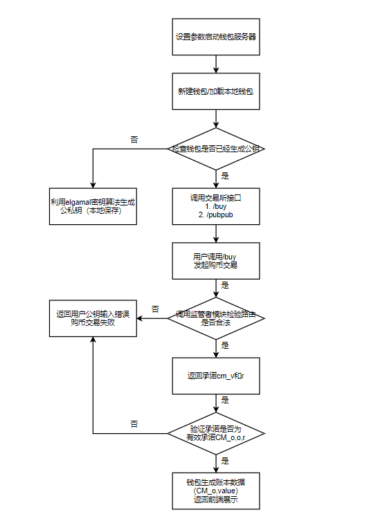

# Wallet APIs 
本文档主要介绍区块链钱包的接口文档，描述了钱包的数据结构、钱包后端调用交易所接口和链上接口的两大核心功能的实现细节。

## 钱包的数据结构
备注：分别为用户状态和后端存储的帐单格式建立数据表，设置 `ID` 为索引。 
```Golang
// PublicKey 公钥
type PublicKey struct {
	G1, G2, P, H *big.Int
}

// PrivateKey 私钥
type PrivateKey struct {
	PublicKey
	X *big.Int
}

// 承诺
type Commitment struct {
	commitment, r []byte
}

// 用于和用户交互的账单格式，不存储ID
type ReScore struct{
    CM Cmooitment
    value int //钱数
    vor *big.Int //随机数
}

// 在后端中存储的账单格式，方便索引
type Score struct{
    ID int //标识，标识这个承诺属于哪个账户
    Sc ReScore
}

// 用户状态
type Account struct{
    ID int
    Key PrivateKey 
}

var ReFortune []ReScore //用于读取和返还用户本地钱包文件
```

## GenerateKeys 算法
用户新建钱包时，要从监管者处获取G1, G2, P ，并用此数据生成公私钥，私钥要发给用户让他保存好。调用 `GenerateKeys` 函数，生成 `G1`、`G2`、`P` 公钥文件，计算出用户公钥 `H`。
```golang
func GenerateKeys(G1, G2, P *big.Int) (pub PublicKey, priv PrivateKey, err error) {
	//赋值
	priv.P = P	
	priv.G1 = G1	
	priv.G2 = G2

	// 随机选择私钥 X
	priv.X =new(big.Int)
	rnd := rand.New(rand.NewSource(time.Now().UnixNano()))
	priv.X.Rand(rnd, pub.P)

	// 计算公钥 H
	pub.H = new(big.Int)
	pub.H.Exp(pub.G2, priv.X, pub.P)
	priv.H =  pub.H

	return
}
```

## 购币交易
购币交易的场景主要由钱包后端和交易所服务器的接口交互实现。

  
交易所服务器提供接口 `/buy [POST]` ，端口号缺省：`1323`，用户输入样例如下：

```
{
	"g1"    :"9434010866557883432899515512338590271408819035691331775356172679296704297442",
	"g2"    :"16699476090444326034784401952324371377720017398258844087346247796127238764048",
	"p"     :"22462061785371779578762224547786669348890858038353012248859154063999614739741",
	"h"     :"1041504820361995665122100729363779110602830339300272239819296520183869996060",
	"amount": "123"
}
```
- g1：pubkey，链上所有用户保持相同
- g2：pubkey，链上所有用户保持相同
- g3：pubkey，链上所有用户保持相同
- h：user_pubkey，后端调用 GenerateKeys 算法生成公钥
- amount：代表金钱数，即购币金额

设置路由 `/pubpub` 暴露给用户，返回发行者公钥信息。

## 转账交易
转账交易的场景发生在钱包后端与链上提供的接口进行交互。用户填写发送方公钥、接送方公钥、发送金额、找零金额、被花费货币的承诺和被花费货币的承诺随机数，调用链上的 `eth_sendTransaction` 消息调用接口，发送一个 HTTP 请求，返回用户的转账交易记录。

- spk: DATA - 发送方公钥
- rpk: DATA - 接收方公钥
- s: QUANTITY - 发送金额
- r: QUANTITY - 返还（找零）金额
- vor: QUANTITY - 被花费货币的承诺随机数
- cmo: QUANTITY - 被花费货币的承诺

### 转账交易记录
转账交易记录的数据格式为：
