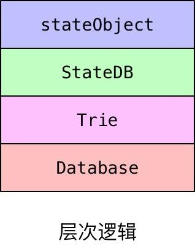

# EVM源码分析（数据存储）

## 1 简介

evm在具体执行合约过程中有三种存储方式

1. 栈（Stack）
2. 内存块（Memory）
3. 状态数据库（StateDB）

只有第三个是被永久存储的，前两个在合约执行完成后被销毁。

Stack和Memory在编译合约过程中被初始化

```go
func (in *EVMInterpreter) Run(contract *Contract, input []byte, readOnly bool) (ret []byte, err error) {
   ......
   var (
      ...
      mem   = NewMemory() // 新建Memory用于内存块存储
      stack = newstack()  // 栈存储
      ...
   )
   ......
}
```

## 2 Stack

主要功能：为了存储合约执行过程中的变量，可以当成cpu中的寄存器

在编译过程中如果用到Stack是不消耗任何gas的

```go
type Stack struct {
   data []*big.Int
}

func newstack() *Stack {
   // 实例化过程中用make方法设置为长度1024的数组
   return &Stack{data: make([]*big.Int, 0, 1024)}
}
```

实例化的栈对象以后，Stack提供了许多具体的操作方法。实现过程中遵从先进后出。下面举出几个方法：

```go
// 在栈顶加入新元素
func (st *Stack) push(d *big.Int) {
	st.data = append(st.data, d)
}
// 删除栈顶元素
func (st *Stack) pop() (ret *big.Int) {
	ret = st.data[len(st.data)-1]
	st.data = st.data[:len(st.data)-1]
	return
}
// 将第n个元素置于栈顶，与当前栈顶元素位置交换，保证其余元素在栈中位置不变
func (st *Stack) swap(n int) {
	st.data[st.len()-n], st.data[st.len()-1] = st.data[st.len()-1], st.data[st.len()-n]
}
// 取栈顶元素
func (st *Stack) peek() *big.Int {
	return st.data[st.len()-1]
}
```

## 3 Memory

主要功能：为了存储合约执行过程中的变量，可以当成一片虚拟的内存

在编译过程中用到Memory是要消耗少量gas的

下面是Memory具体定义，和实例化的过程

```go
type Memory struct {
   store       []byte // 这里就当成开辟了一片模拟的内存
   lastGasCost uint64 // 用来在每次使用Memory时，参与计算消耗的 gas。
}

func NewMemory() *Memory {
   return &Memory{}
}
```

与Stack一样，Memory同样实现了许多方法

```go
// 拓展内存空间
func (m *Memory) Resize(size uint64) {
   if uint64(m.Len()) < size {
      m.store = append(m.store, make([]byte, size-uint64(m.Len()))...)
   }
}
// 下面两个方法都是用于将指定数据存入指定偏移地址中
func (m *Memory) Set(offset, size uint64, value []byte) {
	......
}
func (m *Memory) Set32(offset uint64, val *big.Int) {
	......
}
// 下面两个方法用来请求内存中数据
func (m *Memory) GetCopy(offset, size int64) (cpy []byte) {
	......
}
func (m *Memory) GetPtr(offset, size int64) []byte {
	......
}
```

## 4 StateDB

### 4.1 简介

作用：存储所有账户信息，合约代码和合约数据。这是一块永久存储对象，这个对象不是 evm 模块中的对象，相当于硬盘存储。

以太坊真正存储数据的地方是LevelDB数据库，StateDB提供的是缓存，StateDB是一级缓存，状态树是二级缓存。也就是说我们的应用要从数据库中增删查找数据，首先是把数据从数据库拿到状态树里，再从状态树中取出放入StateDB中，最后从StateDB中提取数据。



cachedTrie实现了Trie，cachingDB实现了Databse

```go
// 实现Database接口，缓存常用的trie
type cachingDB struct {
   //保存trie数据的db
   db *trie.Database
   mu sync.Mutex
   // 缓存过去的trie，队列类型
   pastTries     []*trie.SecureTrie
   codeSizeCache *lru.Cache
}

// 包含了trie和缓存db，trie实际是存在db中的
type cachedTrie struct {
   *trie.SecureTrie
   db *cachingDB
}
```

### 4.2 数据结构

```go
type StateDB struct {
   // Database是以太坊真正存储数据的地方
   db   Database
   // 在Database之上使用tire的数据结构
   trie Trie

   // This map holds 'live' objects, which will get modified while processing a state transition.
   // 用来缓存从tire中读取的信息，tire在被调用的工程中会访问数据库
   stateObjects        map[common.Address]*stateObject
   stateObjectsPending map[common.Address]struct{} // State objects finalized but not yet written to the trie
   stateObjectsDirty   map[common.Address]struct{} // State objects modified in the current execution

   // DB error.
   // State objects are used by the consensus core and VM which are
   // unable to deal with database-level errors. Any error that occurs
   // during a database read is memoized here and will eventually be returned
   // by StateDB.Commit.
   dbErr error

   // The refund counter, also used by state transitioning.
   refund uint64

   thash, bhash common.Hash
   txIndex      int
   logs         map[common.Hash][]*types.Log
   logSize      uint

   preimages map[common.Hash][]byte

   // Journal of state modifications. This is the backbone of
   // Snapshot and RevertToSnapshot.
   journal        *journal
   validRevisions []revision
   nextRevisionId int

   // Measurements gathered during execution for debugging purposes
   AccountReads   time.Duration
   AccountHashes  time.Duration
   AccountUpdates time.Duration
   AccountCommits time.Duration
   StorageReads   time.Duration
   StorageHashes  time.Duration
   StorageUpdates time.Duration
   StorageCommits time.Duration
}
```

### 4.2 接口实现

在 core/vm/interface.go 中实现了StateDB的一些特殊功能的接口，这些接口的具体实现都是在core/state/statedb.go中具体实现，实现过程中会从上到下调用数据库。

```go
type StateDB interface {
    // 创建账户函数 表明evm需要你执行创建一个新的账户体系
	CreateAccount(common.Address)

    // 减去一个账户的余额
	SubBalance(common.Address, *big.Int)
	// 添加一个账户的余额
	AddBalance(common.Address, *big.Int)
	// 获取一个账户的余额
	GetBalance(common.Address) *big.Int
    // 获取账户的nonce 因为以太坊要根据nonce在决定交易的执行顺序和合约地址的生成
	GetNonce(common.Address) uint64
	// 更新合约的nonce
	SetNonce(common.Address, uint64)

    // 获取合约地址的整个合约代码的hash值
	GetCodeHash(common.Address) common.Hash
	// 获取合约代码
	GetCode(common.Address) []byte
	// 设置合约代码
	SetCode(common.Address, []byte)
	// 获取合约代码的大小
	GetCodeSize(common.Address) int
  // 获取和添加偿还金额
	AddRefund(uint64)
	GetRefund() uint64
  // 注意这两个函数很重要 其实质就是相当于数据库的select和update 
  // 一个智能合约的全局静态数据的读取和写入就是通过这两个函数
	GetState(common.Address, common.Hash) common.Hash
	SetState(common.Address, common.Hash, common.Hash)

  // 合约账户自杀 或者是否已经自杀 主要是以太坊的一个机制 自杀的合约会给与退费
	Suicide(common.Address) bool
	HasSuicided(common.Address) bool

  // 判断一个合约是否存在
	Exist(common.Address) bool
	// 判断合约是否为空
	// is defined according to EIP161 (balance = nonce = code = 0).
	Empty(common.Address) bool

	RevertToSnapshot(int)
	Snapshot() int

  // 此函数就是在我们在智能合约中执行emit命令时调用的
	AddLog(*types.Log)
	AddPreimage(common.Hash, []byte)

  // 这个接口在evm中没有使用到 我们可以写一个空函数
	ForEachStorage(common.Address, func(common.Hash, common.Hash) bool)
}
```


