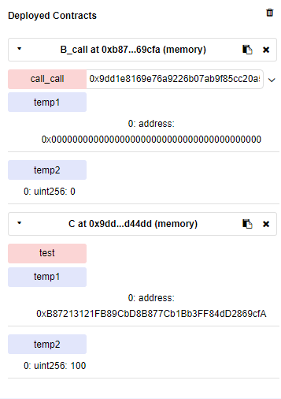
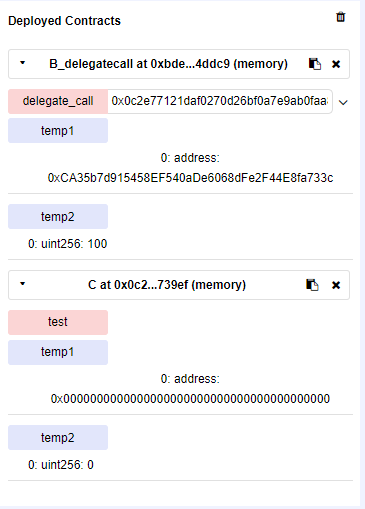
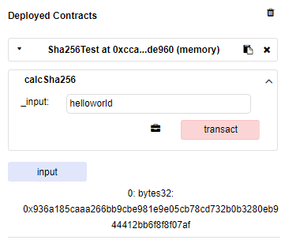

# EVM源码分析（合约间调用与预编译合约）

## 1.调用合约实例

```solidity
pragma solidity ^0.5.0; 

contract C {    
	address public temp1;    
	uint256 public temp2;    
	function test() public  {        
		temp1 = msg.sender;        
		temp2 = 100;    
    }
}

contract B_call {    
	address public temp1;   
	uint256 public temp2;    
	function call_call(address addr) public {        
		addr.call(abi.encode(bytes4(keccak256("test()"))));        
    }
} 

contract B_delegatecall {    
	address public temp1;   
	uint256 public temp2;    
	function delegate_call(address addr) public {            
		addr.delegatecall(abi.encode(bytes4(keccak256("test()"))));       
    }
} 

contract B_high{
    address public temp1;   
	uint256 public temp2; 
	function high_call(address addr) public {
	    B(addr).test();
	}
}
```


## 2 调用合约指令

一共有三种EVM指令（call，delegatecall，callcode）

callcode已废用，在homestead阶段改为delegatecall

下面：假设A调用合约B，B合约中实现delegatecall或call方法调用合约C，具体分析不同方法调用的不同点

### 2.1 call方法实现

是在被调用者（合约C）的上下文执行,只能修改被调用者（合约C）的storage

call阻止msg.sender和msg.value的传递



call方法对应的EVM-opcode如下

```go
CALL: {
   execute:     opCall,
   constantGas: params.CallGasFrontier,
   dynamicGas:  gasCall,
   minStack:    minStack(7, 1),
   maxStack:    maxStack(7, 1),
   memorySize:  memoryCall,
   valid:       true,
   returns:     true,
},
```

下面是该操作码对应的执行函数

```go
func opCall(pc *uint64, interpreter *EVMInterpreter, contract *Contract, memory *Memory, stack *Stack) ([]byte, error) {
   // Pop gas. The actual gas in interpreter.evm.callGasTemp.
   interpreter.intPool.put(stack.pop())
   gas := interpreter.evm.callGasTemp
   // Pop other call parameters.
   addr, value, inOffset, inSize, retOffset, retSize := stack.pop(), stack.pop(), stack.pop(), stack.pop(), stack.pop(), stack.pop()
   // 要调用的合约账户C的地址
   toAddr := common.BigToAddress(addr)
   value = math.U256(value)
   // Get the arguments from the memory.
   args := memory.GetPtr(inOffset.Int64(), inSize.Int64())

   // 在合约相互调用的时候如果附带ETH，是要计入gas消耗总量的
   if value.Sign() != 0 {
      gas += params.CallStipend
   }
   ret, returnGas, err := interpreter.evm.Call(contract, toAddr, args, gas, value)
   if err != nil {
      stack.push(interpreter.intPool.getZero())
   } else {
      stack.push(interpreter.intPool.get().SetUint64(1))
   }
   if err == nil || err == errExecutionReverted {
      // 把执行的返回值内容放入内存，便于后面的指令使用
      memory.Set(retOffset.Uint64(), retSize.Uint64(), ret)
   }
   contract.Gas += returnGas

   interpreter.intPool.put(addr, value, inOffset, inSize, retOffset, retSize)
   return ret, nil
}
```

### 2.2 delegatecall方法实现

是在调用者（合约B）的上下文中执行, 可以修改调用者（合约B）的storage

delegatecall允许msg.sender和msg.value的传递



DELEGATECALL是Homestead阶段新增的EVM-opcode

```go
instructionSet[DELEGATECALL] = operation{
   execute:     opDelegateCall, // 实现函数
   dynamicGas:  gasDelegateCall,
   constantGas: params.CallGasFrontier,
   minStack:    minStack(6, 1),
   maxStack:    maxStack(6, 1),
   memorySize:  memoryDelegateCall,
   valid:       true,
   returns:     true,
}
```

下面是该操作码对应的执行函数

```go
func opDelegateCall(pc *uint64, interpreter *EVMInterpreter, contract *Contract, memory *Memory, stack *Stack) ([]byte, error) {
   // Pop gas. The actual gas is in interpreter.evm.callGasTemp.
   interpreter.intPool.put(stack.pop())
   gas := interpreter.evm.callGasTemp
   // Pop other call parameters.
   // 这里进行栈调用的时候少了一个value值，因为delegateCall方法的value值是继承A的value
   addr, inOffset, inSize, retOffset, retSize := stack.pop(), stack.pop(), stack.pop(), stack.pop(), stack.pop()
   // 要调用的合约账户地址
   toAddr := common.BigToAddress(addr)
   // Get arguments from the memory.
   args := memory.GetPtr(inOffset.Int64(), inSize.Int64())

   ret, returnGas, err := interpreter.evm.DelegateCall(contract, toAddr, args, gas)
   if err != nil {
      stack.push(interpreter.intPool.getZero())
   } else {
      stack.push(interpreter.intPool.get().SetUint64(1))
   }
   if err == nil || err == errExecutionReverted {
      // 把执行的返回值内容放入内存，便于后面的指令使用
      memory.Set(retOffset.Uint64(), retSize.Uint64(), ret)
   }
   contract.Gas += returnGas

   interpreter.intPool.put(addr, inOffset, inSize, retOffset, retSize)
   return ret, nil
}
```

DelegateCall方法的具体实现，这个方法不像call和creat方法可以被外部账户直接调用

```go
func (evm *EVM) DelegateCall(caller ContractRef, addr common.Address, input []byte, gas uint64) (ret []byte, leftOverGas uint64, err error) {
   // 递归调用检查和深度检验，同call方法
   if evm.vmConfig.NoRecursion && evm.depth > 0 {
      return nil, gas, nil
   }
   if evm.depth > int(params.CallCreateDepth) {
      return nil, gas, ErrDepth
   }

   var (
      snapshot = evm.StateDB.Snapshot()
      // 这里对to的定义，将来执行改变的也将是caller.Address()账户地址下合约（B）的状态
       // to       = AccountRef(addr) call()方法中指定的是c的地址
      to       = AccountRef(caller.Address())
   )

   // 这里加入AsDelegate方法进行重写
   contract := NewContract(caller, to, nil, gas).AsDelegate()
   contract.SetCallCode(&addr, evm.StateDB.GetCodeHash(addr), evm.StateDB.GetCode(addr))

   ret, err = run(evm, contract, input, false)
   if err != nil {
      evm.StateDB.RevertToSnapshot(snapshot)
      if err != errExecutionReverted {
         contract.UseGas(contract.Gas)
      }
   }
   return ret, contract.Gas, err
}
```

通过下面方法对NewContract方法重写，可以看出合约C执行允许msg传递

```go
func (c *Contract) AsDelegate() *Contract {
   // NOTE: caller must, at all times be a contract. It should never happen
   // that caller is something other than a Contract.
   parent := c.caller.(*Contract)
   c.CallerAddress = parent.CallerAddress
   c.value = parent.value

   return c
}
```

### 2.3 高级方法实现调用

实现的机制大概就是通过实例化合约对象，完成合约的调用，参照上面的call_high方法

翻译成的汇编片段如下，可以看出来调用的是evm-opcode的CALL指令，实现功能也一样

```assembly
 tag 16			
      JUMPDEST 			
      POP 			
      GAS 			
      CALL        ## there
      ISZERO 			
      DUP1 			
      ISZERO 			
      PUSH [tag] 17		
      JUMPI 			
      RETURNDATASIZE 			  
      PUSH 0			
      DUP1 			
      RETURNDATACOPY 			
      RETURNDATASIZE 			
      PUSH 0			
      REVERT 			
```


## 3 预编译合约

1. 预编译合约是以太坊内置的一些已经写好的合约，利用native Go来实现。这些合约是用来被我们正常写的合约调用的，不能独立于我们的合约自己运行。
2. 预编译合约是 EVM 中用于提供更复杂库函数(通常用于加密、散列等复杂操作)的一种折衷方法。因为计算量很大，所以预编译合约的内容并不是很容易用从操作码的方式实现（与evm存储空间容量的256bit，即32字节有关系）

合约代码实例

```solidity
pragma solidity ^0.4.21;

contract Sha256Test {
    uint256 time = 123;
    bytes32 input;

    function calcSha256(string memory _input) public {
    	// 这里实现了hash256算法
        bytes32 id = sha256(_input);
        input = id;
    }

}
```

下面是上述代码翻译出来的汇编片段，同样也是调用了EVM-opcode的CALL指令，但是这里并不涉及什么状态修改，因为precontract的内容其实并没有放到虚拟机中执行

```assembly
GAS 			
CALL 	## there		
ISZERO 		
DUP1 			
ISZERO 		
PUSH [tag] 10		
JUMPI 		
RETURNDATASIZE 		
```



回顾一下run函数，下面是run方法中的片段

```go
if contract.CodeAddr != nil {
      // 设置为适用于Frontier和Homestead阶段预编译以太坊集
      precompiles := PrecompiledContractsHomestead
      // 下面设置是拜占庭阶段的预编译以太坊集
      if evm.chainRules.IsByzantium {
         precompiles = PrecompiledContractsByzantium
      }
      // 下面是伊斯坦布尔阶段的预编译以太坊集
      if evm.chainRules.IsIstanbul {
         precompiles = PrecompiledContractsIstanbul
      }
      // 如果是上述阶段的特殊地址，RunPrecompiledContract调用其阶段对应的Run方法返回的字节码结果，并输出
      if p := precompiles[*contract.CodeAddr]; p != nil {
         // 在这里具体执行预编译合约
         return RunPrecompiledContract(p, input, contract)
      }
   }
```

下面是执行预编译合约的的具体内容

```go
func RunPrecompiledContract(p PrecompiledContract, input []byte, contract *Contract) (ret []byte, err error) {
   gas := p.RequiredGas(input)
   // 调用RequiredGas方法，UseGas扣除预编译合约消耗的gas
   if contract.UseGas(gas) {
      // Run方法具体执行预编译合约内容
      return p.Run(input)
   }
   return nil, ErrOutOfGas
}
```

下面是预编译合约的数据结构

```go
type PrecompiledContract interface {
   RequiredGas(input []byte) uint64  // RequiredPrice calculates the contract gas use
   Run(input []byte) ([]byte, error) // Run runs the precompiled contract
}
```

下面是在以太坊Homestead阶段内置的预编译合约

```go
var PrecompiledContractsHomestead = map[common.Address]PrecompiledContract{
   common.BytesToAddress([]byte{1}): &ecrecover{},
   common.BytesToAddress([]byte{2}): &sha256hash{},
   common.BytesToAddress([]byte{3}): &ripemd160hash{},
   common.BytesToAddress([]byte{4}): &dataCopy{},
}
```

下面看一下sha256hash合约的具体实现，根据数据结构中的定义这里定义了两个方法

```go
// SHA256 implemented as a native contract.
type sha256hash struct{}

// RequiredGas returns the gas required to execute the pre-compiled contract.
//
// This method does not require any overflow checking as the input size gas costs
// required for anything significant is so high it's impossible to pay for.
func (c *sha256hash) RequiredGas(input []byte) uint64 {
   return uint64(len(input)+31)/32*params.Sha256PerWordGas + params.Sha256BaseGas
}
func (c *sha256hash) Run(input []byte) ([]byte, error) {
   h := sha256.Sum256(input)
   return h[:], nil
}
```
