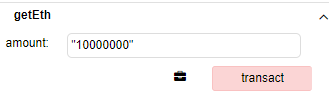
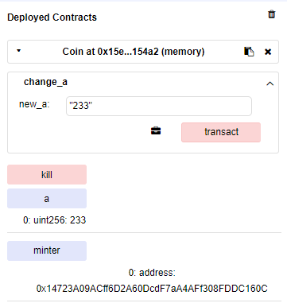
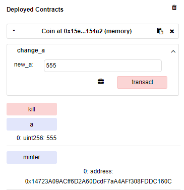
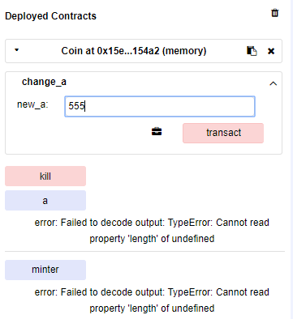
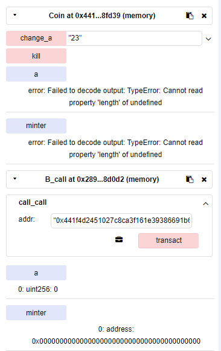
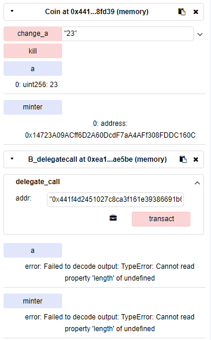
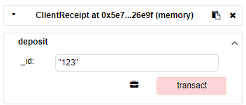

# EVM源码分析（合约字节码分析 ）

## 1 以太坊中的合约Code

下面是定义的Code的数据类型（字节数组）

```go
Code     []byte
```

1. 存入合约的形式一般为下（十六进制）在存入过程中以8位（两个字符）为一个字节，利用了hex.DecodeString方法
2. pc++其实是对Code取下一个字节，也就是取实际中的下两个字符

下面是一段合约和其对应的字节码示例

```solidity
pragma solidity ^0.4.11;

contract C {
    uint256 a;
    function C() {
      a = 1;
    }
}
```

```go
60606040523415600e57600080fd5b600160008190555060358060236000396000f3006060604052600080fd00a165627a7a72305820d315875f56b532ab371cf9aa86a62850e13eb6ab194847011dcd641b9a9d2f8d0029
```

## 2 C合约Code的拆分

```solidity
pragma solidity ^0.5.0;

contract C {
    uint256 a;
    constructor() public{
      a = 1;
    }
}
```

下面是部署时用到的代码Binary

```go
60606040523415600e57600080fd5b600160008190555060358060236000396000f300

PUSH1 0x60 PUSH1 0x40 MSTORE CALLVALUE ISZERO PUSH1 0xE JUMPI PUSH1 0x0 DUP1 REVERT JUMPDEST PUSH1 0x1 PUSH1 0x0 DUP2 SWAP1 SSTORE POP PUSH1 0x35 DUP1 PUSH1 0x23 PUSH1 0x0 CODECOPY PUSH1 0x0 RETURN STOP
```

下面是智能合约本身的代码runtime

```go
6060604052600080fd00
PUSH1 0x60 PUSH1 0x40 MSTORE PUSH1 0x0 DUP1 REVERT STOP
```

下面是auxdata的内容，不具体运行，合约代码的校验码和solc版本的数据

```go
a165627a7a72305820d315875f56b532ab371cf9aa86a62850e13eb6ab194847011dcd641b9a9d2f8d0029

LOG1 PUSH6 0x627A7A723058 KECCAK256 0xd3 ISZERO DUP8 0x5f JUMP 0xb5 ORIGIN 0xab CALLDATACOPY SHR 0xf9 0xaa DUP7 0xa6 0x28 POP 0xe1 RETURNDATACOPY 0xb6 0xab NOT 0x48 0x47 ADD SAR 0xcd PUSH5 0x1B9A9D2F8D STOP 0x29
```

### 2.1 部署代码Binary详解

#### 2.1.1 Payable检查

Payable是智能合约中的一个关键字，附带该关键字的函数中会涉及以太币转账

下面是Payable字段的具体解析


1. 如果调用智能合约附带以太币，则终止程序，进行对合约账户的转账
2. 如果调用智能合约附带以太币，则转而执行构造函数

#### 2.1.2 执行构造函数


这里主要把外部声明的变量赋值并存储到stateDB里面，最后清空栈。

这里有一个细节是完成了dup2，而不是直接剪切原始数据，保证原始数据不易丢失。

1. 在以太坊中，StateDB 是一个 key-value pair。每一个 key 对应一个 32 字节长的数据块（存储槽）。所以在上图所示的情况里面，0x0 这个 key 所对应的数据块里面存储了 0x1 这个数（因为这个数的数据类型是uint256，即32 字节，高位补 0）。
2. 实际中，我们不会用到范围这么大的整数，一般一个数据槽中有很多数据

如果声明两个uint128类型变量a，b。在StateDB中的存储方式如下：

```c
[         b         ][         a         ]
[16 bytes / 128 bits][16 bytes / 128 bits]
```

#### 2.1.3 复制代码


把栈中对应偏移地址为0x23，长度为0x35的数据存储到内存对应的偏移地址从0x00开始的内存空间中，最后将内存中新存储的内容返回

### 2.1.2 运行代码runtime详解

这里对应智能合约被调用的时候的各种方法和函数


在我们的例子中，智能合约只有一个构造函数，而没有其他方法，所以上图所示的代码并没有做什么有实际意义的操作。

## 3 waterflow合约code

waterflow合约和对应的字节码如下

```solidity
pragma solidity ^0.5.0;

contract watertap {
	// 向合约地址申请转账ETH
    function getEth(uint amount) public {
        require(amount < 10000000000);
        msg.sender.transfer(amount);
    }
    // 给合约地址转账ETH
    function send() public payable {}
}
```

```assembly
6080604052600436106043576000357c0100000000000000000000000000000000000000000000000000000000900480638e3073a6146048578063b46300ec14607f575b600080fd5b348015605357600080fd5b50607d60048036036020811015606857600080fd5b81019080803590602001909291905050506087565b005b608560e2565b005b6402540be40081101515609957600080fd5b3373ffffffffffffffffffffffffffffffffffffffff166108fc829081150290604051600060405180830381858888f1935050505015801560de573d6000803e3d6000fd5b5050565b56fea165627a7a72305820f130e28a36f17868a2cfeb06840d38072ebabd5d114698eca201587ff5cb1b650029
```

### 3.1 Payable检查

```assembly
  ## 开辟64byte内存空间
  PUSH 80			contract watertap {
  PUSH 40			contract watertap {
  MSTORE 			contract watertap {
  ## 若contract.value = 0，执行构造函数
  CALLVALUE 			contract watertap {
  DUP1 			
  ISZERO 			
  PUSH [tag] 1		
  JUMPI 
  ## 终止程序
  PUSH 0			
  DUP1 			
  REVERT 			
```

### 3.2 执行构造函数

```assembly
## 本合约未定义构造函数，直接结束
JUMPDEST 			a 
  POP 			contract watertap {
```

### 3.3 复制代码

```assembly
  ## 获取runtime字节码和auxdata字节码在内存中的偏移地址和总长度，把取到的具体字节码带回return
  ## 最后return的内容对应部署最终结果，在creat（）中被存储到对应合约账户stateDB中
  PUSH  [$] 0000000000000000000000000000000000000000000000000000000000000000		
  DUP1 			contract watertap {
  PUSH  [$] 0000000000000000000000000000000000000000000000000000000000000000	
  PUSH 0			contract watertap {
  CODECOPY 			contract watertap {
  PUSH 0			contract watertap {
  RETURN 			contract watertap {
```

### 3.4 运行代码runtime

#### 3.4.1 input内容

input字段内容实例和字节码实例如下



```assembly
0x8e3073a60000000000000000000000000000000000000000000000000000000000989680
```

#### 3.4.2 input字段对应调用方法

```assembly
 .code
 	  ## 开辟64byte内存空间
      PUSH 80			contract watertap {
      PUSH 40			contract watertap {
      MSTORE 			contract watertap {
	  ## 将input字段长度压入栈中，与4进行对比
      PUSH 4			contract watertap {
      CALLDATASIZE 			contract watertap {
      ## 长度小于4,调转至tag1
      LT 			    contract watertap {
      PUSH [tag] 1			contract watertap {
      JUMPI 			contract watertap {
      ## 加载input内容前32个字节
      PUSH 0			contract watertap {
      CALLDATALOAD 			contract watertap {
	  ## 取input内容前4个字节
      PUSH 100000000000000000000000000000000000000000000000000000000			
      SWAP1 			contract watertap {
      DIV 			contract watertap {
	  ## 判断input前4个字节内容是否等于getEth(uint amount)哈希值，是则跳转至tag2
      DUP1 			contract watertap {
      PUSH 8E3073A6			contract watertap {
      EQ 			contract watertap {
      PUSH [tag] 2			contract watertap {
      JUMPI 			contract watertap {
	  ## 判断input前4个字节内容是否等于send()哈希值，是则跳转至tag2
      DUP1 			contract watertap {
      PUSH B46300EC			contract watertap {
      EQ 			contract watertap {
      PUSH [tag] 3			contract watertap {
      JUMPI 			contract watertap {
```

#### 3.4.3 input字段内容错误——tag1

```assembly
tag 1			contract watertap {
	  ## input长度小于4,结束执行
      JUMPDEST 			contract watertap {
      PUSH 0			contract watertap {
      DUP1 			contract watertap {
      REVERT 			contract watertap {
```

#### 3.4.4 getEth(uint amount)——tag2

```assembly
tag 2			
	  ## 因为getETH（）方法是不带payable字段的
	  ## 这里判断若contract.value = 0，执行tag4
      JUMPDEST 			
      CALLVALUE 			
      DUP1 			
      ISZERO 			
      PUSH [tag] 4			 
      JUMPI 			
      ## 如果附带了ETH，即contract.value ！= 0，结束执行
      PUSH 0			
      DUP1 			
      REVERT 			
```

```assembly
 tag 4			
 	  ## 取到input的32-64字节内容，如果这段内容为空，执行tag5，如果有内容执行tag6
      JUMPDEST 			 
      POP 			nt amount) public {
      PUSH [tag] 5			nt amount) public {
      PUSH 4			nt amount) public {
      DUP1 			nt amount) public {
      CALLDATASIZE 			
      SUB 			
      PUSH 20			
      DUP2 			
      LT 			
      ISZERO 			
      PUSH [tag] 6			
      JUMPI 			
      PUSH 0			
      DUP1 			
      REVERT 		
```

```assembly
tag 5			
	  ## 结束执行
      JUMPDEST 			
      STOP 
```

tag6，tag7，tag11，tag12为getEth的具体实现。ret最终返回给ApplyTransaction，ApplyTransaction并未对ret进行任何操作，很大一部分stateDB的改变全部在运行程序的过程中实现了。

#### 3.4.5 send()——tag2

```assembly
tag 3			
	  ## send（）方法定义了payable字段实现对合约账户的转账
	  ## 这里实现如果tag9（具体函数内容）并未加载，则执行tag8
      JUMPDEST 			
      PUSH [tag] 8			
      PUSH [tag] 9			
      JUMP [in]
```

```assembly
  tag 8			
  	  ## 结束执行
      JUMPDEST 			
      STOP 			
```

```assembly
 tag 9			
      ## 本智能合约并未具体实现send（）函数，所以tag9直接结束执行
      JUMPDEST 			
      JUMP [out]	
```

## 4 waterflow-two合约

```solidity
pragma solidity ^0.5.0;

contract watertap {
	// 向合约地址申请转账ETH
	uint256 a; 
	constructor(uint con)public{
	    a = con;
	}
    function getEth(uint amount) public {
        require(amount < 30000000000);
        msg.sender.transfer(amount);
    }
    // 给合约地址转账ETH
    function send() public payable {
    }
}
```

1. 这里添加了构造函数。在合约部署时也会附带input字段。input字段并没有传入run（）方法；但是在合约部署，最终用go语言去解释并执行构造函数的时候调用了input。
2. 这里的外部变量a，在构造函数实现并存储进stateDB，最终要进入合约账户地址（key）对应的存储状态，存储状态又是一个map，以这个例子为例：a是key，传入并付给a的值为value。

## 5 合约自毁

先看一下合约的具体内容

```solidity
pragma solidity ^0.5.1;

contract Coin {
    address public minter;
    uint public a;
    
    constructor() public {
        minter = msg.sender;
    }
    
    function change_a(uint new_a) public{
        a  = new_a;
    }
    
    function kill() public{
       if (minter == msg.sender) {    // 权限检查
          selfdestruct(msg.sender);   // 销毁合约
       }
    }

}
```

### 5.1 运行结果

（1）部署合约之后，先调用change_a方法给状态变量a赋值“233”



（2）更换账户地址，调用kill方法。再调用change_a方法改变a的值，发现合约依然存在，并且可以运行



（3）将调用账户地址换回来（即换成minter的地址），再去调用kill方法，最后进行检验。发现此时Coin合约已经被销毁，并且无法再被调用



### 5.2 调用销毁

```
pragma solidity ^0.5.1;

contract Coin {
    address public minter;
    uint public a;
    
    constructor() public {
        minter = msg.sender;
    }
    
    function change_a(uint new_a) public{
        a  = new_a;
    }
    // 注意这里没有设置调用权限
    function kill() public{
          selfdestruct(msg.sender); // 销毁合约
    }

}

contract B_call {    
	address public minter;   
	uint public a;    
	function call_call(address addr) public {        
		addr.call(abi.encode(bytes4(keccak256("kill()"))));        
    }
} 

contract B_delegatecall {    
	address public minter;   
	uint public a;     
	function delegate_call(address addr) public {            
		addr.delegatecall(abi.encode(bytes4(keccak256("kill()"))));       
    }
} 
```

（1）下面是用call方法调用销毁了Coin合约



（2）下面用delegatecall方法销毁了调用方合约B_delegatecall本身



### 5.3 EVM指令实现

```assembly
JUMPDEST 			
CALLER 			
PUSH FFFFFFFFFFFFFFFFFFFFFFFFFFFFFFFFFFFFFFFF			
AND 		     	; 将调用方的地址与ffffff...相与，实际就是调用方的地址
SELFDESTRUCT 
```

下面是自毁方法对应的指令

```go
SELFDESTRUCT: {
   execute:    opSuicide,
   dynamicGas: gasSelfdestruct,
   minStack:   minStack(1, 0),
   maxStack:   maxStack(1, 0),
   halts:      true,
   valid:      true,
   writes:     true,
},
```

下面是自毁指令的具体执行函数

```go
func opSuicide(pc *uint64, interpreter *EVMInterpreter, contract *Contract, memory *Memory, stack *Stack) ([]byte, error) {
   balance := interpreter.evm.StateDB.GetBalance(contract.Address())
   // 将合约账户中剩余的余额转移到，调用方地址账户中
   interpreter.evm.StateDB.AddBalance(common.BigToAddress(stack.pop()), balance)
   // 调用状态数据库进行销毁
   interpreter.evm.StateDB.Suicide(contract.Address())
   return nil, nil
}
```

## 6 合约events与logs

### 6.1 实例

事件是使用EVM日志内置功能的方便工具，在DAPP的接口中，它可以反过来调用Javascript的监听事件的回调。

```solidity
pragma solidity ^0.5.1;

contract ClientReceipt {
    event Deposit(
        address indexed _from,
        uint256 indexed _id,
        uint _value
    );

    function deposit(uint256 _id)payable public {
        emit Deposit(msg.sender, _id, msg.value);
    }
}
```

下面是一次事件被调用的实例，在外部，我们同样可以调用并且获取到返回日志的内容，这里返回的json内容，方便与外部交互。



```json
{
		"from": "0x5e72914535f202659083db3a02c984188fa26e9f",
		"topic": "0x90890809c654f11d6e72a28fa60149770a0d11ec6c92319d6ceb2bb0a4ea1a15",
		"event": "Deposit",
		"args": {
			"0": "0xCA35b7d915458EF540aDe6068dFe2F44E8fa733c",
			"1": "123",
			"2": "3",
			"_from": "0xCA35b7d915458EF540aDe6068dFe2F44E8fa733c",
			"_id": "123",
			"_value": "3",
			"length": 3
		}
}
```

### 6.1 EVM指令实现

对应一共5个指令，这里topics的内容一个是指定了被调用的相关函数，还制定了所有的索引值

```assembly
LOG0 LOG1 LOG2 LOG3 LOG4
```


LOG3对应跳转表如下

```go
LOG3: {
   execute:    makeLog(3),
   dynamicGas: makeGasLog(3),
   minStack:   minStack(5, 0),
   maxStack:   maxStack(5, 0),
   memorySize: memoryLog,
   valid:      true,
   writes:     true,
},
```

EVM中定义的执行函数

```go
func makeLog(size int) executionFunc {
   return func(pc *uint64, interpreter *EVMInterpreter, contract *Contract, memory *Memory, stack *Stack) ([]byte, error) {
      topics := make([]common.Hash, size)
      mStart, mSize := stack.pop(), stack.pop()
      for i := 0; i < size; i++ {
         topics[i] = common.BigToHash(stack.pop())
      }

      d := memory.GetCopy(mStart.Int64(), mSize.Int64())
      interpreter.evm.StateDB.AddLog(&types.Log{
         Address: contract.Address(),
         Topics:  topics,
         Data:    d,
         // This is a non-consensus field, but assigned here because
         // core/state doesn't know the current block number.
         BlockNumber: interpreter.evm.BlockNumber.Uint64(),
      })

      interpreter.intPool.put(mStart, mSize)
      return nil, nil
   }
}
```

