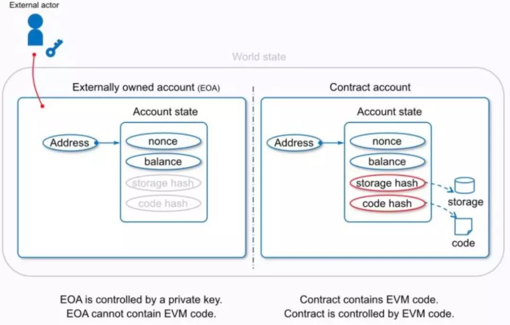

# 智能合约生命周期

## 1.智能合约存储结构



智能合约在状态树中的存储比不同账户多了两个字段（storage，code），在stateDB中的结构可以认为是大树套小树

1. 合约地址Address可以认为是最大的key值，对应着合约账户的各种存储状态并进行打包
2. code hash字段就是合约字节码对应的hash值存储到状态树中
3. storage是EVM执行过程中，包括外部定义的一些变量值。key是变量地址，对应变量名，value是具体值得hash

## 2.合约创建与部署

我们写好智能合约之后，用一定形式填写交易相关的data（from，gaslimit，...），客户端缺省补齐相应字段（nonce，签名...），将交易广播（上述操作用geth客户端均可以实现），最后送给矿工节点执行，并与其他验证的节点取得共识

```err
err creating contract Error: invalid transaction v, r, s values ？
```

## 3.合约被调用

按照上述同样的方式，填写相应字段（需要调用的合约账户地址，附带的value...)，在网络中广播交易。对于调用合约的交易，当矿工在本地用EVM执行出现err，将状态回滚，丢弃交易。并最终与其他节点取得共识。

## 4.合约升级

我们可以人为设置版本控制，智能合约被调用时，默认再去调用最新版本的智能合约，可以将旧版本销毁。

## 4.合约销毁

实现selfdestruct（）方法并对其相应函数进行调用时，智能合约将处于死状态，它将永久不能被其他账户进行调用。

这里要对相应函数进行权限控制，或者判断调用者账户地址，防止智能合约受到攻击。