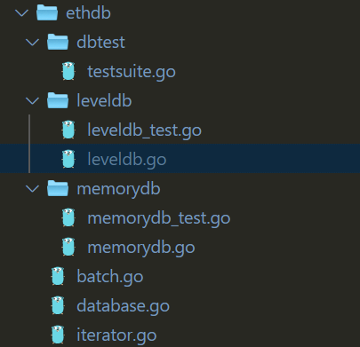

# ethdb源码分析（1）



ethdb目录下，leveldb.go来封装leveldb数据库的接口，memorydb.go封装一个内存结构。batch包装批量操作接口，database包装各种数据库操作接口，iterator包装迭代器操作和错误处理的接口。

## leveldb.go

首先是对一些常量的定义

```go
const (
  // degradationWarnInterval指定如果leveldb数据库跟不上请求的写入时多久打印一次警告。
  degradationWarnInterval = time.Minute
  // minCache 是分配给leveldb读写缓存的最小内存量（以兆字节为单位）
  minCache = 16
  // minHandles是分配给打开的数据库文件的最小文件句柄数。
  minHandles = 16
  // metricsGatheringInterval 指定检索leveldb数据库压缩，io和暂停统计信息以报告给用户的时间间隔。
  metricsGatheringInterval = 3 * time.Second
)
```

然后定义一个database结构,这个结构大致分为5个部分，fn文件名  leveldb实例 Mertrics用来记录数据库的使用情况 quitChan用于处理停止时的一些情况 log是一个跟踪数据库路径的上下文记录器

```go
type Database struct {
	fn string      // filename for reporting
	db *leveldb.DB // LevelDB instance
	
	compTimeMeter      metrics.Meter // Meter for measuring the total time spent in database compaction
	compReadMeter      metrics.Meter // Meter for measuring the data read during compaction
	······

	quitLock sync.Mutex      // Mutex protecting the quit channel access
	quitChan chan chan error // Quit channel to stop the metrics collection before closing the database
	
	log log.Logger // Contextual logger tracking the database path
}
```

随后创建了一个new函数来实例化一个database

```go
// New返回包装的LevelDB对象。namespace是metrics报告应使用的前缀，以显示内部统计信息。
func New(file string, cache int, handles int, namespace string) (*Database, error) {
}

// 主要注意以下几个部分
// 打开数据库并恢复可能存在的错误
db, err := leveldb.OpenFile(file, &opt.Options{
		OpenFilesCacheCapacity: handles,
		BlockCacheCapacity:     cache / 2 * opt.MiB,
		WriteBuffer:            cache / 4 * opt.MiB, // Two of these are used internally
		Filter:                 filter.NewBloomFilter(10),//暂时不清楚
		DisableSeeksCompaction: true,
})

//组装成ldb
ldb := &Database{
		fn:       file,
		db:       db,
		log:      logger,
		quitChan: make(chan chan error),
}

//Mertrics用来记录数据库的使用情况
ldb.compTimeMeter = metrics.NewRegisteredMeter(namespace+"compact/time", nil)
ldb.compReadMeter = metrics.NewRegisteredMeter(namespace+"compact/input", nil)
​``````
// 启动指标收集
go ldb.meter(metricsGatheringInterval)
```

再下面的定义了database所实现的方法，包括Close，Has，Get，Put，Delete，NewBatch，NewIterator，NewIteratorWithStart，NewIteratorWithPrefix，Stat，Compact，Path。这些代码里面都是直接调用leveldb的封装。大致功能如下：

```go
//停止指标收集，将所有待处理的数据刷新到磁盘，并关闭对基础键值存储的所有io访问。
Close()
//判断一个key是否存在于数据库中
Has()
//通过一个key获取value
Get()
//插入k-v对
Put()
//删除key
Delete()
//新建一个只写的k-v存储，缓存对数据库的更改，直到最终写操作时批量处理
NewBatch()
//创建一个二进制字母迭代器。
NewIterator()
//从特定的初始键开始在数据库内容的子集上创建二进制字母迭代器。
NewIteratorWithStart()
//在具有特定键前缀的数据库内容子集上创建二进制字母迭代器。
NewIteratorWithPrefix()
//通过一个给定的property返回数据库统计结果，包括调用了多少次，返回了多少记录，在读写数据上花了多少时间
Stat
//压缩了给定键范围的基础数据存储。 本质上，将删除已删除和覆盖的版本，并对数据进行重新排列以降低访问它们所需的操作成本。
Compact()
//返回数据库目录的路径
Path()
```

另外还有一个database的方法  meter() ,这个暂时没看懂，英文释义大意是 定期检索内部leveldb计数器，并将其报告给指标子系统。

这些方法之后则是定义了 批处理Batch 的结构。

```go
type batch struct {
	db   *leveldb.DB
	b    *leveldb.Batch
	size int
}
```

六个方法 Put ，Delete ，ValueSize，Write，Reset，Replay,代码比较简单，同样是封装自leveldb的函数。以put为例：

```go
func (b *batch) Put(key, value []byte) error {
	b.b.Put(key, value)
	b.size += len(value)
	return nil
}
//将一个k-v对放入批处理batch中，增加size的大小
```

其他的同样只说一下功能

```go
//从batch中删除key
Delete()
//返回batch里面已保存的大小size
ValueSize()
//将batch中的值写入数据库中
Write()
//重置batch，size归0
Reset()
//重新播放batch中的操作
Replay()
```

后面则是定义了一下replay结构和它的两个方法Put和Delete

